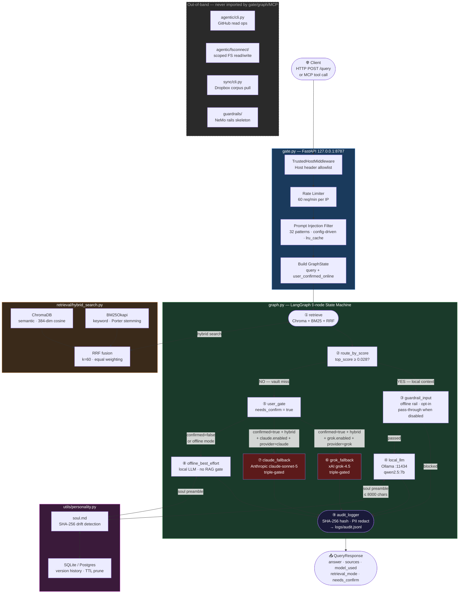

# CyClaw: Local AI you can Trust.

> **Offline-first, RAG-enforced, $ecure Local AI "Second Brain" with Dropbox Sync for data/corpus/ + secure, agentic functionality**

[](https://www.python.org/)
[](https://fastapi.tiangolo.com/)
[](https://github.com/langchain-ai/langgraph)
[](https://github.com/pgvector/pgvector/)
[](https://github.com/CGFixIT/CyClaw/actions/workflows/codeql.yml)
[](https://github.com/cgfixit/CyClaw/actions/workflows/ci.yml)
[](https://github.com/CGFixIT/CyClaw/actions/workflows/devskim.yml)
[](https://github.com/CGFixIT/CyClaw/actions/workflows/gitleaks.yml)
[](https://github.com/CGFixIT/CyClaw/actions/workflows/osv-scanner.yml)

[](https://github.com/CGFixIT/CyClaw/tree/main/docs/screenshots)

---

## What It Does

CyClaw is a personal RAG (Retrieval-Augmented Generation) backend that:

1. **Answers questions exclusively from your local Markdown corpus** — no internet by default
2. **Enforces every safety invariant via LangGraph topology** — not prompts, not config flags, not discipline
3. **Maintains a persistent soul/personality layer** (`soul.md`) with SHA-256 drift detection, atomic evolution writes, and user-gated modification
4. **Falls back to an external LLM only with explicit user confirmation** in hybrid mode — Grok (xAI) or Claude (Anthropic), selected per-query, each independently triple-gated at config, env, and per-query level
5. **Exposes both a FastAPI HTTP gateway and an MCP server** for Claude Desktop / Copilot Studio integration
6. **Ships optional, out-of-band operator layers** for Dropbox corpus sync (`sync/`) and agentic GitHub context / governed local workflows (`agentic/`, `.claude/`) — never imported into the request path, now also drivable from the browser terminal via governed **Sync** and **Agentic** consoles
7. **Extends the agentic layer to local data** (v1.8) with an opt-in **filesystem connector** (`agentic/fsconnect/` — scoped reads + gated writes over local/SMB shares, TOCTOU-safe) and a read-only **SQL connector** (`agentic/sqlconnect/` — SELECT-only Postgres/MSSQL scaffold) — both disabled by default and out-of-band
8. **Adds an optional NeMo Guardrails content-safety layer** (v1.8, `guardrails/`) that soft-imports `nemoguardrails` and degrades to offline heuristic rails — defense-in-depth only, never a routing authority (graph topology stays the sole policy)
9. **Scaffolds an optional LangChain Deep Agents / governed harness-optimizer layer** (v1.9, `agentic/deepagent_github/` + `agentic/harness_optimizer/`) — opt-in, disabled by default, and out-of-band like every other agentic feature above; phases 0-5 (config, workspace tools, mock scoring/acceptance gate) are implemented and tested, phases 6-9 (real subagent wiring, fixture-based GitHub coding evaluator, governed propose/apply) are in progress

---

## Architecture

```
User Query (HTTP POST /query or MCP tool call)
         │
         ▼
    ┌─────────────────────────────────────────────────────┐
    │  gate.py  (FastAPI, 127.0.0.1:8787)                 │
    │  • Rate limit (60 req/min per IP — RUNS FIRST)      │
    │  • Injection filter (sanitizer.py, config-driven)   │
    │  • Soul init (PersonalityManager closure)           │
    │  • Telemetry kill block (before any SDK import)     │
    └──────────────────┬──────────────────────────────────┘
                       │
                       ▼
    ┌─────────────────────────────────────────────────────┐
    │  graph.py  (LangGraph 9-node State Machine)         │
    │                                                     │
    │  [ENTRY]                                            │
    │     ↓                                               │
    │  1. retrieve  (Chroma + BM25 + RRF fusion)          │
    │     ↓                                               │
    │  2. route_score  (top_score >= 0.028 RRF?)          │
    │     ├─ YES ──→ 3. guardrail_input (offline rail;    │
    │     │           opt-in, pass-through when disabled) │
    │     │           blocked ──→ 8. audit_logger          │
    │     │           passed  ──→ 4. local_llm             │
    │     │                        (Ollama :11434)        │
    │     └─ NO  ──→ 5. user_gate (needs_confirm=true)    │
    │                    ├─ confirmed + hybrid ──→        │
    │                    │      6. grok_fallback OR       │
    │                    │         claude_fallback        │
    │                    │      (selected per-query)      │
    │                    └─ declined / offline ──→        │
    │                           7. offline_best_effort    │
    │     ↓ (all paths converge)                          │
    │  8. audit_logger (SHA-256 + PII redact → jsonl)     │
    │     ↓                                               │
    │  [END]                                              │
    └─────────────────────────────────────────────────────┘
                       │
                       ▼
    ┌─────────────────────────────────────────────────────┐
    │  HybridRetriever  (retrieval/hybrid_search.py)      │
    │  • ChromaDB  (semantic, all-MiniLM-L6-v2, 384d)    │
    │  • BM25Okapi (keyword, Porter stemming)             │
    │  • RRF fusion (k=60, equal 1.0/1.0 weighting)      │
    │  • Per-chunk provenance metadata in every result    │
    └─────────────────────────────────────────────────────┘
```

### LangGraph Topology (rendered)



---

## API Key Setup (Soul Mutations)

CyClaw's soul mutation endpoints (`/soul/propose`, `/soul/apply`, `/soul/reload`, `/soul/restore`) require a **Bearer API key**. Without it they return `HTTP 401` immediately — intentional fail-closed behavior.

> **All `/soul/*` endpoints — including `GET /soul` — require a valid `Authorization: Bearer <key>` token.** Only `/health`, `/query`, and the console pages (`GET /`, `/static/*`) are unauthenticated.

### Windows — PowerShell

Set for the current session only (cleared on terminal close):

```powershell
$env:CYCLAW_API_KEY = "your-strong-local-secret"
uvicorn gate:app --host 127.0.0.1 --port 8787
```

Persist across sessions (writes to the current user's environment permanently):

```powershell
[System.Environment]::SetEnvironmentVariable(
    "CYCLAW_API_KEY",
    "your-strong-local-secret",
    [System.EnvironmentVariableTarget]::User
)
# Restart your terminal, then launch normally:
uvicorn gate:app --host 127.0.0.1 --port 8787
```

Verify it is set before launching:

```powershell
echo $env:CYCLAW_API_KEY
```

### Windows — Command Prompt (cmd.exe)

```cmd
set CYCLAW_API_KEY=your-strong-local-secret
uvicorn gate:app --host 127.0.0.1 --port 8787
```

Persist permanently (takes effect in new sessions):

```cmd
setx CYCLAW_API_KEY "your-strong-local-secret"
```

### Windows Server 2022 — System-wide (all users, requires admin)

```powershell
[System.Environment]::SetEnvironmentVariable(
    "CYCLAW_API_KEY",
    "your-strong-local-secret",
    [System.EnvironmentVariableTarget]::Machine
)
```

Or via GUI: **System Properties → Advanced → Environment Variables → System variables → New**.

### Linux / macOS — Bash / Zsh

Set for the current session:

```bash
export CYCLAW_API_KEY="your-strong-local-secret"
uvicorn gate:app --host 127.0.0.1 --port 8787
```

Persist in your shell profile (`~/.bashrc`, `~/.zshrc`, or `~/.profile`):

```bash
echo 'export CYCLAW_API_KEY="your-strong-local-secret"' >> ~/.bashrc
source ~/.bashrc
uvicorn gate:app --host 127.0.0.1 --port 8787
```

Persist for a **systemd service** (Linux server):

```ini
# /etc/systemd/system/cyclaw.service
[Unit]
Description=CyClaw RAG Gateway
After=network.target

[Service]
Type=simple
User=cyclaw
WorkingDirectory=/opt/CyClaw
Environment="CYCLAW_API_KEY=your-strong-local-secret"
Environment="GROK_API_KEY=offline-dummy-sk-123"
ExecStart=/opt/CyClaw/.venv/bin/uvicorn gate:app --host 127.0.0.1 --port 8787
Restart=on-failure

[Install]
WantedBy=multi-user.target
```

```bash
sudo systemctl daemon-reload
sudo systemctl enable --now cyclaw
```

### All platforms — `.env` file (already in `.gitignore`)

Create `.env` in the repo root:

```
API KEYS added to config.yaml
CYCLAW_API_KEY=api-key
GROK_API_KEY=InputAPIkey
CLAUDE_API_KEY=InputAPIkey
```

Load it before launching:

```bash
# Bash / Zsh
export $(grep -v '^#' .env | xargs)
uvicorn gate:app --host 127.0.0.1 --port 8787
```

```powershell
# PowerShell
Get-Content .env | ForEach-Object {
    if ($_ -match '^([^#=][^=]*)=(.*)$') {
        [System.Environment]::SetEnvironmentVariable($Matches[1].Trim(), $Matches[2].Trim())
    }
}
uvicorn gate:app --host 127.0.0.1 --port 8787
```

### Choosing a key value

CyClaw is loopback-only (`127.0.0.1:8787`) — the key never crosses a network. Still:

- Use at least **20 random characters**: `openssl rand -hex 20` (Linux/macOS) or `[System.Web.Security.Membership]::GeneratePassword(24,4)` (PowerShell)
- Do **not** reuse a password from elsewhere
- Do **not** commit the key to Git (`.env` is already in `.gitignore`)

## Quick Start

### Prerequisites

| Requirement | Version | Notes |
|---|---|---|
| Python | 3.12 | Primary supported runtime |
| [Ollama](https://ollama.com/) | Any | Must be running on `localhost:11434` |
| Model pulled in Ollama | — | `qwen2.5:7b` (default), `mistral:7b`, or any chat model |

### Install

```bash
git clone https://github.com/CGFixIT/CyClaw
cd CyClaw
python3.12 -m venv .venv
source .venv/bin/activate        # Windows: .venv\Scripts\activate

# 1) Install CPU-only torch first (CVE-2025-32434 fixed in 2.6.0; 2.13.0 is within the patched range)
pip install torch==2.13.0+cpu --index-url https://download.pytorch.org/whl/cpu

# 2) Install the rest, pinned to the verified transitive tree.
pip install -r requirements.txt -c constraints.txt
```

### Required local prep

```bash
mkdir -p data/personality index logs
printf '# Soul\n' > data/personality/soul.md
export GROK_API_KEY=dummy
```

### Run

```bash
python -m retrieval.indexer
uvicorn gate:app --host 127.0.0.1 --port 8787
```

Open `/` for the terminal UI and `/health` for readiness. The terminal exposes five operator consoles — **Soul**, **Sync**, **Agentic**, **Filesystem**, and **SQL** — the latter four calling `POST /ops/sync`, `/ops/agentic`, `/ops/fsconnect`, and `/ops/sqlconnect` (API-key gated, rate-limited, audited).

---

## Project Structure

```text
CyClaw/
├── gate.py
├── graph.py
├── config.yaml                 # single source of truth
├── README.md
├── Dropbox_Sync_Guide.md
├── mcp_hybrid_server.py        # retrieval-only MCP server
├── agentic/                    # out-of-band GitHub context + governed registry
│   ├── cli.py
│   ├── context.py
│   ├── gh_client.py
│   ├── registry.py
│   ├── writer.py               # stubbed write scaffold, non-executing
│   ├── fsconnect/              # (v1.8) local/SMB filesystem connector
│   │   ├── cli.py
│   │   ├── client.py           # scoped reads (fs_list/stat/read/grep)
│   │   ├── pathsafe.py         # TOCTOU-safe openat/O_NOFOLLOW security core
│   │   ├── writer.py           # gated, atomic writes (default-disabled)
│   │   └── indexer.py          # toggleable RAG-corpus indexing of the share
│   ├── sqlconnect/             # (v1.8) read-only SQL scaffold (Postgres/MSSQL)
│   │   ├── cli.py
│   │   └── client.py           # SELECT-only query guard, env-only DSN
│   ├── harness_optimizer/      # (v1.9) governed better-harness-style optimizer scaffold
│   │   ├── core.py             # Experiment/Surface/RunReport/CandidateDecision models
│   │   ├── proposer.py         # scoped train/holdout workspace builder
│   │   ├── mcp/tools.py        # audited, symlink-hardened proposer workspace tools
│   │   └── governance.py       # visible-case-hardcoding + governance-finding gates
│   └── deepagent_github/       # (v1.9) optional LangChain Deep Agents GitHub harness
│       ├── builder.py          # lazy create_deep_agent() seam, never imported unless enabled
│       ├── permissions.py      # phase-5 no-write policy refusal
│       └── subagents.py        # validated SubAgent specs, no bare-string tools
├── guardrails/                 # (v1.8) optional NeMo Guardrails layer (out-of-band)
│   ├── cli.py
│   ├── config.py
│   ├── integration.py          # soft-imports nemoguardrails; degrades gracefully
│   ├── rails.py                # offline heuristic rails (injection/soul/grounding)
│   ├── metrics.py              # separate logs/guardrails.jsonl stream (hashes only)
│   └── config/                 # NeMo config.yml + rails.co (Colang flows)
├── .claude/                    # local operator workflows and prompts
│   ├── commands/
│   ├── hooks/
│   ├── memory/
│   ├── patterns/
│   ├── rules/
│   ├── skills/
│   ├── tools/
│   └── utility-prompts/
├── retrieval/
│   ├── indexer.py
│   ├── hybrid_search.py
│   ├── embeddings.py
│   └── stemmer.py
├── llm/
│   └── client.py
├── sync/                       # optional Dropbox corpus sync
│   ├── cli.py
│   ├── runner.py
│   └── scheduler.py
├── utils/
│   ├── sanitizer.py
│   ├── logger.py
│   ├── personality.py
│   ├── health.py
│   └── ratelimit.py
├── tests/
├── docs/
├── static/
├── data/
│   ├── corpus/
│   └── personality/
└── .github/workflows/
```

---

## Dropbox Corpus Sync

CyClaw includes an **optional, out-of-band** Dropbox sync layer that mirrors a Dropbox corpus into `data/corpus/` without touching `gate.py`, `graph.py`, or the MCP request path.

**Key capabilities**
- `rclone`-backed pull sync with safety fuses (`max_delete`, `max_transfer`)
- audit logging for changed corpus files
- optional scheduler integration for Linux and Windows
- optional reindex trigger when corpus changes

**Core commands**

```bash
python -m sync.cli test
python -m sync.cli sync --dry-run
python -m sync.cli sync
python -m sync.cli status
python -m sync.cli schedule
python -m sync.cli unschedule
```

The same actions are available from the **Sync Console** panel in the terminal UI via `POST /ops/sync` (loopback-only, API-key gated, audited).

See `Dropbox_Sync_Guide.md` for full setup and scheduling details.

---

## Agentic Layer (v1.6.0)

CyClaw now includes a **concise, governed agentic layer** for local operator workflows. It is **opt-in, disabled by default, and fully out-of-band**: it is never imported by `gate.py`, `graph.py`, or `mcp_hybrid_server.py`.

### What it adds

- **Read-only GitHub context** through the `gh` CLI
- **Governed local skills registry** with explicit human gating
- **Project workflows and operator helpers** under `.claude/`
- **Reusable local patterns** for memory, commands, tools, hooks, and utility prompts

### Security posture

- reads only in normal operation
- no GitHub token is stored or forwarded by CyClaw
- `gh` is invoked as an argv list, not via shell execution
- write behavior remains scaffolded and non-executing in the current release
- all agentic reads, refusals, and registry changes are audit logged

### Enable it

```yaml
agentic:
  enabled: true
  repo: "CGFixIT/CyClaw"
  mode: "read"
  writes_enabled: false
  gh_min_version: "2.40.0"
  registry_path: "data/agentic/skills_registry.json"
```

### Main agentic commands

```bash
python -m agentic.cli status
python -m agentic.cli context --repo
python -m agentic.cli context --pr 123
python -m agentic.cli context --issue 45
python -m agentic.cli test
python -m agentic.cli propose-skill --name deploy --desc "..." --body-file s.md --reason "draft"
python -m agentic.cli apply-skill --name deploy --desc "..." --body-file s.md --reason "add deploy runbook" --confirm
```

The **Agentic Console** panel drives these from the terminal UI via `POST /ops/agentic`; skill-Apply stays disabled behind a 4-gate checklist (`mode=write` + `writes_enabled` + reason + `--confirm`) — dry-run only under shipped defaults.

**Key areas in agentic folders**
- `skills/` — reusable project skills / workflows
- `commands/` — shortcut command entry points
- `patterns/` — repeatable operating patterns
- `tools/` — tool wrappers and helper definitions
- `utility-prompts/` — reusable operator prompts
- `memory/` — memory-oriented helpers / artifacts
- `hooks/` and `rules/` — local guardrails and automation boundaries

**Examples from the current repo**
- run / smoke-test workflows for CyClaw
- architecture, tests, logging, and speed refactor loops
- wrap-up / session-end workflows
- memory orchestration support patterns

---

## Filesystem & SQL Connectors (v1.8)

v1.8 extends the agentic layer beyond GitHub to **local data**, for the regulated or security conscious use case where AI use is compliance heavy. Both connectors are **opt-in, disabled by default, and fully out-of-band** — never imported by `gate.py`, `graph.py`, or `mcp_hybrid_server.py`, so the six security invariants hold by construction. While disabled, their CLIs are a pure no-op (exit 0).

### `agentic/fsconnect/` — local / SMB filesystem connector

Scoped **reads** and separately-gated **writes** over a local or SMB file share, sharing one TOCTOU-safe security core.

- **`pathsafe.py` security core** — POSIX `openat` / `O_NOFOLLOW` handle-descent from a held root directory fd (so the root cannot be swapped under the process). Denies UNC, NTFS alternate data streams (`file::$DATA`), `\\?\` / `\\.\` device paths, `..` traversal, and any symlink / reparse point. Segment-aware containment closes **CVE-2025-53110** (sibling-prefix) and `realpath` + `O_NOFOLLOW` close **CVE-2025-53109** (symlink/junction escape).
- **Reads** (`fs_list` / `fs_stat` / `fs_read` / `fs_grep`) confined to `allowed_roots`, audited, with a 5 MiB read cap and advisory OWASP∪`banned_patterns` content scanning.
- **Writes** (`fs_write` / `fs_append` / `fs_mkdir` / `fs_move`) — fully built but **`writes_enabled: false` by default**; confined to a **separate** `writable_roots` list; gated by a human `reason` + `--confirm` (for destructive ops); atomic (`tmp` + `os.replace`); **content-agnostic** (never calls the LLM — an operator pipes local-LLM/QWEN output in). A code-level `FS_WRITE_HARD_DISABLE` kill switch forces dry-run regardless of config.
- **Toggleable RAG-corpus indexing** of the share (`index_enabled`, dry-run default) stages eligible files into the corpus and triggers a reindex **subprocess** — enabling a generate → write → index loop without importing the retrieval layer.

```bash
python -m agentic.fsconnect.cli status
python -m agentic.fsconnect.cli read  <path>            # scoped read
python -m agentic.fsconnect.cli grep  <path> <pattern>
python -m agentic.fsconnect.cli write <path> --reason "..."   # dry-run unless writes_enabled
python -m agentic.fsconnect.cli index --apply           # stage share → corpus
python -m agentic.fsconnect.cli test                    # pre-flight self-test
```

Enable in `config.yaml`:

```yaml
fsconnect:
  enabled: true
  allowed_roots: ["/srv/share"]   # REQUIRED when enabled; existing dirs
  max_file_bytes: 5242880         # 5 MiB read cap
  writes_enabled: false           # master write switch (dry-run plans while false)
  writable_roots: [null]          # null => OS default (/var/lib/cyclaw-fs | C:\CyClaw-FS)
  max_write_bytes: 10485760       # 10 MiB write cap
  index_enabled: false            # toggle RAG-corpus indexing of the share
```

### `agentic/sqlconnect/` — read-only SQL connector (v0.1 scaffold)

A disabled-by-default scaffold for read-only on-prem SQL (Postgres / MSSQL). Read-only is enforced three ways: a **SELECT/WITH-only query guard** (rejects DDL/DML, stacked statements, and comment-hidden keywords by scanning a quote-stripped copy), a **session-level read-only** transaction, and a hard `allow_write: false`. The DSN is read from an **environment variable only** (`CYCLAW_SQL_DSN`), never hardcoded; drivers (`psycopg` / `pyodbc`) are imported lazily.

```bash
python -m agentic.sqlconnect.cli status
python -m agentic.sqlconnect.cli schema                 # list table schemas (read-only)
python -m agentic.sqlconnect.cli query --table public.users   # bounded preview
python -m agentic.sqlconnect.cli test
```

```yaml
sqlconnect:
  enabled: false
  driver: "postgres"             # "postgres" | "mssql"
  dsn_env: "CYCLAW_SQL_DSN"      # DSN from this env var only
  statement_timeout_ms: 5000
  max_rows: 1000
  allow_write: false             # reserved; v0.1 cannot write regardless
```

---

## NeMo Guardrails (v1.8)

An **opt-in** content-safety layer in `guardrails/`. Absence of the `guardrails:` block, or `enabled: false` (the shipped default), is a pure no-op. Since Phase 2, when enabled, `utils/guardrail_bridge.py` wires its offline input rail into one visible `graph.py` node (`guardrail_input`, between `route_by_score` and `local_llm`) — still **defense-in-depth only, never a routing authority**: the graph's own `guardrail_router` edge (topology, not guardrails code) decides where a blocked query goes. `guardrails` itself is still never imported directly by `gate.py` or `graph.py` — `utils/guardrail_bridge.py` is the only seam, preserving module isolation (invariant I6). `mcp_hybrid_server.py` never touches it at all.

- **`nemoguardrails` is an optional dependency.** The layer **soft-imports** it and, when it is absent, degrades to **offline heuristic rails** that need no second LLM call:
  - **input** — light prompt-injection marker scan + soul/identity-mutation intent detection (the content-layer arm of the Soul-Governance invariant);
  - **output** — token-overlap **grounding** check against the retrieved context, flagging likely-ungrounded (hallucinated) answers below `hallucination_threshold`.
- When `nemoguardrails` **is** installed, the same Python checks back the live NeMo actions (via the Colang flows in `guardrails/config/rails.co`), so the offline heuristics and live rails never drift.
- Decisions are recorded to a **separate** metrics stream (`logs/guardrails.jsonl`) that stores **only SHA-256 hashes** — never raw text — mirroring the audit log's privacy posture.

```bash
python -m guardrails.cli status                         # config + nemoguardrails availability
python -m guardrails.cli check "your query here"        # run offline rails (no LLM/NeMo needed)
python -m guardrails.cli metrics                         # summarize the guardrail stream
python -m guardrails.cli test                            # pre-flight self-test
```

```yaml
guardrails:
  enabled: false                 # opt-in; also gates the graph.py guardrail_input node
  engine: "openai"               # Ollama OpenAI-compatible endpoint
  model: "qwen2.5:7b"            # keep in sync with models.local_llm.model
  hallucination_threshold: 0.18  # token-overlap floor for the grounding rail
  metrics_path: "logs/guardrails.jsonl"   # separate from logs/audit.jsonl (hashes only)
```

> Full design / wiring plan: `docs/NeMo/later_development_guideline.md`. Phase 2
> implementation contract: `docs/NeMo/phase2_implementation_plan.md`.

---

## Agentic Harness Scaffold (v1.9)

A governed, **opt-in, disabled-by-default, and out-of-band** scaffold for two related
future capabilities — never imported by `gate.py`, `graph.py`, or `mcp_hybrid_server.py`,
same isolation guarantee as every other agentic feature above:

- **`agentic/harness_optimizer/`** — a better-harness-style optimizer that would evaluate
  candidate improvements to allowed harness surfaces against visible train cases and
  hidden holdout cases, deterministic scoring, and a hard acceptance gate (no score
  regression, no unallowed surface changed, no visible-case hardcoding, no critical
  governance finding).
- **`agentic/deepagent_github/`** — an optional LangChain Deep Agents-backed local GitHub
  coding harness using Ollama and scoped CyClaw tool wrappers, lazily importing
  `deepagents` only when explicitly enabled.

**Status:** phases 0-5 (config validation, the proposer workspace + its audited,
symlink-hardened tool boundary, mock scoring/acceptance gate, the lazy `deepagent_github`
builder seam) are implemented and covered by `tests/test_agentic_harness_optimizer.py`
and `tests/test_agentic_harness_phase345.py`. Phases 6-9 (real Deep Agents subagent
wiring, a fixture-based GitHub coding evaluator, and governed propose/apply with
human-confirmed acceptance) are in progress. Full plan and phase ledger:
`docs/agentic/GITHUB_DEEP_AGENT_HARNESS_OPTIMIZER_PLAN.md`.

Every gate below the master `agentic.enabled` switch defaults to `false`; while
disabled, nothing under either package is reachable from `agentic.cli`, and no
`deepagents`/`langchain` optional dependency is imported.

```yaml
agentic:
  deepagent_github:
    enabled: false
    allow_deepagents_dependency: false    # extras must be installed explicitly
    allow_filesystem_write_tools: false
    allow_shell_execution: false
    allow_github_writes: false            # writer.py remains the write-policy boundary
  harness_optimizer:
    enabled: false
    require_human_confirm_for_accept: true
    allow_local_model_judge: false
```

---

## MCP Server

For Claude Desktop or other MCP-compatible clients:

```json
{
  "mcpServers": {
    "cyclaw": {
      "command": "python",
      "args": ["/path/to/CyClaw/mcp_hybrid_server.py"]
    }
  }
}
```

The MCP server exposes a retrieval-only `hybrid_search` tool. It has **no sampling capability** and is intentionally isolated from the agentic, filesystem/SQL connector, NeMo Guardrails, and Dropbox corpus sync layers.

---

## Security Model

| Layer | Mechanism |
|---|---|
| Network | Binds `127.0.0.1:8787` — no external exposure by design |
| Input | Config-driven injection filter (`policy.prompt_filter`) |
| Rate limit | 60 req/min per IP |
| Telemetry | Kill block runs before any SDK import in `gate.py` |
| Audit | All paths log SHA-256 query hash + PII-redacted metadata |
| Grok gating | Triple gate: `mode=hybrid` AND `grok.enabled=true` AND `user_confirmed_online=true` |
| Claude gating | Same triple gate, independently: `mode=hybrid` AND `claude.enabled=true` AND `user_confirmed_online=true` |
| Soul writes | Explicit human reason string + enforced write-boundary scan + atomic write |
| Agentic writes | Stubbed / non-executing in current release |
| Filesystem connector | Reads scoped to `allowed_roots` (5 MiB cap); writes default-OFF, confined to a separate `writable_roots`, gated by human `reason` + `--confirm`, atomic; TOCTOU-safe `pathsafe` core denies UNC/ADS/device-path/`..`/symlink escapes |
| SQL connector | Read-only: SELECT/WITH-only query guard + session read-only + hard `allow_write: false`; DSN from env var only; disabled scaffold by default |
| Guardrails | Out-of-band, opt-in defense-in-depth; degrades to offline heuristic rails without `nemoguardrails`; never a routing authority; separate hash-only metrics stream |
| `/ops/*` routes | Loopback-only, `require_api_key` gated, rate-limited (60/min), every call audited (`ops_sync_executed` / `ops_agentic_executed` / `ops_fsconnect_executed` / `ops_sqlconnect_executed`); shells out via `subprocess.run([...])` — never imports `sync/` or `agentic/` |
| Container | Non-root, `no-new-privileges`, `cap_drop: ALL`, read-only rootfs, seccomp, resource limits; optional eBPF/Falco detection (`deploy/falco/`, off by default) |

> **Scope:** CyClaw is a single-operator, loopback-bound local server. The full threat model — what the sandbox does and does **not** cover (no microVM by design) and why — is documented in [`docs/THREAT_MODEL.md`](docs/THREAT_MODEL.md).

---

*Built by [Chris Grady](https://cgfixit.com) · [cgfixit.com/linkedin](https://cgfixit.com/linkedin)*
