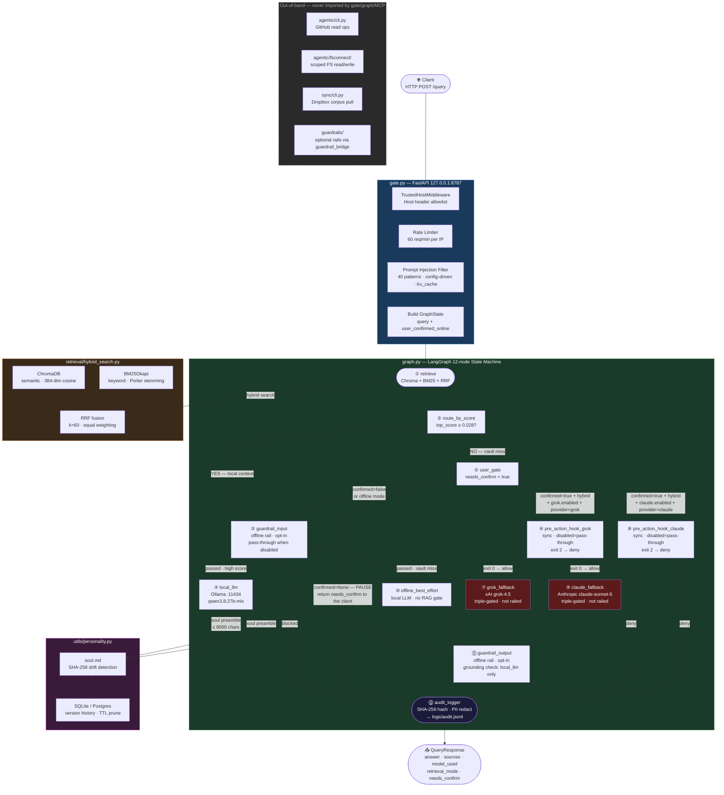

# CyClaw — local AI you can trust, and track $pend

[](https://www.python.org/)
[](https://fastapi.tiangolo.com/)
[](https://github.com/langchain-ai/langgraph)
[](https://github.com/cgfixit/CyClaw/actions/workflows/ci.yml)

[](https://github.com/CGFixIT/CyClaw/tree/main/docs/screenshots)

CyClaw is a local RAG / chatbot / research server for **your own documents, on
your own hardware**: hybrid retrieval over a local Markdown corpus, a local
model answering from it, and the safety rules written into the graph that
routes each request — not into a prompt asking a model to behave. It binds to
`127.0.0.1:8787`, answers locally by default, and treats any call to a paid
provider as an exception you confirm per question and can account for
afterwards, token by token.

**What that means in practice**

- **Your data stays put.** Once the embedding model is cached, nothing leaves
  the machine unless you say so on that specific question.
- **Policy is topology.** Retrieval is the graph's unconditional entry node,
  every path converges on the audit logger, and the online-provider gate is a
  graph edge — checkable in code, not a system message someone can forget.
- **Paid calls are opt-in per request and ledgered.** Three independent
  conditions must hold before Grok or Claude is called; every billed call
  appends its token counts to a local ledger, and dollars are derived at read
  time so a rate-card correction re-prices history instead of baking in errors.
- **Everything else ships off.** Per-user auth, memory, guardrails, the
  local-data connectors, the agentic coding loop, and the Telegram / X channels
  are all behind master switches that ship disabled.

**Scope.** CyClaw is a trusted-operator, loopback-bound, single-tenant server:
one operator by default, a small mutually-trusted group with their own accounts
once `auth.enabled` is on. It is not a multi-tenant service. The full threat
model — including what the sandbox does *not* cover (no microVM by design) — is
[`docs/THREAT_MODEL.md`](docs/THREAT_MODEL.md).

## Table of Contents

**Getting started**

- [Quick Start](#quick-start)
- [What It Does](#what-it-does)
- [Architecture](#architecture)
- [Installation](#installation)
- [Full Setup Guide](setup-guide.md) — every platform, Docker, and every REST endpoint with a copy-pasteable `curl`

**Configuration and access**

- [API Key Setup (Soul Mutations)](#api-key-setup-soul-mutations)
- [Per-User Authentication](#per-user-authentication)

**Operating it**

- [Spend Tracking](#spend-tracking)
- [Benchmarks and Evals](#benchmarks-and-evals)
- [Dropbox Corpus Sync](#dropbox-corpus-sync)
- [macOS launchd & Keychain](#macos-launchd--keychain)
- [Local Model Fine-Tuning](#local-model-fine-tuning)

**Optional layers** (master switches ship disabled; each section names its enablement gates)

- [Optional layers at a glance](#optional-layers)
- [Agentic Layer](#agentic-layer)
- [Agentic Coding Loop (GitHub)](#agentic-coding-loop-github)
- [Filesystem, SQL & Passive Network Connectors](#filesystem-sql--passive-network-connectors)
- [NeMo Guardrails](#nemo-guardrails)
- [Telegram Channel](#telegram-channel)
- [OpenTweet Channel](#opentweet-channel)

**Reference**

- [Security Model](#security-model)
- [Project Structure](#project-structure)
- [Documentation Map](#documentation-map)
- [License](#license)

---

## Quick Start

**macOS (Apple Silicon)** — the onboarding script handles installation, keys,
Ollama, indexing, and startup:

```bash
git clone https://github.com/CGFixIT/CyClaw && cd CyClaw
bash macos/setup-cyclaw.sh
```

**Linux** — manual path (Ollama must already be running on `:11434`):

```bash
git clone https://github.com/CGFixIT/CyClaw && cd CyClaw
python3.12 -m venv .venv && source .venv/bin/activate
pip install torch==2.13.0+cpu --index-url https://download.pytorch.org/whl/cpu
pip install -r requirements.txt -r requirements-test.txt -c constraints.txt --ignore-installed PyYAML
ollama pull qwen3.8:27b-mlx
export CYCLAW_API_KEY="$(openssl rand -hex 20)"  # needed for the /soul/* and /ops/* endpoints
python -m retrieval.indexer                      # builds the retrieval index, once
python gate.py                                   # → http://127.0.0.1:8787
```

**Windows** uses the same dependency pins with PowerShell activation
(`py -3.12 -m venv .venv`, `.\.venv\Scripts\Activate.ps1`); see
[Windows](setup-guide.md#windows-powershell) and
[Linux](setup-guide.md#linux-bash) in the setup guide.

Confirm it's alive: `curl http://127.0.0.1:8787/health`, then open
`http://127.0.0.1:8787/` for the browser console.

> **Manual macOS install differs in one step.** The `+cpu` torch wheel does not
> exist for macOS, so torch is installed plain (`torch==2.13.0`) from stripped
> copies of `requirements.txt` and `constraints.txt`. Exact commands:
> [macOS (Apple Silicon)](setup-guide.md#macos-apple-silicon).

---

## What It Does

CyClaw answers questions from your documents using a local model reading a
local index. What makes the "nothing leaves the machine" claim checkable is
*where* the safety lives: in the shape of the graph, not in a prompt, a system
message, or a config flag someone could forget to set.

> **First run is the one exception.** If the sentence-transformer embedding
> model is not already in the Hugging Face cache, `retrieval/embeddings.py`
> fetches it once — a documented bootstrap, not a per-question escalation, and
> not something `user_confirmed_online` gates. Once cached, a disk-only probe
> (`try_to_load_from_cache`, no network) confirms it and every later load
> passes `local_files_only=True`, so a warm cache never reaches out again. Seed
> the cache on a machine you are happy to let fetch once, and CyClaw is offline
> from its first query onward.

### The core — always present, no switches involved

1. **Retrieval comes first, unconditionally.** `retrieve` is the entry node of
   the 12-node LangGraph state machine in `graph.py`; no model call can precede
   it. Graph edges enforce retrieval and provider selection; they do not
   guarantee that generated claims are grounded — `offline_best_effort` can
   answer from partial context or model knowledge after a vault miss.
2. **Hybrid search over your Markdown corpus.** ChromaDB semantic vectors plus
   BM25 keyword ranking, fused by Reciprocal Rank Fusion (`retrieval.rrf_k`).
   Both legs run locally on CPU. A top hit weaker than `retrieval.min_score`
   (and `retrieval.min_semantic_score`, when a cosine score is present) routes
   to a user gate instead of a confident guess.
3. **A local model by default.** Ollama serving the tag in
   `models.local_llm.model` (shipped: `qwen3.8:27b-mlx`). The prompt-context
   budget (`retrieval.max_context_tokens`), the generation cap (`max_tokens`),
   and every timeout are `config.yaml` values; nothing tunable is hardcoded
   elsewhere.
4. **A governed personality layer.** `data/personality/soul.md` with SHA-256
   drift detection and atomic writes. `POST /soul/apply` — the route that
   adopts *new* content — requires a human `reason` string and runs an enforced
   injection scan. Two paths deliberately differ and are documented as such:
   `POST /soul/restore` re-adopts previously-vetted `.bak` content under a
   hardcoded reason after an advisory scan (`apply_evolution(..., scan=False)`
   skips enforcement), and a missing `soul.md` self-heals to a default at boot.
   The soul is governed — neither frozen nor self-editable.
5. **Online fallback, triple-gated per question.** A paid call to Grok (xAI)
   or Claude (Anthropic) happens only when **all three** hold:
   `app.mode: hybrid` **and** the chosen provider's own `enabled` flag **and** a
   `user_confirmed_online: true` that lives only in that one request body — it
   is never persisted, never a config key, and never carried over to the next
   question. The provider is picked per query via `online_provider`. Both
   providers ship `enabled: true`, so on a default checkout the per-question
   confirmation is the gate actually holding the line. (This is not a
   server-enforced two-step challenge: a programmatic client may send `true`
   on its first `POST /query`. What the gate guarantees is that *something*
   has to assert it per request, and that nothing in `config.yaml` can assert
   it once for all of them.) Outbound calls are additionally capped by the
   remaining `api.graph_timeout_sec` budget: a retry whose backoff would
   overrun the deadline is refused rather than left to hang. Every section
   below that says "triple-gated" means exactly this gate.
6. **Two front doors.** A FastAPI gateway bound to `127.0.0.1:8787` (browser
   console at `/`) and a retrieval-only MCP server (`mcp_hybrid_server.py`,
   `sampling: None`) for Claude Desktop / Copilot Studio, which exposes search
   and no model path at all.
7. **An audit trail that hashes the question.** All eleven upstream paths
   converge on `audit_logger` before END, writing a SHA-256 query hash plus
   PII-redacted metadata to `logs/audit.jsonl`; `cyclaw-metrics` is the offline
   reader. Hashing reduces stored query content; the log still contains
   sensitive metadata and needs local access controls. Setting
   `logging.audit_fields.include_query_hash: false` stores raw query text
   instead (redactors still apply) and is privacy-affecting — `utils/logger.py`
   says so in its own module docstring.

### Where the invariants are enforced

Those properties are enforced in four different places, and the distinction
matters to anyone auditing them: **graph topology** (`retrieve` as entry,
routing by edges, audit convergence), **`gate.py` construction** (two of the
three external-provider gates — only the per-request confirmation is decided in
the graph), **`utils/personality.py`** (the soul reason gate and atomic write),
and **import structure** (module isolation — the core request path never
imports the optional packages; this is invariant **I6**, referenced throughout
this README). `python3 .claude/skills/invariant-guard/check_invariants.py`
asserts all six invariants (I1–I6) plus five guards (G1–G5) statically;
[`INVARIANTS.md`](INVARIANTS.md) records which are enforced by code and which
by convention, and names the test pinning each.

### Optional layers

The layers are not all isolated the same way, and the table mixes three kinds:

- **Route modules** registered onto the gateway itself — per-user
  authentication and the memory store.
- **In-path utilities** that run *inside* the core request path — the Numbat
  stream (`audit_log` lazy-imports `utils/numbat_emitter` on every audit
  record) and the spend ledger (`graph.py` reaches `utils/spend` through
  `llm/client.py`). That is why both live in `utils/` rather than in
  out-of-band packages, and why both are **on** by default: neither needs a
  config edit to start writing, neither adds network egress, and both write
  local files. Note that the Numbat stream is a second *sensitive local log*,
  not a privacy improvement.
- **I6-isolated subsystems** — everything else. `gate.py`, `graph.py`, and the
  MCP server never import them, a boundary asserted statically rather than
  merely intended. Every row marked `off` is a no-op until you edit
  `config.yaml`.

| Layer | What it adds | Ships |
|---|---|---|
| [Per-user authentication](#per-user-authentication) (`gate_auth.py`, `utils/authn*`) | scrypt password hashes, session cookie + CSRF for browsers, bearer device tokens for scripts, three roles (`admin`/`operator`/`audit`), `cyclaw-user` CLI. With `auth.enabled: true`, `POST /query` and the console require a session or named token | off |
| Facts + episodes memory (`gate_memory.py`, [`memory/`](memory/README.md); plan in [`docs/memory/`](docs/memory/README.md), not the `docs/memories/` sandbox notes) | SQLite + FTS5 store with propose/apply governance (human `reason` plus an injection scan on apply) and an optional retrieval-fusion hook | off |
| [NeMo Guardrails](#nemo-guardrails) ([`guardrails/`](guardrails/README.md)) | content-safety input rail and an output grounding check, degrading to offline heuristic rails when `nemoguardrails` is absent — defense in depth, never a routing authority | off |
| [Dropbox corpus sync](#dropbox-corpus-sync) (`sync/`) | an `rclone` wrapper that refreshes `data/corpus/` out-of-band and signals "reindex" by exit code | CLI only |
| [Local-data connectors](#filesystem-sql--passive-network-connectors) (`agentic/fsconnect`, `sqlconnect`, `netconnect`) | scoped filesystem reads with gated atomic writes, SELECT-only SQL, and passive LAN inventory with no active probes | off |
| [Agentic layer](#agentic-layer) + [coding loop](#agentic-coding-loop-github) (`agentic/`) | read-only GitHub context via the `gh` CLI, a governed skills registry, and a real-repo clone → plan → patch → verify → **human decides** → commit pipeline whose push and draft-PR steps are two further separate decisions | off |
| [Telegram](#telegram-channel) (`telegram/`) and [OpenTweet](#opentweet-channel) (`opentweet/`) channels | a phone remote and a weekly X poster; both reach the pipeline only through loopback `POST /query`, never a direct `graph.py` call | off |
| Numbat forensic stream (`utils/numbat_emitter.py`) | a derived NDJSON projection of the audit trail at `logs/numbat-events.ndjsonl` that the pinned Numbat 0.2.0 CLI can score for patterns like `exfil.curl_post_file` ([design note](docs/security-philosophy/numbat_secondary_evaluator.md)). Projected after hashing and redaction, but it carries host/user metadata | **on** |
| [Spend ledger](#spend-tracking) (`utils/spend.py`) | token counts per billed Grok/Claude API-key call in `logs/spend.jsonl`, tagged `source: query` (`/query` fallback) or `source: agentic` (cloud planner). Grok stores xAI `cost_in_usd_ticks`; Claude is priced from Anthropic usage tokens. Dollars are derived at read time by `cyclaw-metrics` | **on** |
| [Fine-tune kit](#local-model-fine-tuning) (`tools/lora_finetune/`) | an offline QLoRA kit that teaches a local model this codebase. Not installed by any runtime install surface | operator toolkit |

---

## Architecture

`gate.py` (FastAPI on `127.0.0.1:8787`) runs the `TrustedHostMiddleware` Host
allowlist, then the per-IP rate limiter (**60 req/min — it runs first, before
the injection filter**), then the config-driven injection filter, then soul
init, and hands a `GraphState` to the 12-node LangGraph state machine in
`graph.py`. Routing is graph edges only — `retrieve` is the unconditional
entry, and every path converges on `audit_logger` before END. The numbered
plain-text version of this flow is [`CLAUDE.md`](CLAUDE.md) §2 "The Map"; the
invariants it encodes are in [`INVARIANTS.md`](INVARIANTS.md).

### LangGraph Topology (rendered)


```mermaid
flowchart TD
    A(["🌐 Client\nHTTP POST /query"])
    A --> B

    subgraph GATEWAY ["gate.py — FastAPI 127.0.0.1:8787"]
        B["TrustedHostMiddleware\nHost header allowlist"]
        B --> C["Rate Limiter\n60 req/min per IP"]
        C --> D["Prompt Injection Filter\n40 patterns · config-driven · lru_cache"]
        D --> E["Build GraphState\nquery + user_confirmed_online"]
    end

    E --> F

    subgraph GRAPH ["graph.py — LangGraph 12-node State Machine"]
        F(["① retrieve\nChroma + BM25 + RRF"])
        F --> G["② route_by_score\ntop_score ≥ 0.028?"]
        G -->|"YES — local context"| X["③ guardrail_input\noffline rail · opt-in\npass-through when disabled"]
        X -->|"blocked"| L
        X -->|"passed · high score"| H["④ local_llm\nOllama :11434\nqwen3.8:27b-mlx"]
        G -->|"NO — vault miss"| I["⑤ user_gate\nneeds_confirm = true"]
        I -->|"confirmed=true + hybrid\n+ grok.enabled + provider=grok"| PG["⑥ pre_action_hook_grok\nsync · disabled=pass-through\nexit 2 → deny"]
        PG -->|"exit 0 → allow"| J["⑦ grok_fallback\nxAI grok-4.5\ntriple-gated · not railed"]
        I -->|"confirmed=true + hybrid\n+ claude.enabled + provider=claude"| PC["⑧ pre_action_hook_claude\nsync · disabled=pass-through\nexit 2 → deny"]
        PC -->|"exit 0 → allow"| W["⑨ claude_fallback\nAnthropic claude-sonnet-5\ntriple-gated · not railed"]
        I -->|"confirmed=false\nor offline mode"| X
        X -->|"passed · vault miss"| K["⑩ offline_best_effort\nlocal LLM · no RAG gate"]
        I -->|"confirmed=None — PAUSE\nreturn needs_confirm to the client"| L
        H --> Y["⑪ guardrail_output\noffline rail · opt-in\ngrounding check: local_llm only"]
        J --> Y
        W --> Y
        K --> Y
        Y --> L
        PG -.->|"deny"| L
        PC -.->|"deny"| L
        L(["⑫ audit_logger\nSHA-256 hash · PII redact\n→ logs/audit.jsonl"])
    end

    L --> M(["📤 QueryResponse\nanswer · sources · model_used\nretrieval_mode · needs_confirm"])

    subgraph RETRIEVAL ["retrieval/hybrid_search.py"]
        N["ChromaDB\nsemantic · 384-dim cosine"]
        O["BM25Okapi\nkeyword · Porter stemming"]
        P["RRF fusion\nk=60 · equal weighting"]
        N --> P
        O --> P
    end

    F <-->|"hybrid search"| P

    subgraph SOUL ["utils/personality.py"]
        Q["soul.md\nSHA-256 drift detection"]
        R["SQLite / Postgres\nversion history · TTL prune"]
        Q <--> R
    end

    H <-->|"soul preamble\n≤ 8000 chars"| Q
    K <-->|"soul preamble"| Q

    subgraph OOB ["Out-of-band — never imported by gate/graph/MCP"]
        S["agentic/cli.py\nGitHub read ops"]
        T["agentic/fsconnect/\nscoped FS read/write"]
        U["sync/cli.py\nDropbox corpus pull"]
        V["guardrails/\noptional rails via guardrail_bridge"]
    end

    style GATEWAY fill:#1a3a5c,color:#ffffff,stroke:#4a90d9
    style GRAPH fill:#1a3a2a,color:#ffffff,stroke:#4a9d5a
    style RETRIEVAL fill:#3a2a1a,color:#ffffff,stroke:#d9904a
    style SOUL fill:#3a1a3a,color:#ffffff,stroke:#d94ad9
    style OOB fill:#2a2a2a,color:#aaaaaa,stroke:#666666,stroke-dasharray:5 5
    style J fill:#5c1a1a,color:#ffffff
    style W fill:#5c1a1a,color:#ffffff
    style L fill:#1a1a3a,color:#ffffff
```

The retrieval-only MCP server calls the retriever directly after sanitization;
it does not enter this HTTP gateway or generation graph.

What the diagram compresses: `HybridRetriever` (`retrieval/hybrid_search.py`)
fuses ChromaDB (semantic, `all-MiniLM-L6-v2`, 384-dim cosine, CPU-only
embeddings) with BM25Okapi (keyword, Porter stemming) by RRF (`k=60`, equal
weighting) and carries per-chunk provenance metadata in every result. The
telemetry kill block runs before any SDK import, and the MCP server and the
indexer apply the same block.

---

## Installation

Install, first run, and starting the gateway are in
[`setup-guide.md`](setup-guide.md). macOS installs plain `torch==2.13.0`;
Windows and Linux use the `+cpu` wheel. Platform scripts:
[`macos/README.md`](macos/README.md) and
[`powershell/README.md`](powershell/README.md). The optional GHCR image is
[`docs/DOCKER.md`](docs/DOCKER.md).

---

## API Key Setup (Soul Mutations)

`/soul/*`, `/ops/*`, `/memory/*`, and `/audit/summary` require a Bearer
`CYCLAW_API_KEY` and fail closed (401) when it is unset. `/query` and
`/health` do not use that key. What the key gates, and the per-platform
generate step, are in
[`setup-guide.md`](setup-guide.md#cyclawapikey--required-for-the-soul-console-not-for-query).
macOS persist is the Keychain bootstrap:
[`macos/README.md`](macos/README.md#key-bootstrap)
([401 recovery](macos/README.md#401--key-drift-recovery)).
Provider key names and the ledger are in
[`spend/README.md`](spend/README.md#api-keys).
Windows user-env persist is the next heading. Scheduled-task secrets use
[`powershell/README.md`](powershell/README.md#scripts)
(`powershell/CyClaw-CredMan-Set.ps1`, `powershell/CyClaw-CredMan-Env.ps1`).

### Windows — PowerShell / cmd.exe

Generate the session value in
[`setup-guide.md`](setup-guide.md#windows-powershell), then persist it.
Current user (open a new session before `python gate.py`):

```powershell
[System.Environment]::SetEnvironmentVariable("CYCLAW_API_KEY", $env:CYCLAW_API_KEY, "User")
```

cmd.exe: `set CYCLAW_API_KEY=<value>` for the session, `setx CYCLAW_API_KEY "<value>"` to persist.
A repo `.env` is sourced by `powershell/Invoke-CyClaw.ps1` only when every
Allow ACE is the current user:

```powershell
icacls .env /inheritance:r /grant:r "${env:USERNAME}:(R,W)"
```

Scheduled-task secrets use Credential Manager
([`powershell/README.md`](powershell/README.md#scripts)).

## Per-User Authentication

The operator API key above gates soul and ops routes. Per-user auth is the
account system (`gate_auth.py`): scrypt passwords, a session cookie plus CSRF
for browsers, named device tokens for scripts, and roles `admin`, `operator`,
and `audit`. It ships with `auth.enabled: false`. While that switch is off,
every `/auth/*` route returns 503. The design, the role table, TLS, and the
non-loopback bind rule are in
[`docs/AUTHENTICATION_DESIGN.md`](docs/AUTHENTICATION_DESIGN.md).
First-boot `curl` and `cyclaw-user` are in
[`setup-guide.md`](setup-guide.md#authentication-routes-auth-off-by-default).

---

## Spend Tracking

Every triple-gated Grok/Claude call that actually bills appends one line to
`logs/spend.jsonl` via `utils/spend.py`. The rule is **tokens are the ground
truth; dollars are derived at read time** — the ledger never stores a price, so
correcting a stale rate re-prices the entire history instead of leaving wrong
numbers baked into old lines. It never stores query text, prompt content, or
API keys, and writes are best-effort: a full disk logs a warning and drops the
row rather than turning a successful paid answer into a failed request.

Two production call sites write to it, distinguished by `source`, plus a
third for evals:

| `source` | Writer | What it covers |
|---|---|---|
| `query` | `llm/client.py` | The `/query` online fallback — the triple-gated Grok/Claude escalation a human confirmed per request |
| `agentic` | `agentic/deepagent_github/chat_client.py` | The out-of-band cloud planner's one-shot plan calls |
| `eval` | `tests/judge_eval.py` / `judge_calibrate.py` | Opt-in Anthropic-judge evals; routed to a separate `logs/evals/spend.jsonl`, never the production ledger |

**Reading it:**

```bash
python -m metrics          # or: cyclaw-metrics, once `pip install -e .`
```

The Spend section prints `today` and `last_7d` windows: total input/output
tokens, a derived USD figure, per-provider and per-source row counts, and two
data-quality counters — `usage_missing` (a billed call whose usage CyClaw
couldn't parse) and `rate_unknown` (a model with no rate-table entry). When any
row carried a vendor-reported cost, the same window also shows `table_usd`,
`ticked_table_usd`, `vendor_usd`, and `delta_usd` side by side, so a drift
between CyClaw's rate table and the vendor's own billing is visible rather than
hidden behind one number.

**Pricing rules that are exact, not approximated:** Grok's long-context band
(above a 200k-token prompt, xAI bills the *entire* request at the long rate,
not just the tokens past the threshold) and Claude's cache-write pricing split
by TTL (5-minute vs. 1-hour, when the vendor reports the split). `PRICED_AS_OF`
is computed from the dated rate table's own verification dates and flagged
stale after 30 days, so a long-running deployment surfaces "these dollars are
from an old rate card" instead of quietly reporting a confident, wrong total.

**Verifying against the vendor:** `compare_vendor_cost()` prices a row both by
rate table and by xAI's own ticks and reports the delta (`ticks_mismatch()`
decides when it's worth acting on); Claude has no ticks, so its check is the
Anthropic console total for the same window. `utils/sequence_detect.py` also
joins the ledger to `logs/audit.jsonl` on the shared `query_hash` — printed as
a Sequences section by `cyclaw-metrics` — to forensically correlate a blocked
injection attempt with a later online escalation, restricted to `source ==
"query"` rows so the agentic plane never mixes in.

**Live probes** (they spend real money, opt-in only, never collected by
pytest): `CYCLAW_SPEND_LIVE=1 python tests/spend_live_probe.py` writes to a
**temp** ledger and deletes it — it never appends `logs/spend.jsonl` — and
asserts no forbidden field (query, prompt, content, api_key, authorization)
reached the row.

Full field-by-field schema, the Darwin Keychain service names for
`GROK_API_KEY`/`ANTHROPIC_API_KEY`, and the agentic-plane live-probe walkthrough
are in [`spend/README.md`](spend/README.md).

---

## Benchmarks and Evals

Quality is measured on four separate planes, and only the first one blocks a
merge. All of them score the synthetic fixture under
`tests/fixtures/groundedness/` (eight documents, 52 labeled cases in six
categories including `injected_content`, where the evidence itself carries
instructions); none of them is a graph node or a security control.

| Plane | Command | Runs | Measures |
|---|---|---|---|
| Retrieval gate | `python -m tests.ci_rag_smoke` | every PR (`ci.yml`), no LLM | four `data/corpus` queries against the `retrieval.min_score` gate, then hit@5 / Recall@5 / MRR on the fixture against floors in `tests/ci_rag_smoke.py`, plus a check that each injected document's stored chunk was sanitized to `[FILTERED]` |
| Local dogfood | `CYCLAW_EVAL_DOGFOOD=1 python scripts/cyclaw-eval-dogfood.py` | operator, opt-in | one case per category on the real loopback model, with latency and a sanitizer probe; rows are `generated` or `unverified`, never assumed |
| Anthropic judge | `CYCLAW_EVAL_LIVE=1 python tests/judge_eval.py` (+ `ANTHROPIC_API_KEY`) | operator, opt-in, spends money | groundedness, completeness and abstention per case, graded by Claude; metadata-only report under `logs/evals/` |
| Local judge | same command with `evals.local_judge.enabled: true`; `tests/judge_calibrate.py` for the 36-row calibration set | operator, opt-in, fully local | the same rubric graded by a second loopback model of a different family; `python -m metrics` prints the run trend |

**Measured so far.** The retrieval gate holds at hit@5 1.0 / Recall@5 1.0 /
MRR 1.0 on CI (20 scored cases, 2026-09-12) and locally after the fixture grew
to 52 (44 scored cases, 2026-09-16). The dogfood matrix produced five real
`generated` rows on `qwen3.8:27b-mlx` on an M5 Pro 48 GB and walked the
stop / restart / Ctrl-C / online-gate recovery steps
([dated record](docs/audits/2026-09-12_Local_Qwen_Dogfood_Matrix.md)).
**No judge-plane result has been published yet, so there is no groundedness
number for the shipped model.** The planes, their thresholds' owners, and the
not-yet-measured list are in [`docs/EVALS.md`](docs/EVALS.md).

---

## Dropbox Corpus Sync

An **optional, out-of-band** `rclone`-backed pull sync mirrors a Dropbox corpus
into `data/corpus/` without touching `gate.py`, `graph.py`, or the MCP request
path. It carries safety fuses (`max_delete`, `max_transfer`), an OS-backed
single-instance lock (`fcntl.flock` / `msvcrt.locking`) that keeps a scheduled
run and a manual run from racing and releases even if the process dies, audit
logging of changed corpus files, an optional reindex trigger, and scheduler glue
for cron / Windows Task Scheduler plus an opt-in Darwin-only launchd backend
(`sync.scheduler_backend: "launchd"`, `schedule_frequency` daily/weekly/monthly)
that generates the plist and prints the `launchctl bootstrap` command — never
loading it itself.

```bash
python -m sync.cli setup          # first-run bootstrap; then: test | sync --dry-run | sync | status | schedule | unschedule
```

The **Sync Console** panel drives the same actions via `POST /ops/sync`
(loopback-only, API-key gated, audited). Full setup and scheduling:
[`docs/! How-To-Guides/Dropbox_Sync_Guide.md`](docs/%21%20How-To-Guides/Dropbox_Sync_Guide.md);
module internals (lock lifecycle, exit codes, error taxonomy):
[`docs/SYNC_README.md`](docs/SYNC_README.md).

---

## macOS launchd & Keychain

CyClaw's scheduled and supervised jobs on macOS run through **generated launchd
LaunchAgents** with one uniform posture: every generator writes a plist from
real resolved install paths and prints the exact `launchctl bootstrap` command
— **none of them ever loads the agent itself**. Loading a background job is
always a separate, explicit operator action.

- **Secrets never land in a plist.** Token-bearing jobs chain
  `macos/cyclaw-keychain-env.sh`, which fetches the secret from the Keychain at
  process start, exports it, and `exec`s the real command — failing closed
  (nothing launched) if the item is missing or empty. Store secrets first with
  `macos/cyclaw-keychain-set.sh`, a no-echo prompt driven by `security` itself
  so the secret never appears in any argv; the item is trust-pinned with
  `-T /usr/bin/security`.
- **Scheduled jobs** — Dropbox sync (see [Dropbox Corpus Sync](#dropbox-corpus-sync)),
  Telegram poll/health, fsconnect trash emptying, and OpenTweet — each a
  generate-only `*-plist` subcommand (commands below).
- **Supervised services** (highest risk) — `macos/generate_service_plist.py`
  writes a KeepAlive LaunchAgent for `gate.py`. Because that turns a loopback
  server into an always-on listener that survives reboot, it refuses to write
  without `--confirm` **and** a non-empty `--reason` (the reason-required idiom
  soul mutations use). Restart-on-crash only; a clean `launchctl stop` stays
  stopped. The Windows counterpart is `windows/generate_service_task.py`.
- **Uninstall symmetry** — `macos/uninstall-cyclaw.sh` unschedules any
  registered sync job and boots out + removes landed CyClaw LaunchAgents by
  label (`telegram-poll`, `telegram-health`, `fsconnect-trash`, `gate`,
  `keys-rotate`, `opentweet`, plus the retired console's `harness` label so
  an older install's agent is still removed), so no background job outlives the
  install. Sync's own launchd job is owned by `sync.cli unschedule`.

**Core commands**

```bash
bash macos/cyclaw-keychain-set.sh com.cgfixit.cyclaw.telegram-bot-token   # store a secret (TTY prompt)
python -m telegram.cli poll-plist                                        # Darwin-only; generates, never loads
python -m telegram.cli health-plist
python -m agentic.fsconnect.cli trash-empty-plist
python -m opentweet.cli schedule-plist                                   # Darwin-only; generates, never loads
python macos/generate_service_plist.py --service gate \
    --reason "keep the RAG server up across reboots" --confirm
```

Script-by-script reference (including 401 / key-drift recovery):
[`macos/README.md`](macos/README.md). Design and phase ledger:
[`docs/work/MACOS_LAUNCHD_INTEGRATION_PLAN.md`](docs/work/MACOS_LAUNCHD_INTEGRATION_PLAN.md).

---

## Local Model Fine-Tuning

Retrieval tells the local model what this codebase *says*; a fine-tune teaches
it how this codebase *thinks*, so an operator model stops re-deriving the same
invariants on every question. `tools/lora_finetune/` is a QLoRA kit for
`models.local_llm.model` built on a curated Q&A dataset generated from live
source — `graph.py`, `INVARIANTS.md`, `retrieval/indexer.py`, `llm/client.py`,
`config.yaml` — with each example carrying `source_refs` back to the file it
came from.

**It is an operator toolkit outside the runtime install profiles.** Its CUDA
training install is currently blocked: Unsloth's dependency ranges conflict
with the kit's patched Hugging Face pins. Do not bypass those pins. The base RAG
stack already pulls Transformers through sentence-transformers; that does not
install or validate the Unsloth training stack. The kit's own requirements are
excluded from this repo's OSV walk; audit the actual training environment
separately.

**It is not air-gapped, though.** `finetune_qwen38.py` calls
`FastModel.from_pretrained` with a Hugging Face repo id and no
`local_files_only`, so the base checkpoint downloads on first run, and
rebuilding the dataset can pull a tokenizer the same way. On a machine with no
egress, seed the model and tokenizer caches first — "offline" here means
independent of the CyClaw server and its config, not free of network.

```bash
python tools/lora_finetune/build_cyclaw_corpus.py   # rebuild the dataset from source
python tools/lora_finetune/dryrun_finetune.py       # full control flow, mocked, no GPU
```

Dataset shape, category counts, the confirmed training-install blocker, and the
`pip-audit`-on-the-GPU-box step are in
[`tools/lora_finetune/README.md`](tools/lora_finetune/README.md).

---

## Agentic Layer

A **concise, governed agentic layer** for local operator workflows. It is
**opt-in, disabled by default, and out-of-band (I6)** — never imported by
`gate.py`, `graph.py`, or `mcp_hybrid_server.py`. `data/agentic/skills_registry.json`
is a governed store that ships empty (`apply-skill` writes it). Package guide:
[`agentic/README.md`](agentic/README.md).

What it adds: read-only GitHub context through the `gh` CLI (invoked as an
argv list, never via a shell; no GitHub token is stored or forwarded by
CyClaw), a governed local skills registry with explicit human gating, and the
operator workflows under `.claude/` ([`.claude/README.md`](.claude/README.md)).
All agentic reads, refusals, and registry changes are audit logged.

The GitHub write path (`gh pr create --draft`) is implemented and its
code-level gate `EXECUTION_ENABLED` ships `True` (operator-signed 2026-08-07),
as do `mode: "write"` and `writes_enabled`. The layer master switch
`agentic.enabled` still ships `false`, so a default checkout cannot open a PR —
that switch, plus a per-call `reason` and `confirm`, is what refuses. Procedure
and the `CYCLAW_AGENTIC_WRITE_DISABLE` rollback:
[`docs/agentic/GITHUB_WRITE_ENABLEMENT.md`](docs/agentic/GITHUB_WRITE_ENABLEMENT.md).

### Enable it

```yaml
agentic:
  enabled: true                  # the one edit this block asks you to make
  repo: "cgfixit/CyClaw"
  mode: "write"                  # ships open since 2026-08-07
  writes_enabled: true           # ships open since 2026-08-07
  gh_min_version: "2.40.0"
  registry_path: "data/agentic/skills_registry.json"
```

### Main agentic commands

```bash
python -m agentic.cli status
python -m agentic.cli context --repo
python -m agentic.cli context --pr 123
python -m agentic.cli context --issue 45
python -m agentic.cli test
python -m agentic.cli propose-skill --name deploy --desc "..." --body-file s.md --reason "draft"
python -m agentic.cli apply-skill --name deploy --desc "..." --body-file s.md --reason "add deploy runbook" --confirm
```

The **Agentic Console** panel drives these from the terminal UI via
`POST /ops/agentic`; skill-Apply is refused under shipped defaults by
`agentic.enabled: false` (the CLI no-ops while it is off), and a per-call
`reason` + `--confirm` remain mandatory once it is on.

---

## Agentic Coding Loop (GitHub)

The real-repo pipeline clones a repo, plans, patches, verifies, and stops for
a human decision before it commits. Pushing the branch and opening a draft PR
are two further decisions. A default checkout holds the run: `agentic.enabled`,
`deepagent_github.enabled`, and `allow_git_write_tools` ship `false`.
Enablement and commands are in
[`agentic/README.md`](agentic/README.md#2-real-repo-coding-loop)
and
[`docs/agentic/AGENTIC_README.md`](docs/agentic/AGENTIC_README.md#9-governed-github-coding-harness).
Draft-PR arming and the `CYCLAW_AGENTIC_WRITE_DISABLE` rollback are in
[`docs/agentic/GITHUB_WRITE_ENABLEMENT.md`](docs/agentic/GITHUB_WRITE_ENABLEMENT.md).

---

## Filesystem, SQL & Passive Network Connectors

Three connectors extend the agentic layer to local data. All three ship off
and stay outside the request path. `fsconnect` does scoped filesystem reads,
with writes on a separate gate. `sqlconnect` is SELECT-only. `netconnect`
is a passive inventory of local host data and the existing neighbor cache.
Enablement, the security notes, and the tool lists are in
[`agentic/README.md`](agentic/README.md):
[filesystem](agentic/README.md#5-filesystem-connector),
[SQL](agentic/README.md#6-sql-connector-read-only),
and [passive network](agentic/README.md#7-passive-network-connector).

---

## NeMo Guardrails

An **opt-in** content-safety layer in `guardrails/`
([package README](guardrails/README.md)). Absence of the `guardrails:` block,
or `enabled: false` (the shipped default), is a pure no-op. When enabled,
`utils/guardrail_bridge.py` wires two visible `graph.py` nodes —
`guardrail_input` (after `route_by_score`) and `guardrail_output` (after
generation; grounding check on the **`local_llm` path only**) — still
**defense-in-depth only, never a routing authority**: the graph's own edges
decide where a blocked query goes. `gate.py` / `graph.py` /
`mcp_hybrid_server.py` never import `guardrails` directly (I6). Status table:
[`docs/NeMo/README.md`](docs/NeMo/README.md).

`nemoguardrails` is an **optional dependency**: the layer soft-imports it and,
when absent, degrades to offline heuristic rails that need no second LLM call —
an **input** rail (prompt-injection marker scan + soul/identity-mutation intent
detection, the content-layer arm of the Soul-Governance invariant) and an
**output** rail (token-overlap **grounding** check against the retrieved
context, flagging likely-hallucinated answers below `hallucination_threshold`).
When `nemoguardrails` **is** installed, the same Python checks back the live
NeMo actions via the Colang flows in `guardrails/config/rails.co`, so offline
heuristics and live rails never drift. Decisions go to a **separate** metrics
stream (`logs/guardrails.jsonl`) that stores only SHA-256 hashes.

```bash
python -m guardrails.cli status
python -m guardrails.cli check "your query here"
python -m guardrails.cli metrics
python -m guardrails.cli test
```

Config keys (`guardrails.enabled`, `engine`, `model`, `hallucination_threshold`,
`metrics_path`) and their shipped values live in `config.yaml`; the status
table, phased history, and rail semantics are in
[`docs/NeMo/README.md`](docs/NeMo/README.md).

---

## Telegram Channel

An **optional, out-of-band (I6)** Telegram channel (`telegram/`, shipped
`enabled: false`) that gives the single trusted operator a phone-reachable
remote — outbound notifications and, when configured, allowlisted two-way chat.
Inbound chat text only ever reaches the RAG pipeline via loopback
`POST /query`, never a direct call into `graph.py`.

Outbound notify (`mode: "notify"`) or long-poll two-way chat (`mode: "chat"`,
the shipped YAML, still `enabled: false`; long-poll only, no public webhook
listener beside the loopback server; T1-first remains the recommended enable
order). `allowed_chat_ids` is required non-empty when enabled, and the bot
token comes only from the env var named by `bot_token_env`
(`TELEGRAM_BOT_TOKEN`), never from YAML. T3 hybrid-confirm consent
(`allow_hybrid_confirm: false` by default): the exact private-chat command
`/online on <grok|claude>` is the only way chat text can set
`user_confirmed_online`, for one next message only (`hybrid_confirm_ttl_sec`,
hard-capped at 300s) — core's triple gate remains the final authority. T4 media
staging (`media.enabled: false`) accepts private-chat attachments captioned
`/save --confirm <reason>` only through the existing `agentic/fsconnect` write
path. The `poll-plist` / `health-plist` generators never load, and their
secrets are injected at process start by the Keychain wrapper (see
[macOS launchd & Keychain](#macos-launchd--keychain)).

**Core commands**

```bash
python -m telegram.cli status
python -m telegram.cli test
python -m telegram.cli send --chat-id "<id>" --text "..."   # T1; add --dry-run to preview
python -m telegram.cli poll                                # T2; requires telegram.mode: chat
python -m telegram.cli poll-plist                          # Darwin-only; generates, never loads
python -m telegram.cli health-plist                        # Darwin-only; generates, never loads
```

See [`docs/channels/TELEGRAM_DESIGN.md`](docs/channels/TELEGRAM_DESIGN.md) for
architecture, the T0–T4 phase ledger, and the threat-model obligations
(`docs/THREAT_MODEL.md`'s seventh amendment), and
[`telegram/README.md`](telegram/README.md) for package internals.

---

## OpenTweet Channel

Optional out-of-band (I6) X poster (`opentweet/`, shipped `enabled: false`).
Generation is loopback `POST /query` with `user_confirmed_online: false`, so
it can never trigger a paid call. The default write is an OpenTweet **draft**;
`scheduled_date` is opt-in via `opentweet.schedule_enabled`. Schedulers never
send `publish_now`.

**Core commands**

```bash
python -m opentweet.cli status
python -m opentweet.cli test
python -m opentweet.cli post --topic "..."          # add --dry-run to preview
python -m opentweet.cli schedule-plist              # Darwin; generates, never loads
python -m opentweet.cli schedule-task               # Windows; generates, never registers
```

See [`docs/channels/OPENTWEET_DESIGN.md`](docs/channels/OPENTWEET_DESIGN.md)
and [`opentweet/README.md`](opentweet/README.md). Keychain/CredMan wrappers
are in [`macos/README.md`](macos/README.md) and
[`powershell/README.md`](powershell/README.md).

---

## Security Model

| Layer | Mechanism |
|---|---|
| Network | Binds `127.0.0.1:8787` — no external exposure by design; `_require_loopback_bind` refuses a non-loopback `api.host` outside the documented auth + TLS exception ([auth + TLS bind guard](docs/AUTHENTICATION_DESIGN.md#7-interaction-with-the-main-bind-guard-825)) |
| Endpoint trust | `utils/endpoint_trust.py` allowlists where a generation client may talk, checked in `graph.py` itself. The local nodes accept loopback or an exact host from `models.local_llm.trusted_hosts` (ships `[]`) before any local context or soul text leaves the process; the online nodes pin Grok to `api.x.ai` and Claude to `api.anthropic.com`, so a tampered `base_url` cannot redirect a confirmed call, and an explicit `user_confirmed_online: false` is refused a second time here as a backstop to the triple gate. Denials surface as a typed `ENDPOINT_TRUST` error |
| Input | Config-driven injection filter (`policy.prompt_filter`: 40 `banned_patterns`, `max_input_chars: 4000`) |
| Rate limit | 60 req/min per IP (`api.rate_limit`), sliding window; in-memory by default, optional SQLite or Postgres persistence |
| Proxy bypass | All `httpx` clients set `trust_env=False` — ambient `HTTP(S)_PROXY`/`.netrc` cannot reroute local traffic, see the path-embedded Telegram bot token, or carry `GROK_API_KEY` / `ANTHROPIC_API_KEY` on a confirmed hybrid call (`utils/health.py`, `llm/client.py` local + Grok + Claude, `telegram/client.py`, `opentweet/client.py`). This reverses the old "operator proxy governs paid egress" exception |
| Telemetry | Canonical kill maps (`utils/telemetry_kill.py`: telemetry + a visibly-separate update-check map, plus a removed-outright scrub set incl. the declarative-OTel config names) applied before any SDK import by every maintained Python chokepoint (invariant-guard G1 pins 14 orderings) AND delivered as literal environment before the interpreter starts at every process boundary — Docker ENV, the shipped launchers, generated launchd plists / Windows tasks / cron lines, and verifier/`gh` children via `build_telemetry_safe_env`; ONNX Runtime additionally gets the post-import `disable_telemetry_events()` call at its load seams (`utils/onnx_telemetry.py`). HF Hub network calls are also cut off once the embedding model is confirmed cached (`retrieval/embeddings.py`). Not a network kill switch: intentional policy-gated egress is classified separately in [SECURITY.md](SECURITY.md) |
| Audit | All paths log SHA-256 query hash + PII-redacted metadata ([What It Does](#what-it-does), item 7) |
| Grok / Claude gating | The [triple gate](#the-core--always-present-no-switches-involved) (item 5), applied independently per provider: `mode=hybrid` AND `<provider>.enabled=true` AND `user_confirmed_online=true` |
| Soul writes | Explicit human reason string + enforced write-boundary scan + atomic write |
| Agentic writes | `pr_create` implemented; the source constant and two config gates ship open since 2026-08-07, so `agentic.enabled` (ships `false`) plus per-call reason/confirm is what refuses. `pr_comment`/`issue_comment` remain plan-only. Git-level writes (real-repo commit/push and draft-PR publish) are additionally gated on `deepagent_github.allow_git_write_tools`, which ships `false` |
| Filesystem connector | Reads scoped to `allowed_roots` (5 MiB cap) with POSIX held-fd descent and Windows same-handle containment; writes default-OFF and hard-refused on Windows, otherwise confined to separate `writable_roots`, gated by human `reason` + `--confirm`, and atomic; UNC/ADS/device-path/`..`/symlink escapes are denied |
| SQL connector | Read-only: SELECT/WITH-only query guard + session read-only + hard `allow_write: false`; DSN from env var only; disabled scaffold by default |
| Network connector | Passive only and disabled by default; explicit RFC1918/loopback CIDRs; `self` plus existing OS neighbor-cache reads; no ping, sweep, port probe, packet send, scheduler, or `/ops` route |
| Guardrails | Out-of-band, opt-in defense-in-depth; degrades to offline heuristic rails without `nemoguardrails`; never a routing authority; separate hash-only metrics stream |
| Telegram channel | Out-of-band, ships `enabled: false`; non-empty `allowed_chat_ids` allowlist required to arm; inbound chat reaches the pipeline only via loopback `POST /query`; T3 hybrid-confirm consent (`allow_hybrid_confirm`) ships off — only an explicit `/online on <grok\|claude>` grants one TTL-capped per-request consent; T4 media staging off and confined to the fsconnect write path |
| OpenTweet channel | Out-of-band, ships `enabled: false`; answers only via loopback `POST /query` with `user_confirmed_online: false`; default write is a draft; schedulers generate-don't-load and never send `publish_now`; API key from env / Keychain / CredMan, never YAML or a plist `EnvironmentVariables` dict |
| launchd secrets (macOS) | Generated plists never embed tokens — `macos/cyclaw-keychain-env.sh` injects secrets from the macOS Keychain at exec time and fails closed when the item is missing; `cyclaw-keychain-set.sh` stores them via a no-echo `security` prompt so the secret never appears in argv or the plist; the supervised-service generators (`macos/generate_service_plist.py --service gate`, `windows/generate_service_task.py`) additionally require `--confirm` + a non-empty `--reason` |
| `/ops/*` routes | Loopback-only, `require_api_key` gated, rate-limited (60/min), every call audited (`ops_sync_executed` / `ops_agentic_executed` / `ops_fsconnect_executed` / `ops_sqlconnect_executed`); shells out via `subprocess.run([...])` — never imports `sync/` or `agentic/` |
| `/auth/*` routes | Per-user auth (`gate_auth.py`, [`docs/AUTHENTICATION_DESIGN.md`](docs/AUTHENTICATION_DESIGN.md)); first-boot `GET /auth/setup-status` (no credential; same-origin-checked) and loopback-only `POST /auth/bootstrap-password`; session cookie + CSRF for browsers, bearer device tokens for programmatic clients; three roles gate the `/auth/users*` admin surface, with the last enabled `admin` protected from disable/delete/role-change; every `/auth/*` handler checks `auth.enabled` first and returns 503 (not 404). When `auth.enabled` is true, `POST /query` requires a session or named device token |
| `/memory/*` + `/query/export/html` routes | Optional, default-off memory admin surface (`gate_memory.py`); every `memory:` switch ships `false`; `require_api_key` gated, rate-limited; mutating routes (`propose`/`apply`/`reject`) require a non-empty `reason` string, with an injection scan on `apply` |
| Container | Non-root, `no-new-privileges`, `cap_drop: ALL`, read-only rootfs, seccomp, resource limits; optional eBPF/Falco detection (`deploy/falco/`, off by default) |
| Dependency risk | Pins are tracked in `constraints.txt` and walked by the `pip-audit` workflow. One accepted risk is recorded inline: `chromadb==1.5.9` carries CVE-2026-45829 (critical pre-auth RCE, no upstream patch), accepted **only** for the embedded `PersistentClient` mode CyClaw uses — no `HttpClient`, no `trust_remote_code`. Rationale and status: [SECURITY.md](SECURITY.md) |

> **Docker / GHCR:** published runtime image `ghcr.io/cgfixit/cyclaw`
> (tag-triggered). Operator guide, pull/run commands, Falco opt-in notes, and
> explicit non-goals (no microVM): [`docs/DOCKER.md`](docs/DOCKER.md). Host
> publish remains `127.0.0.1` only.

> **Scope:** CyClaw is a trusted-operator, loopback-bound local server — one
> operator by default, a small set of mutually trusted operators with their own
> accounts and roles once `auth.enabled` is on, and single-tenant either way
> (everyone reaches the same corpus, soul, and model). LAN or WAN exposure is
> possible only through the threat model's documented bind exceptions (auth +
> TLS), never by default. The full threat model — what the sandbox does and
> does **not** cover (no microVM by design) and why — is
> [`docs/THREAT_MODEL.md`](docs/THREAT_MODEL.md). The underlying design
> philosophy (telemetry kill, offline-first posture) lives in
> [`docs/security-philosophy/`](docs/security-philosophy/).

---

## Project Structure

```text
CyClaw/
├── gate.py                     # FastAPI gateway — bind guard, middleware, GraphState hand-off
├── gate_ops.py                 # /ops/* endpoints (sync/agentic/fsconnect/sqlconnect subprocess shims)
├── gate_auth.py                # /auth/* endpoints — session cookie + CSRF, bearer device tokens
├── gate_memory.py              # /memory/* + /query/export/html — optional, default-off memory admin surface
├── graph.py                    # the 12-node LangGraph state machine
├── metrics.py                  # audit.jsonl analyzer + spend.jsonl Spend section (cyclaw-metrics)
├── spend/                      # spend/README.md — full token-ledger reference (see Spend Tracking)
├── config.yaml                 # single source of truth
├── README.md
├── mcp_hybrid_server.py        # retrieval-only MCP server
├── memory/                     # optional facts + episodes store (default-off)
│   ├── README.md               # package pointer (not docs/memories/)
│   ├── store.py                # SQLite + FTS5; non-fatal episode staging (stage_episode)
│   ├── policy.py               # propose/apply governance (reason required, injection scan)
│   ├── retrieval_adapter.py    # optional fusion hook into hybrid retrieval
│   ├── mirror.py               # /memory/status dict + GET /query/export/html
│   ├── consolidation.py        # stub — stay false in v1
│   └── models.py               # typed request/response shapes
├── agentic/                    # out-of-band GitHub context + governed registry (see README.md)
│   ├── cli.py
│   ├── context.py
│   ├── gh_client.py
│   ├── registry.py
│   ├── writer.py               # gh pr create --draft; armed flag, held by agentic.enabled
│   ├── real_repo_loop.py       # clone → plan → patch → verify → human decides → commit
│   ├── unslop_bridge.py        # offline slop-detection probe for real_repo_loop; default off
│   ├── vendor/unslop/          # vendored offline AI-writing-tell scanners (suggest.py); no network calls
│   ├── executor/               # sandboxed argv-list check runner; required fail-closed hard sandbox (hard_sandbox.py)
│   ├── fsconnect/              # local/SMB filesystem connector
│   │   ├── cli.py
│   │   ├── client.py           # scoped reads (fs_list/stat/read/grep/glob/largest)
│   │   ├── pathsafe.py         # held-handle containment core (POSIX + Windows reads)
│   │   ├── writer.py           # gated, atomic writes (default-disabled)
│   │   └── indexer.py          # toggleable RAG-corpus indexing of the share
│   ├── sqlconnect/             # read-only SQL scaffold (Postgres/MSSQL)
│   │   ├── cli.py
│   │   └── client.py           # SELECT-only query guard, env-only DSN
│   ├── netconnect/             # passive LAN inventory (self + ARP/neighbor cache); no active probes
│   ├── harness_optimizer/      # retired 2026-07-31 train/holdout scaffold; kept and tested, all gates false
│   │   ├── core.py             # Experiment/Surface/RunReport/CandidateDecision models
│   │   ├── proposer.py         # scoped train/holdout workspace builder
│   │   ├── mcp/tools.py        # audited, symlink-hardened proposer workspace tools
│   │   └── governance.py       # visible-case-hardcoding + governance-finding gates
│   └── deepagent_github/       # live workspace tools + cloud planner; DeepAgents subgraph retired
│       ├── repo_workspace.py   # live: jailed workspace tools (clone/read/write/commit/push) used by real_repo_loop
│       ├── chat_client.py      # live: cloud-provider planner adapter (Grok/Claude)
│       ├── builder.py          # retired DeepAgents subgraph (2026-07-31) — kept, not deleted
│       ├── permissions.py      # phase-5 no-write policy refusal
│       └── subagents.py        # validated SubAgent specs, no bare-string tools
├── guardrails/                 # opt-in rails; graph nodes via guardrail_bridge
│   ├── README.md
│   ├── cli.py
│   ├── config.py
│   ├── integration.py          # soft-imports nemoguardrails; degrades gracefully
│   ├── rails.py                # offline heuristic rails (injection/soul/grounding)
│   ├── metrics.py              # separate logs/guardrails.jsonl stream (hashes only)
│   └── config/                 # NeMo config.yml + rails.co (Colang flows)
├── telegram/                   # optional Telegram channel (out-of-band), shipped enabled: false
│   ├── cli.py
│   ├── client.py               # Bot API client — outbound notify + long-poll inbound chat
│   ├── config.py               # loads config.yaml's `telegram:` block
│   ├── runner.py               # long-poll loop; answers via loopback POST /query only
│   ├── state.py                # long-poll offset + per-chat T3 hybrid-confirm session (default off)
│   ├── media.py                # T4 attachment staging via agentic/fsconnect (default off)
│   └── ratelimit.py
├── opentweet/                  # optional X channel (out-of-band), shipped enabled: false
│   ├── cli.py                  # status / test / post / schedule-plist / schedule-task
│   ├── client.py               # loopback /query + OpenTweet REST; trust_env=False
│   ├── config.py               # loads config.yaml's `opentweet:` block
│   ├── runner.py               # topic → query → validate → draft/schedule
│   └── selftest.py
├── powershell/                 # Windows installer/launcher for the RAG gateway
│   ├── Install-CyClaw.ps1      # home + venv + PATH shim + profile function
│   ├── Invoke-CyClaw.ps1
│   └── Uninstall-CyClaw.ps1
├── windows/                    # Windows supervised-service task generator (--confirm + --reason; never registers)
│   └── generate_service_task.py
├── macos/                      # macOS/Linux installer/launchd glue (see macos/README.md)
│   ├── setup-cyclaw.sh         # single entry point: clone? + one-shot + optional start/browser/autofill
│   ├── setup-from-clone.sh     # one-shot after git clone (Apple Silicon)
│   ├── install-cyclaw.sh
│   ├── uninstall-cyclaw.sh
│   ├── invoke-cyclaw.sh        # gate :8787
│   ├── setup-cyclaw-keys.sh    # Keychain + ~/.CyClaw/.env (never config.yaml)
│   ├── setup-fsconnect.sh      # confined ~/CyClaw-FS list/stat/read
│   ├── cyclaw-keychain-*.sh    # Keychain inject/store for launchd jobs
│   ├── generate_service_plist.py  # supervised gate LaunchAgent — requires --confirm + --reason, never loads
│   └── LaunchAgents/           # templates only — never auto-loaded
├── .claude/                    # local operator workflows and prompts
│   ├── commands/
│   ├── hooks/
│   ├── rules/
│   └── skills/                 # 22 project skills; see .claude/README.md
├── retrieval/
│   ├── indexer.py
│   ├── hybrid_search.py
│   ├── embeddings.py
│   ├── stemmer.py
│   ├── vector_store.py         # pluggable: embedded ChromaDB (default) or pgvector; sole Chroma chokepoint
│   └── clear_cache.py          # dry-run-by-default embedding-cache cleaner (cyclaw-clear-cache)
├── llm/
│   └── client.py
├── sync/                       # optional Dropbox corpus sync
│   ├── cli.py
│   ├── runner.py
│   └── scheduler.py
├── utils/
│   ├── sanitizer.py
│   ├── logger.py
│   ├── personality.py
│   ├── health.py
│   ├── ratelimit.py
│   ├── launchd_plist.py        # stdlib-only plist builder shared by the telegram / fsconnect / opentweet / generate_service_plist generators (sync.scheduler builds its own)
│   ├── guardrail_bridge.py     # only bridge from graph.py to guardrails/ (never a direct import)
│   ├── endpoint_trust.py       # destination allowlist: loopback-or-trusted_hosts for the local model, api.x.ai / api.anthropic.com for the online ones
│   ├── ops_runner.py           # subprocess shim behind /ops/* — never imports sync/ or agentic/
│   ├── config_validation.py    # boot-time config validation; fails fast
│   ├── errors.py               # typed exception hierarchy rooted at RAGError
│   ├── repo_paths.py           # validates repo-relative paths for ops without importing agentic
│   ├── numbat_emitter.py       # derived Numbat NDJSON stream: action-plane emits + mainline audit projection
│   ├── spend.py                # append-only Grok/Claude token ledger (logs/spend.jsonl); dollars derived at read time
│   ├── sequence_detect.py      # offline forensic join of audit.jsonl + spend.jsonl on query_hash (CLI only)
│   ├── authn.py                # per-user auth primitives: scrypt hashing, lockout arithmetic, id generation
│   ├── authn_store.py          # users/sessions/device_tokens backend (CYCLAW_AUTH_DB_URL)
│   ├── authn_manager.py        # AuthManager — ties authn.py + authn_store.py together; no HTTP awareness
│   ├── authn_cli.py            # cyclaw-user console script (local-only by construction)
│   ├── gen_cert.py             # cyclaw-gen-cert — self-signed cert + key with hostname/LAN SAN
│   ├── telemetry_kill.py       # shared kill block — applied by gate.py, the five out-of-band package __init__.py files, and eight module-level chokepoints (invariant-guard G1 pins all 14 orderings)
│   └── onnx_telemetry.py       # post-import ONNX Runtime suppression at the two model-load seams
├── schemas/                    # Pydantic API models (api.py; extra='forbid', strict)
├── scripts/                    # install-githooks.sh, check-pr-template.sh, measure_local_llm_throughput.py, cyclaw-eval-dogfood.py
├── tools/
│   └── lora_finetune/          # offline QLoRA kit for local_llm.model; installed by no runtime surface (see Local Model Fine-Tuning)
├── deploy/                     # apparmor/ falco/ seccomp/ container hardening: builtin seccomp + opt-in AppArmor/Falco
├── tests/
├── docs/
├── static/
├── data/
│   ├── corpus/
│   ├── personality/
│   └── agentic/                # skills_registry.json — governed store, ships empty
└── .github/workflows/
```

Every top-level package and directory above carries its own `README.md`
(map + traps + links to its authoritative doc) — the one exception is `tools/`,
whose README lives a level down at `tools/lora_finetune/README.md`. The tree
omits most of them for brevity.

---

## Documentation Map

| Read this | When you want |
|---|---|
| [`setup-guide.md`](setup-guide.md) | every install path step by step, Docker, and every REST endpoint with `curl` |
| [`INVARIANTS.md`](INVARIANTS.md) | the rules behind the graph, which are enforced by code vs. convention, and the test pinning each |
| [`CLAUDE.md`](CLAUDE.md) | the numbered request-path map and the operator conventions AI tooling works under |
| [`SECURITY.md`](SECURITY.md) | egress classification, dependency risk acceptances, disclosure |
| [`docs/THREAT_MODEL.md`](docs/THREAT_MODEL.md) | scope, bind exceptions, and the numbered amendments the sections above cite |
| [`docs/AUTHENTICATION_DESIGN.md`](docs/AUTHENTICATION_DESIGN.md) | the per-user auth design and rationale |
| [`docs/DOCKER.md`](docs/DOCKER.md) | the GHCR image, compose hardening, Falco opt-in |
| [`docs/EVALS.md`](docs/EVALS.md) | the four eval planes, thresholds, and what is not yet measured |
| [`spend/README.md`](spend/README.md) | the ledger schema, Keychain service names, live probes |
| [`docs/security-philosophy/`](docs/security-philosophy/) | why telemetry is killed and why offline is the default |
| [`macos/README.md`](macos/README.md) / [`powershell/README.md`](powershell/README.md) | platform scripts, Keychain / Credential Manager, 401 recovery |

---

## License

Source-available, all rights reserved; personal use is permitted — see
[`LICENSE`](LICENSE) for the exact terms.

*Designed and built by Chris Grady, with AI tooling used under human review,
CI, and the invariant guard.*
