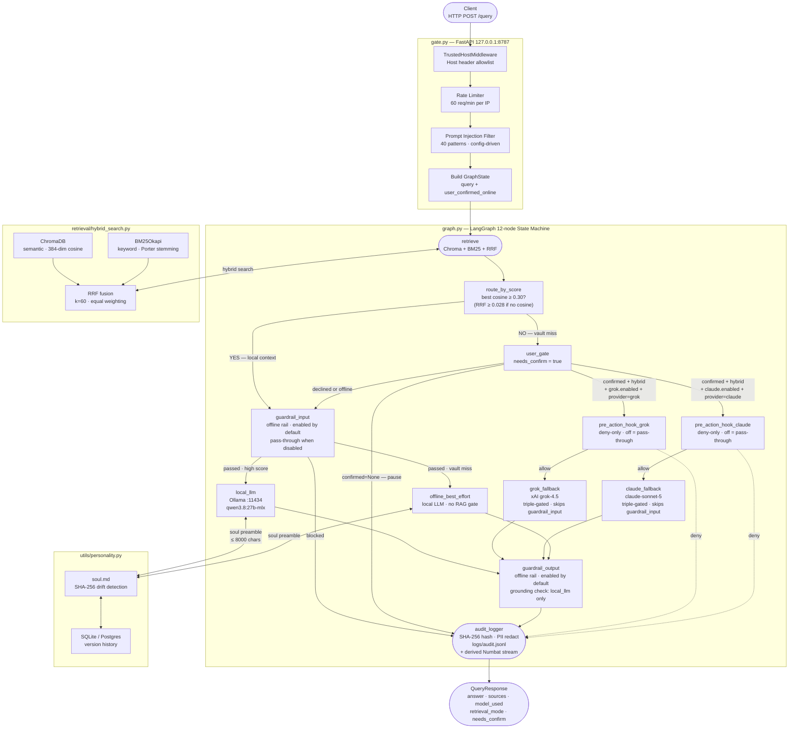

# CyClaw

[](https://www.python.org/)
[](https://fastapi.tiangolo.com/)
[](https://github.com/langchain-ai/langgraph)
[](https://github.com/cgfixit/CyClaw/actions/workflows/ci.yml)

[](https://github.com/cgfixit/CyClaw/tree/main/docs/screenshots)

CyClaw answers questions from **your documents on your hardware**. Its
12-node LangGraph starts with retrieval, ends every path in the audit log,
and requires per-question consent for paid Grok or Claude fallback. The
server binds to `127.0.0.1:8787`.

- Embeddings, BM25, and the cross-encoder run locally on CPU. Cache both
  retrieval models before going offline.
- Soul, ops, memory, and audit routes require [operator access](#api-key-setup-soul-mutations).
  Key-based credentials fail closed without `CYCLAW_API_KEY`; an enabled
  admin's login also works when per-user auth is on.
- Audit records hash questions by default; the spend ledger records billed
  tokens. `cyclaw-metrics` reads both offline.
- Guardrails (with NeMo in every base install), the Numbat stream, and the
  spend ledger ship on. Auth, memory, connectors, the agentic loop, and
  Telegram/X channels ship off.

CyClaw serves one trusted operator or a mutually trusted group with auth
enabled. It provides neither tenant isolation nor a microVM.
See the [threat model](docs/THREAT_MODEL.md).

## Table of Contents

- [Quick Start](#quick-start)
- [For newcomers](#for-newcomers)
- [What It Does](#what-it-does)
- [Architecture](#architecture)
- [Installation](#installation)
- [API Key Setup (Soul Mutations)](#api-key-setup-soul-mutations)
- [Per-User Authentication](#per-user-authentication)
- [Spend Tracking](#spend-tracking)
- [Benchmarks and Evals](#benchmarks-and-evals)
- [Current development](#current-development)
- [Optional layers](#optional-layers)
- [Security Model](#security-model)
- [Project Structure](#project-structure)
- [Documentation Map](#documentation-map)
- [License](#license)

Step-by-step installs and every REST call: [Full Setup Guide](setup-guide.md).

---

## Quick Start

**macOS (Apple Silicon)** — install, keys, Ollama, index, and startup:

```bash
git clone https://github.com/cgfixit/CyClaw && cd CyClaw
bash macos/setup-cyclaw.sh
```

**Linux** — Ollama already running on `127.0.0.1:11434`:

```bash
git clone https://github.com/cgfixit/CyClaw && cd CyClaw
python3.12 -m venv .venv && source .venv/bin/activate
pip install torch==2.13.0+cpu --index-url https://download.pytorch.org/whl/cpu
pip install -r requirements.txt -r requirements-test.txt -c constraints.txt --ignore-installed PyYAML
ollama pull qwen3.8:27b-mlx
export CYCLAW_API_KEY="$(openssl rand -hex 20)"  # operator routes; /query uses sessions/tokens when auth is on
python -m retrieval.indexer                      # once; without this, /query is 503
python gate.py                                   # http://127.0.0.1:8787
```

**Windows** uses the same pins (`py -3.12 -m venv .venv`,
`.\.venv\Scripts\Activate.ps1`). [Windows](setup-guide.md#windows-powershell)
and [Linux](setup-guide.md#linux-bash).

Confirm: `curl http://127.0.0.1:8787/health`, then open
`http://127.0.0.1:8787/`.

Updating an existing environment? Rerun the install, then follow the
[NeMo verification](setup-guide.md#verify-the-installed-nemo-runtime).

> **Manual macOS install:** there is no `+cpu` torch wheel for macOS; use
> plain `torch==2.13.0` per [macOS (Apple Silicon)](setup-guide.md#macos-apple-silicon).

---

## For newcomers

**Python and install paths.** Use Python 3.12 (`>=3.12,<3.13`), not an
unversioned `python3` that may resolve to 3.11; `.venv` needs no admin
rights. Choose [native macOS](macos/README.md), [Windows](powershell/README.md),
the Linux Quick Start, or [Docker](docs/DOCKER.md) (`linux/amd64`, publish on
`127.0.0.1` only, and create the bind directories first). `pip install -e .`
adds the `cyclaw-*` commands; the `python -m …` forms always work.

**Secrets.** `gate.py` reads environment variables, never dotenv files.
`Invoke-CyClaw.ps1` reads non-secret settings from the first owner-only
file found, preferring `%USERPROFILE%\.CyClaw\.env` over a checkout dotenv.

**Secret persistence.** The setup paths have different operations:

| Platform | Setup | Operation | Default secret store | Plaintext opt-in |
|---|---|---|---|---|
| macOS | `macos/setup-cyclaw-keys.sh` | Set up or preserve gateway key | Keychain | `--write-env-file` |
| Windows | `powershell/Install-CyClaw.ps1` | Migrate existing plaintext secrets | Credential Manager | `-WriteEnvFile` |

Plaintext secret lines require the platform's explicit opt-in. Services read
secrets at execution through `macos/cyclaw-keychain-env.sh` or
`powershell/CyClaw-CredMan-Env.ps1`, never from dotenv, plist, task XML,
`config.yaml`, shell rc files, or argv. A missing provider key leaves that
provider unavailable, not the server down. [Provider keys](spend/README.md#api-keys).

**Offline and hybrid.** Shipped `app.mode: hybrid` permits a paid call only
when the selected provider is enabled, available, and confirmed for that
one request; confirmation is never persisted. Set `app.mode: offline` or
decline to stay local. Model downloads are separate from that consent:
after indexing, `models.embeddings.offline_after_index: true` forces local
files, and the ~91 MB reranker loads on the first query, so cache it first.

**Ports.** Gateway `127.0.0.1:8787` (`api.port`, launcher override
`CYCLAW_GATE_PORT`), Ollama `127.0.0.1:11434`, optional local failover off by
default. The old `:8790` coding console is now the separate
[CG-agent-harness](https://github.com/cgfixit/CG-agent-harness).

**First-run checks and limits.**

- Without an index, `/query` returns `503 INDEX_NOT_FOUND`. Run
  `python -m retrieval.indexer`, or use the browser's `POST /index/build`
  (loopback, same-origin, no forwarding headers; operator access once
  `CYCLAW_API_KEY` is set) and watch `GET /index/status`.
- `/health` reporting `degraded` usually means Ollama is down, not a crash.
  `TELEMETRY KILL` at startup is expected. `/auth/*` returns 503 while auth is off.
- The 60/min per-IP rate limit resets on restart unless
  `api.rate_limit.persist_path` or a Postgres DSN is set. `/health` and
  `/index/status` are public and not rate-limited.
- Browser CORS allows `http://127.0.0.1:8787` and `http://localhost:8787`;
  `/query` always rejects cross-site requests.
- Restart the gateway after editing sanitizer config (it is cached).
  `CYCLAW_EMBED_CACHE_SIZE` (default 2048) is an env var, not a YAML key.

Check policy offline with
`python .claude/skills/invariant-guard/check_invariants.py`; unit tests run
with `GROK_API_KEY=dummy python -m pytest tests/ -q --tb=short` and no live provider.

**Local records.** Paths are relative to the repository. Directory ignore checks
use representative children (`logs/evals/doc-sync-probe.json` and `index/bm25.json`),
not a guarantee about every possible descendant.

| Path | Git status | Contents and behavior |
|---|---|---|
| `logs/audit.jsonl` | ignored | Authoritative audit, written synchronously on the request thread. Questions are SHA-256 hashes by default, including when `logging.audit_fields` is absent or empty. Explicit `include_query_hash: false` stores redacted query text |
| `logs/spend.jsonl` | ignored | Tokens for billed Grok/Claude calls, without query text or prices |
| `logs/numbat-events.ndjsonl` | ignored | Derived redacted audit and out-of-band events; observation only |
| `logs/cyclaw.log` | ignored | Application log; a bounded writer drops records rather than holding a request on stalled I/O |
| `logs/evals/` | ignored | Opt-in dogfood and judge output, separate from production billing |
| `index/` | ignored | Chroma and `bm25.json`; rebuild after corpus changes |
| `data/personality/soul.md` | tracked | Changes appear in `git status` and broad staging |
| `data/personality/cyclaw_soul.db` | ignored | Version DB; not yet generated in a clean checkout |
| `data/personality/soul.md.bak` | ignored | Vetted backup; not yet generated in a clean checkout |

Day-two commands:

```bash
python -m metrics                           # spend, audit aggregates, sequences
python -m retrieval.clear_cache             # dry-run; --apply deletes .emb_cache
python -m retrieval.indexer                 # rebuild after editing data/corpus/
curl -s http://127.0.0.1:8787/index/status   # build progress
```

---

## What It Does

CyClaw retrieves Markdown and `.txt` documents before generation. The
enabled output rails enforce a token-overlap floor for retrieved local
answers. This heuristic does not verify individual factual claims; the
separate [evals](docs/EVALS.md) measure answer quality.

1. **Retrieval first.** `retrieve` starts the 12-node graph. A miss can still
   reach `offline_best_effort` with partial context.
2. **Hybrid search.** ChromaDB and BM25 fuse through RRF (`retrieval.rrf_k`).
   A vault hit needs the best cosine to clear `retrieval.min_semantic_score`;
   without cosines, the fused score must clear the RRF-scale
   `retrieval.min_score`. The cross-encoder runs in shadow mode
   (`retrieval.min_rerank_score: null` audits `rerank_best`, vetoes nothing).
   [Retrieval reference](retrieval/README.md).
3. **Local generation.** Ollama runs `models.local_llm.model`, shipped as
   `qwen3.8:27b-mlx`. Tunables live in `config.yaml`.
4. **Governed soul.** `data/personality/soul.md` has SHA-256 drift detection
   and atomic writes. `POST /soul/apply` requires a human `reason` and an
   enforced injection scan. Restore, `/soul/reload`, and startup drift
   recovery are the documented unscanned or advisory exceptions; a missing
   soul self-initializes. [Soul invariants](INVARIANTS.md), Rules 4–5.
5. **Confirmed external fallback.** Grok (`grok-4.5`, `api.x.ai`) or Claude
   (`claude-sonnet-5`, `api.anthropic.com`) requires hybrid mode, that
   provider enabled, and `user_confirmed_online: true` on the request.
   Calls share the remaining `api.graph_timeout_sec` budget, and
   `utils/endpoint_trust.py` rejects rewritten provider URLs.
6. **HTTP and MCP.** FastAPI serves the browser at `/`. The separate MCP
   server exposes sanitized retrieval only (`sampling: None`, no generation).
7. **Audit convergence.** All eleven upstream nodes reach `audit_logger`
   before END. `cyclaw-metrics` reads the audit offline.

[The six invariants](INVARIANTS.md) cover retrieval-first entry, topology,
external consent, audit convergence, soul governance, and import isolation.
Core modules do not import `agentic`, `sync`, `guardrails`, `telegram`, or
`opentweet`; the invariant checker enforces that boundary.

**Storage and console.** `indexing.vector_backend` defaults to embedded
`chroma` (optional `pgvector`); BM25 is JSON, never pickle.
`static/terminal.html` provides queries, index progress, Soul, Sync,
Agentic, Filesystem, and SQL panels, plus Users and Audit when auth is on.

### Optional layers at a glance

| Layer | Purpose | Ships |
|---|---|---|
| [Per-user auth](#per-user-authentication) | Passwords, sessions, device tokens, and roles | off |
| [Memory](docs/memory/README.md) | SQLite/FTS5 facts and episodes, propose/apply, optional retrieval fusion and HTML export. Consolidation remains an inert stub | off |
| [NeMo Guardrails](#nemo-guardrails) | Deny-only input/output checks, deterministic fallback on NeMo failure | on; NeMo installed with base dependencies |
| [Dropbox sync](docs/SYNC_README.md) | Out-of-band `rclone` corpus pull | CLI |
| [Connectors](agentic/README.md) | Scoped filesystem, SELECT-only SQL, passive LAN inventory | off |
| [Agentic loop](docs/agentic/AGENTIC_README.md) | GitHub context, skills, clone/plan/patch/verify, human decisions | off |
| [Telegram](docs/channels/TELEGRAM_DESIGN.md) / [OpenTweet](docs/channels/OPENTWEET_DESIGN.md) | Phone remote and X drafts through loopback `/query` | off |
| [Numbat stream](docs/security-philosophy/numbat_secondary_evaluator.md) | Derived NDJSON, observation only | on |
| [Pre-action hook](docs/security-philosophy/numbat_pre_action_gate.md) | Deny-only gate before a confirmed external call | off |
| [Spend ledger](#spend-tracking) | Billed token counts | on |
| [Fine-tune kit](tools/lora_finetune/README.md) | Separate QLoRA toolkit | toolkit |

---

## Architecture

`gate.py` initializes the soul at startup. Requests pass the Host allowlist,
applicable authentication, a **60/min per-IP limit before injection filtering**,
and the config-driven filter before entering the graph as `GraphState`.
Graph edges control routing. [Operating contract](CLAUDE.md) and
[security invariants](INVARIANTS.md).


```mermaid
flowchart TD
    A(["Client\nHTTP POST /query"])
    A --> B

    subgraph GATEWAY ["gate.py — FastAPI 127.0.0.1:8787"]
        B["TrustedHostMiddleware\nHost header allowlist"]
        B --> C["Rate Limiter\n60 req/min per IP"]
        C --> D["Prompt Injection Filter\n40 patterns · config-driven"]
        D --> E["Build GraphState\nquery + user_confirmed_online"]
    end

    E --> F

    subgraph GRAPH ["graph.py — LangGraph 12-node State Machine"]
        F(["retrieve\nChroma + BM25 + RRF"])
        F --> G["route_by_score\nbest cosine ≥ 0.30?\n(RRF ≥ 0.028 if no cosine)"]
        G -->|"YES — local context"| X["guardrail_input\noffline rail · enabled by default\npass-through when disabled"]
        X -->|"blocked"| L
        X -->|"passed · high score"| H["local_llm\nOllama :11434\nqwen3.8:27b-mlx"]
        G -->|"NO — vault miss"| I["user_gate\nneeds_confirm = true"]
        I -->|"confirmed + hybrid\n+ grok.enabled + provider=grok"| PG["pre_action_hook_grok\ndeny-only · off = pass-through"]
        PG -->|"allow"| J["grok_fallback\nxAI grok-4.5\ntriple-gated · skips guardrail_input"]
        I -->|"confirmed + hybrid\n+ claude.enabled + provider=claude"| PC["pre_action_hook_claude\ndeny-only · off = pass-through"]
        PC -->|"allow"| W["claude_fallback\nclaude-sonnet-5\ntriple-gated · skips guardrail_input"]
        I -->|"declined or offline"| X
        X -->|"passed · vault miss"| K["offline_best_effort\nlocal LLM · no RAG gate"]
        I -->|"confirmed=None — pause"| L
        H --> Y["guardrail_output\noffline rail · enabled by default\ngrounding check: local_llm only"]
        J --> Y
        W --> Y
        K --> Y
        Y --> L
        PG -.->|"deny"| L
        PC -.->|"deny"| L
        L(["audit_logger\nSHA-256 hash · PII redact\nlogs/audit.jsonl\n+ derived Numbat stream"])
    end

    L --> M(["QueryResponse\nanswer · sources · model_used\nretrieval_mode · needs_confirm"])

    subgraph RETRIEVAL ["retrieval/hybrid_search.py"]
        N["ChromaDB\nsemantic · 384-dim cosine"]
        O["BM25Okapi\nkeyword · Porter stemming"]
        P["RRF fusion\nk=60 · equal weighting"]
        N --> P
        O --> P
    end

    F <-->|"hybrid search"| P

    subgraph SOUL ["utils/personality.py"]
        Q["soul.md\nSHA-256 drift detection"]
        R["SQLite / Postgres\nversion history"]
        Q <--> R
    end

    H <-->|"soul preamble\n≤ 8000 chars"| Q
    K <-->|"soul preamble"| Q
```

The MCP server calls the retriever directly after sanitization and never
enters this gateway or graph. The diagram omits the per-answer NeMo
`check()` and the post-graph CEL monitor; see [Optional layers](#optional-layers).

---

## Installation

Platform steps, Docker, conda (`environment.yml`), and first index:
[`setup-guide.md`](setup-guide.md). macOS installs plain `torch==2.13.0`;
Windows and Linux use the `+cpu` wheel. Scripts:
[`macos/README.md`](macos/README.md),
[`powershell/README.md`](powershell/README.md). Image:
[`docs/DOCKER.md`](docs/DOCKER.md).

---

## API Key Setup (Soul Mutations)

`/soul/*`, `/ops/*`, `/memory/*`, `/query/export/html`, and `/audit/summary`
require operator access. `/health` is public; `/query` requires a session
or device token when `auth.enabled` is true. Operator credentials are:

- **Bearer `CYCLAW_API_KEY`**, for HTTP clients and scripts. Comparison is
  `hmac.compare_digest`.
- **The console cookie.** "Unlock operator tools" trades the key once for
  an HttpOnly, `SameSite=Strict` cookie (`security.console_session_ttl_sec`,
  12 h shipped). "Lock" deletes it; rotating the key revokes every cookie.
- **An admin login**, when `auth.enabled` is on (no key needed).
  `operator` and `audit` accounts do not get operator access.

Cookie writes need CSRF tokens and cookies reject cross-site requests.
Without `CYCLAW_API_KEY`, Bearer and console-cookie access fail closed.

`macos/invoke-cyclaw.sh` and `powershell\Invoke-CyClaw.ps1` generate a
missing key into the OS keystore and open a single-use `#pair=...` unlock
link (5 minutes). To unlock by hand, copy the key into the dialog:

```bash
# macOS
security find-generic-password -a "$(whoami)" -s com.cgfixit.cyclaw.api-key -w | pbcopy
```

```powershell
# Windows, from the CyClaw folder
. .\powershell\CyClaw-SecretStore.ps1; (Read-CyclawCredential com.cgfixit.cyclaw.api-key).Secret | Set-Clipboard
```

Do not persist the key with `setx` or a user environment variable; the
launchers read it from the keystore into the gateway process only
([`powershell/README.md`](powershell/README.md#secret-classification)).
Rotation and the macOS bootstrap:
[`macos/README.md`](macos/README.md#key-bootstrap)
([401 recovery](macos/README.md#401--key-drift-recovery)).

`security.api_key_optional` ships `false`. When set, a request skips the key
only if the socket peer is loopback, no forwarding header is present, and
the request is not cross-site; under Docker NAT it is inert.
[`INVARIANTS.md`](INVARIANTS.md) Rule 6 and the
[threat model](docs/THREAT_MODEL.md) (eighteenth amendment) hold the full boundary.

## Per-User Authentication

Separate from the operator API key. `gate_auth.py`: scrypt passwords, a
session cookie plus CSRF for browsers, named device tokens for scripts,
roles `admin`, `operator`, and `audit`. Ships `auth.enabled: false`. While
off, every `/auth/*` route returns 503. Design, TLS, and the non-loopback
bind rule: [`docs/AUTHENTICATION_DESIGN.md`](docs/AUTHENTICATION_DESIGN.md).
First-boot `curl` and `cyclaw-user`:
[`setup-guide.md`](setup-guide.md#authentication-routes-auth-off-by-default).
`cyclaw-gen-cert` writes a self-signed cert for the auth + TLS bind exception.

---

## Spend Tracking

Billed Grok/Claude calls append tokens to `logs/spend.jsonl`. Dollars are
computed at read time, so rate-card corrections re-price history. Rows
exclude queries, prompts, and keys. Write failures warn and drop the row
without failing the answer.

| `source` | Writer | Covers |
|---|---|---|
| `query` | `llm/client.py` | Confirmed `/query` fallback |
| `agentic` | `agentic/deepagent_github/chat_client.py` | Out-of-band planner calls |
| `eval` | `tests/judge_eval.py` | Opt-in judge runs, kept separately under `logs/evals/` |

`python -m metrics` reports `today` and `last_7d` tokens and USD by provider
and source, with vendor-reported costs alongside table prices. Its forensic
Sequences section flags a blocked injection followed within 15 minutes by a
paid call; it enforces no policy. `tests/spend_live_probe.py` **spends real
money** and is opt-in only. [Ledger schema, rate bands, and probes](spend/README.md).

---

## Benchmarks and Evals

Only the retrieval gate blocks merges. These four evaluation paths are
neither graph nodes nor security controls. [Thresholds and limits](docs/EVALS.md).

| Evaluation | Command | Scope |
|---|---|---|
| Retrieval gate | `python -m tests.ci_rag_smoke` | Every PR, no LLM. Corpus probes through `route_by_score_node`, then hit@5, Recall@5, and MRR on 8 documents and 52 fixture cases. Metric floors and `[FILTERED]` injection-chunk assertions block CI |
| Local dogfood | `CYCLAW_EVAL_DOGFOOD=1 python scripts/cyclaw-eval-dogfood.py` | Opt-in real loopback model, one case per category. [Recipe](tests/fixtures/groundedness/DOGFOOD.md) |
| Anthropic judge | `CYCLAW_EVAL_LIVE=1 python tests/judge_eval.py` | Paid opt-in Claude grades groundedness, completeness, and abstention |
| Local judge | Same command with `evals.local_judge.enabled: true` | Same rubric on a second loopback model from a different family |

Fixture retrieval reached 1.0 for hit@5, Recall@5, and MRR; that is not a
claim about arbitrary corpora. The
[reranker bake-off](docs/audits/2026-09-26-reranker-bakeoff.md) found no
passing threshold, so vetoing stays off. The one published local run is the
[Qwen dogfood audit](docs/audits/2026-09-12_Local_Qwen_Dogfood_Matrix.md);
no judge-plane result has been published.

---

## Current development

This README was checked against [`origin/main` at `609e87c6`](https://github.com/cgfixit/CyClaw/commit/609e87c63926a6bfe2aad0007fd631879f263821)
on 2026-10-04, with #1543 and #1544 assumed merged. Recent changes:

| PR | Change |
|---|---|
| [#1543](https://github.com/cgfixit/CyClaw/pull/1543), [#1544](https://github.com/cgfixit/CyClaw/pull/1544) | Clean up temp files after failed agentic atomic writes; remove dead and test-only code (the guardrails threshold setter is now a constant) |
| `5d2c8259`, `609e87c6` | Install and verify NeMo in every base profile; isolate the offline NeMo acceptance check in a container |
| [#1539](https://github.com/cgfixit/CyClaw/pull/1539) | Numbat Track A acceptance: prepared `engine: numbat` hook contract and real CLI/CEL/NeMo checks ([record](docs/audits/2026-10-03-numbat-track-a.md)) |
| [#1537](https://github.com/cgfixit/CyClaw/pull/1537) | Docker requires prepared bind directories ([`docs/DOCKER.md`](docs/DOCKER.md)) |
| [#1536](https://github.com/cgfixit/CyClaw/pull/1536), [#1538](https://github.com/cgfixit/CyClaw/pull/1538) | Align dependency installation contracts; keep the patched LoRA dependency guidance |
| [#1534](https://github.com/cgfixit/CyClaw/pull/1534), [#1535](https://github.com/cgfixit/CyClaw/pull/1535) | Guardrails on by default with deterministic fallback on all four answer routes; docs synced |
| [#1527](https://github.com/cgfixit/CyClaw/pull/1527), [#1528](https://github.com/cgfixit/CyClaw/pull/1528) | Harden workspace Git calls; reject proxied index builds and gate them on the key once set |


---

## Optional layers

Master switches default off except NeMo Guardrails, the local Numbat stream, and the spend ledger.

**Dropbox sync.** `rclone` pulls into `data/corpus/` outside the request
path, bounded by `max_delete`, `max_transfer`, and a single-instance lock;
exit code 10 signals a reindex. Run `python -m sync.cli setup`, then `test`,
`sync --dry-run`, `sync`, `status`, or `schedule`.
[Sync guide](docs/%21%20How-To-Guides/Dropbox_Sync_Guide.md) and
[CLI reference](docs/SYNC_README.md).

**Native scheduling.** Generators write plist/task files and print load
commands; token-bearing jobs use the keystore wrappers. A supervised
gateway (`macos/generate_service_plist.py`, `windows/generate_service_task.py`)
requires `--confirm` and a non-empty `--reason`. [macOS operations](macos/README.md) and
[launchd design](docs/work/MACOS_LAUNCHD_INTEGRATION_PLAN.md).

**Fine-tuning.** The separate QLoRA kit is excluded from runtime installs;
keep its patched pins and audit it separately. `finetune_qwen38.py` can
download its base checkpoint, so seed caches before a no-egress run. GPU-free
dry run: `python tools/lora_finetune/build_cyclaw_corpus.py`, then
`python tools/lora_finetune/dryrun_finetune.py`. [Toolkit](tools/lora_finetune/README.md).

**Agentic coding.** `agentic.enabled: false` makes the out-of-band CLI a
no-op; writes also need a per-call `reason` and `confirm`, and
`allow_git_write_tools` ships false. `python -m agentic.cli real-repo-run`
clones into a jail, plans, patches, and verifies, then waits for a human
decision before committing; push and draft PR are separate decisions.
Checks run under Linux `unshare --net`, macOS `sandbox-exec`, or Windows Job
Objects and fail closed without them; no platform uses a microVM
([threat model](docs/THREAT_MODEL.md)). `real-repo-run*` is CLI-only
(`POST /ops/agentic` returns 422).

```bash
python -m agentic.cli status
python -m agentic.cli context --repo          # also --pr 123 / --issue 45
python -m agentic.cli propose-skill --name deploy --desc "..." --body-file s.md --reason "draft"
```

[Real-repo loop](agentic/README.md#2-real-repo-coding-loop),
[governed harness](docs/agentic/AGENTIC_README.md#9-governed-github-coding-harness),
and [write rollback](docs/agentic/GITHUB_WRITE_ENABLEMENT.md).

**Connectors.** All three ship off and stay outside the request path:
`fsconnect` (bounded reads; writes gated, refused on Windows), `sqlconnect`
(SELECT/WITH only), and `netconnect` (passive, explicit RFC1918/loopback CIDRs).
[Filesystem](agentic/README.md#5-filesystem-connector),
[SQL](agentic/README.md#6-sql-connector-read-only), and
[passive network](agentic/README.md#7-passive-network-connector).

### NeMo Guardrails

`guardrails.enabled: true` ships in `config.yaml`; explicit `false` or an
absent block disables it. `utils/guardrail_bridge.py` is the only path from
the graph to `guardrails/`, preserving core import isolation.

| Guard | Scope and refusal |
|---|---|
| Offline graph input | Local and best-effort paths. Returns `block_message` through `audit_logger` without a model call |
| Offline graph output | `local_llm` only. Replaces answers below `hallucination_threshold` (0.18) or matching soul-leak markers |
| NeMo `check()` | Wraps all four answer nodes using the required `nemoguardrails==0.24.0` engine. Input refusal skips generation; output refusal replaces the answer |
| Broker fallback | Missing, failed, or unsupported live verdicts run deterministic input and soul-leak checks on every answer route. Grounding remains `local_llm` only |

Active rails are Python checks and add no model calls; NVIDIA's
model-assisted `self_check_*` rails are inactive. NeMo failures audit
`guardrail_degraded`. Existing environments: rerun the install, then
`python -m pip check` and `python -m guardrails.verify_install`. See the
[setup guide](setup-guide.md#verify-the-installed-nemo-runtime),
[package guide](guardrails/README.md), [NeMo reference](docs/NeMo/README.md),
and [Track B verification record](docs/audits/2026-10-03-nemo-track-b.md).

### Numbat

CyClaw calls the external CLI pinned at 0.2.0, schema 0.3.0;
it never vendors or imports it.

| Piece | Switch | Default and behavior |
|---|---|---|
| Stream | `numbat.enabled` | On. `utils/numbat_emitter.py` writes redacted audit/out-of-band events to `logs/numbat-events.ndjsonl`, rolling at 50 MiB to one `.1`. Its bounded writer cannot hold requests |
| Pre-action hook | `policy.fallback.pre_action_hook.enabled` | Off. Prepared with `engine: numbat` and maintained monitor-only rules in `config/numbat/gate/`. After external consent, `rules test --no-builtin-rules` allows monitor matches, denies enforcing matches, and denies every engine failure |
| CEL monitor | `numbat.cel.enabled`, extra `numbat-cel` | Off. Two structured-field rules observe weak-retrieval cloud answers and hook/guardrail refusals after HTTP `/query`. Evaluation is independent of the stream switch; recording matches needs the stream. Never blocks |
| Offline scoring | None | Operator CLI and `numbat-rules.yml`. Fixture, stream-contract, and CEL checks block CI |

Nothing scores the live file during a request. The CLI and CEL extra are
not in standard installs, so keep their switches off until installed:
enabling the hook without the binary denies every confirmed external call.
Trial the maintained rules locally before promoting any to `enforce: true`,
and avoid `numbat hook` as the command engine (it exits 0 on errors).
Once enabled, the hook and CEL report readiness in `/health` (absent while
off); operator-gated `/audit/summary` shows `pre_action_hook_last_verdict`.
[Pre-action gate](docs/security-philosophy/numbat_pre_action_gate.md),
[stream](docs/security-philosophy/numbat_secondary_evaluator.md), and
[phase status](docs/plans/NUMBAT_AND_ALWAYS_ON_ROADMAP.md). The combined
[Track A acceptance record](docs/audits/2026-10-03-numbat-track-a.md) covers
real CLI/CEL/NeMo behavior, browser checks, and the limits of the local trial.

### Telegram and OpenTweet

Disabled by default, both call loopback
`POST /query` outside the core graph imports. Credentials come from the
environment variable named in config, never YAML.

Telegram supports outbound `notify` or long-poll `chat` (no public
webhooks) and requires non-empty `allowed_chat_ids`. Only the exact
`/online on <grok|claude>` command, with `allow_hybrid_confirm` on (default
off), can confirm one paid call; the triple gate still applies. OpenTweet
forces `user_confirmed_online: false` and writes drafts by default. Inspect
either with `python -m telegram.cli status` / `python -m opentweet.cli status`.
[Telegram design](docs/channels/TELEGRAM_DESIGN.md),
[Telegram operations](telegram/README.md),
[OpenTweet design](docs/channels/OPENTWEET_DESIGN.md), and
[OpenTweet operations](opentweet/README.md).

---

## Security Model

| Layer | Mechanism |
|---|---|
| Network | Binds `127.0.0.1:8787`. A non-loopback `api.host` is refused except the documented auth + TLS path, or `CYCLAW_ALLOW_NON_LOOPBACK_BIND` ([bind guard](docs/AUTHENTICATION_DESIGN.md#7-interaction-with-the-main-bind-guard-825)) |
| Endpoint trust | Local nodes: loopback or an exact host in `models.local_llm.trusted_hosts` (ships `[]`). Online nodes: `api.x.ai` and `api.anthropic.com` only |
| Input | `policy.prompt_filter`: 40 `banned_patterns`, `max_input_chars` from config. Same filter on MCP search |
| Rate limit | 60 req/min per IP, before the filter. In-memory unless you set SQLite or Postgres |
| Proxy bypass | `httpx` clients set `trust_env=False` |
| Telemetry | Kill maps before any SDK import (invariant-guard G1), plus ONNX's post-import call. Not a network firewall. [`SECURITY.md`](SECURITY.md), [kill reference](docs/security-philosophy/cyclaw_telemetry_kill.env) |
| Audit | SHA-256 query hash + redacted metadata in `logs/audit.jsonl`, then the derived Numbat stream. `include_query_hash: false` stores redacted query text |
| Grok / Claude | [Triple gate](#what-it-does) item 5, then the opt-in pre-action hook (deny-only once enabled) |
| Soul writes | Human `reason` + enforced scan + atomic replace, on `POST /soul/apply` only. Restore, reload, and drift recovery are the exceptions in [What It Does](#what-it-does) item 4 |
| API key | Fail closed. Bearer key, the browser's console cookie, or (with `auth.enabled`) an admin login; cookie writes need CSRF. The loopback bypass is `security.api_key_optional` plus three more conditions ([API Key Setup](#api-key-setup-soul-mutations)) |
| Guardrails | Enabled by default, deny-only. NeMo failures use deterministic checks and audit `guardrail_degraded`. Never grants routes |
| Optional surfaces | Agentic writes, connectors, channels, and `/memory/*` ship off ([Optional layers](#optional-layers)). `/ops/*` needs operator access and runs subprocess argv lists. No tokens in plist or task XML |
| `/auth/*` | Present either way; 503 while auth is off. When on, `/query` needs a session or device token. Last `admin` cannot be removed |
| Container | Non-root, `no-new-privileges`, dropped caps, read-only rootfs. Optional Falco (`deploy/falco/`) ships off |
| Dependency risk | `chromadb==1.5.9` carries CVE-2026-45829, accepted only for embedded `PersistentClient`. [`SECURITY.md`](SECURITY.md) |

Full threat model: [`docs/THREAT_MODEL.md`](docs/THREAT_MODEL.md). Design
notes: [`docs/security-philosophy/`](docs/security-philosophy/).

---

## Project Structure

```text
CyClaw/
├── gate.py                 # FastAPI gateway
├── gate_ops.py             # /ops/* subprocess shims
├── gate_auth.py            # /auth/*
├── gate_memory.py          # /memory/* + /query/export/html
├── graph.py                # 12-node LangGraph
├── metrics.py              # cyclaw-metrics: audit + spend + sequences
├── mcp_hybrid_server.py    # retrieval-only MCP
├── config.yaml             # tunables
├── retrieval/              # indexer, hybrid search, embeddings, rerank,
│                           # vector_store (Chroma or pgvector), clear_cache
├── llm/client.py           # local, Grok, Claude
├── memory/                 # optional facts + episodes (default off)
├── agentic/                # GitHub context, real-repo loop, executor,
│                           # fsconnect / sqlconnect / netconnect
├── guardrails/             # default-on rails, reached only via guardrail_bridge
├── telegram/  opentweet/   # optional channels, shipped off
├── sync/                   # optional Dropbox pull
├── utils/                  # sanitizer, logger, personality, spend,
│                           # sequence_detect, numbat_*, endpoint_trust,
│                           # authn*, console_session, telemetry_kill, onnx_telemetry
├── macos/  powershell/  windows/   # native installers and schedulers
├── spend/                  # ledger reference
├── schemas/  static/  tests/  docs/  deploy/
├── tools/lora_finetune/    # operator QLoRA kit, not a runtime extra
└── .github/workflows/
```

`data/corpus/` is the shipped sample corpus. `data/personality/soul.md` is
the live soul. `data/agentic/skills_registry.json` ships empty.

---

## Documentation Map

| Read this | When you want |
|---|---|
| [`setup-guide.md`](setup-guide.md) | Install paths, Docker, conda, and every REST call |
| [`INVARIANTS.md`](INVARIANTS.md) | I1–I6, what is code vs convention, and the test that pins each |
| [`CLAUDE.md`](CLAUDE.md) / [`AGENTS.md`](AGENTS.md) | Request-path map and the rules agents work under |
| [`SECURITY.md`](SECURITY.md) | Egress, accepted CVEs, disclosure |
| [`docs/THREAT_MODEL.md`](docs/THREAT_MODEL.md) | Scope, bind exceptions, amendments (including the removed harness) |
| [`docs/AUTHENTICATION_DESIGN.md`](docs/AUTHENTICATION_DESIGN.md) | Per-user auth |
| [`docs/DOCKER.md`](docs/DOCKER.md) | GHCR image and compose hardening |
| [`docs/EVALS.md`](docs/EVALS.md) | The four eval planes and their floors |
| [`spend/README.md`](spend/README.md) | Ledger schema and live probes |
| [`docs/memory/README.md`](docs/memory/README.md) | Facts, episodes, propose/apply, and the inert consolidation stub |
| [`retrieval/README.md`](retrieval/README.md) | Hybrid search, the cosine gate, and the shadow reranker |
| [`docs/security-philosophy/`](docs/security-philosophy/) | Telemetry suppression, offline operation, and Numbat designs |
| [`guardrails/README.md`](guardrails/README.md) / [`docs/NeMo/README.md`](docs/NeMo/README.md) | Rail semantics and what is display-only |
| [`docs/agentic/AGENTIC_README.md`](docs/agentic/AGENTIC_README.md) | Real-repo loop, exit codes, and the write gate |
| [`macos/README.md`](macos/README.md) / [`powershell/README.md`](powershell/README.md) | Keychain, Credential Manager, 401 recovery |

---

## License

Source-available, all rights reserved; personal use is permitted. See
[`LICENSE`](LICENSE).

*Designed and built by Chris Grady, with AI tooling used under human review,
CI, and the invariant guard.*
