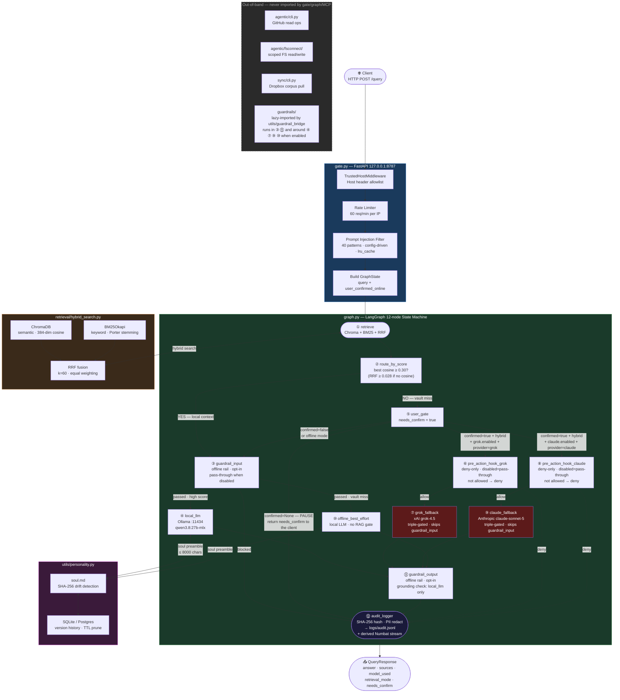

# CyClaw

[](https://www.python.org/)
[](https://fastapi.tiangolo.com/)
[](https://github.com/langchain-ai/langgraph)
[](https://github.com/cgfixit/CyClaw/actions/workflows/ci.yml)

[](https://github.com/CGFixIT/CyClaw/tree/main/docs/screenshots)

CyClaw is a local RAG / chatbot / research server for **your own documents, on
your own hardware**: hybrid retrieval over a local Markdown corpus, a local
model answering from it, and safety rules written into the graph that routes
each request — not into a prompt asking a model to behave. It binds to
`127.0.0.1:8787`, answers locally by default, and treats any paid-provider call
as an exception you confirm per question and can account for afterwards, token
by token.

**What that means in practice**

- **Local answers use local models.** The embedding model and enabled
  reranker each need a cached Hugging Face snapshot. Their bootstrap downloads
  are separate from per-question consent for Grok or Claude.
- **Policy is topology.** Retrieval is the graph's unconditional entry node,
  every path converges on the audit logger, and the online-provider gate is a
  graph edge — checkable in code, not a prompt someone can forget.
- **Paid calls are opt-in and ledgered.** Three independent conditions must
  hold before Grok or Claude is called; every billed call appends token counts
  to a local ledger, with dollars derived at read time so a rate-card fix
  re-prices history instead of baking in errors.
- **Everything else ships off.** Per-user auth, memory, guardrails, local-data
  connectors, the agentic coding loop, and the Telegram/X channels sit behind
  master switches that ship disabled.

**Scope.** CyClaw is a trusted-operator, loopback-bound, single-tenant server —
one operator by default, or a small mutually-trusted group once `auth.enabled`
is on. Not multi-tenant. The full threat model, including what the sandbox
does *not* cover (no microVM by design), is
[`docs/THREAT_MODEL.md`](docs/THREAT_MODEL.md).

## Table of Contents

**Getting started**

- [Quick Start](#quick-start)
- [What It Does](#what-it-does)
- [Architecture](#architecture)
- [Installation](#installation)
- [Full Setup Guide](setup-guide.md) — every platform, Docker, every REST endpoint with `curl`

**Configuration and access**

- [API Key Setup (Soul Mutations)](#api-key-setup-soul-mutations)
- [Per-User Authentication](#per-user-authentication)

**Operating it**

- [Spend Tracking](#spend-tracking)
- [Benchmarks and Evals](#benchmarks-and-evals)
- [Dropbox Corpus Sync](#dropbox-corpus-sync)
- [macOS launchd & Keychain](#macos-launchd--keychain)
- [Local Model Fine-Tuning](#local-model-fine-tuning)

**Optional layers** (master switches ship disabled, except the Numbat stream; each section names its enablement gates)

- [Optional layers at a glance](#optional-layers)
- [Agentic Layer](#agentic-layer)
- [Agentic Coding Loop (GitHub)](#agentic-coding-loop-github)
- [Filesystem, SQL & Passive Network Connectors](#filesystem-sql--passive-network-connectors)
- [NeMo Guardrails](#nemo-guardrails)
- [Numbat](#numbat)
- [Telegram Channel](#telegram-channel)
- [OpenTweet Channel](#opentweet-channel)

**Reference**

- [Security Model](#security-model)
- [Project Structure](#project-structure)
- [Documentation Map](#documentation-map)
- [License](#license)

---

## Quick Start

**macOS (Apple Silicon)** — the onboarding script handles installation, keys,
Ollama, indexing, and startup:

```bash
git clone https://github.com/CGFixIT/CyClaw && cd CyClaw
bash macos/setup-cyclaw.sh
```

**Linux** — manual path (Ollama must already be running on `:11434`):

```bash
git clone https://github.com/CGFixIT/CyClaw && cd CyClaw
python3.12 -m venv .venv && source .venv/bin/activate
pip install torch==2.13.0+cpu --index-url https://download.pytorch.org/whl/cpu
pip install -r requirements.txt -r requirements-test.txt -c constraints.txt --ignore-installed PyYAML
ollama pull qwen3.8:27b-mlx
export CYCLAW_API_KEY="$(openssl rand -hex 20)"  # needed for the /soul/* and /ops/* endpoints
python -m retrieval.indexer                      # builds the retrieval index, once
python gate.py                                   # → http://127.0.0.1:8787
```

**Windows** uses the same dependency pins with PowerShell activation
(`py -3.12 -m venv .venv`, `.\.venv\Scripts\Activate.ps1`); see
[Windows](setup-guide.md#windows-powershell) and
[Linux](setup-guide.md#linux-bash) in the setup guide.

Confirm it's alive: `curl http://127.0.0.1:8787/health`, then open
`http://127.0.0.1:8787/` for the browser console.

> **Manual macOS install differs in one step.** The `+cpu` torch wheel does not
> exist for macOS, so torch installs plain (`torch==2.13.0`) from stripped
> copies of `requirements.txt` and `constraints.txt`. Exact commands:
> [macOS (Apple Silicon)](setup-guide.md#macos-apple-silicon).

---

## What It Does

CyClaw answers questions from your documents using a local model reading a
local index. Graph edges enforce retrieval and paid-provider consent. Model
bootstrap and separately enabled connectors have their own network behavior.

> **Cache both retrieval models for offline use.** `retrieval/embeddings.py`
> and the enabled `retrieval/rerank.py` can fetch missing Hugging Face models.
> Building the index loads only the embedder; the reranker loads on a query.
> Cached snapshots load with `local_files_only=True`. With a completed index,
> `models.embeddings.offline_after_index: true` forces both loaders to use
> local files, even when a snapshot is missing. An unavailable reranker leaves
> the cosine gate in control and sets `rerank_degraded` in the audit record.
> These model downloads do not use `user_confirmed_online`.

### The core — always present, no switches involved

1. **Retrieval comes first, unconditionally.** `retrieve` is the entry node of
   the 12-node LangGraph state machine in `graph.py`; no model call can
   precede it. Edges enforce retrieval and provider selection, not groundedness
   — `offline_best_effort` can answer from partial context after a vault miss.
2. **Hybrid search over your Markdown corpus.** ChromaDB semantic vectors plus
   BM25 keyword ranking, fused by RRF (`retrieval.rrf_k`), both local and
   CPU-only. The gate considers the chunks in the local context window. A query
   whose best semantic match there is below `retrieval.min_semantic_score`
   (or, with no semantic scores, whose top fused
   hit is below `retrieval.min_score`) routes to a user gate. The enabled
   cross-encoder scores retrieved context in shadow mode because
   `retrieval.min_rerank_score` ships `null`; it records scores without vetoing
   a hit. A numeric threshold can reject a hit, but cannot promote a miss.
   See the [retrieval guide](retrieval/README.md) for the measured limits.
3. **A local model by default.** Ollama serving `models.local_llm.model`
   (shipped: `qwen3.8:27b-mlx`). Context budget, generation cap, and every
   timeout are `config.yaml` values — nothing tunable is hardcoded.
4. **A governed personality layer.** `data/personality/soul.md`, SHA-256 drift
   detection, atomic writes. `POST /soul/apply` requires a human `reason` and
   an enforced injection scan; `POST /soul/restore` re-adopts vetted `.bak`
   content under only an advisory scan; a missing file self-heals at boot.
   Governed — neither frozen nor self-editable.
5. **Online fallback, triple-gated per question.** A paid Grok (xAI) or Claude
   (Anthropic) call fires only when **all three** hold: `app.mode: hybrid`
   **and** the provider's own `enabled` flag **and** a per-request
   `user_confirmed_online: true` — never persisted, never carried forward. The
   provider is chosen per query via `online_provider`. Both ship
   `enabled: true`, so the per-question confirmation is the gate actually
   holding the line — not a server-enforced challenge (a client can send
   `true` on its first call), but *something* still has to assert it every
   time. Outbound calls are also capped by the remaining
   `api.graph_timeout_sec` budget. "Triple-gated" below always means this gate.
6. **Two front doors.** A FastAPI gateway at `127.0.0.1:8787` (browser console
   at `/`) and a retrieval-only MCP server (`mcp_hybrid_server.py`,
   `sampling: None`) — search only, no model path.
7. **An audit trail that hashes the question.** All eleven upstream paths
   converge on `audit_logger` before END, writing a SHA-256 query hash plus
   PII-redacted metadata to `logs/audit.jsonl`; `cyclaw-metrics` reads it
   offline. `logging.audit_fields.include_query_hash: false` stores raw query
   text instead (privacy-affecting, per `utils/logger.py`'s own docstring).

### Where the invariants are enforced

Enforced in four places: **graph topology** (entry, routing, audit
convergence), **`gate.py` construction** (two of the three external-provider
gates — only per-request confirmation is decided in the graph),
**`utils/personality.py`** (the soul reason gate and atomic write), and
**import structure** (module isolation, invariant **I6**).
`python3 .claude/skills/invariant-guard/check_invariants.py` asserts all six
invariants plus five guards statically; [`INVARIANTS.md`](INVARIANTS.md)
records which are code-enforced vs. conventional, and the test pinning each.

### Optional layers

Three kinds: **route modules** on the gateway (per-user auth, memory),
**in-path utilities** in `utils/` that run inside the request path (the
Numbat stream and the spend ledger ship **on**, since each only writes a local
file; the pre-action hook and the CEL monitor ship off), and **I6-isolated
subsystems**, never imported by `gate.py`/`graph.py`/the MCP server, a boundary
asserted statically. NeMo Guardrails is I6-isolated at import time but, when
enabled, runs in the request path through `utils/guardrail_bridge.py`.

| Layer | What it adds | Ships |
|---|---|---|
| [Per-user authentication](#per-user-authentication) (`gate_auth.py`, `utils/authn*`) | scrypt password hashes, session cookie + CSRF, bearer device tokens, three roles (`admin`/`operator`/`audit`), `cyclaw-user` CLI. With `auth.enabled: true`, `/query` requires a session or token | off |
| Facts + episodes memory (`gate_memory.py`, [`memory/`](memory/README.md)) | SQLite + FTS5 store with propose/apply governance (human `reason` + injection scan) and an optional retrieval-fusion hook | off |
| [NeMo Guardrails](#nemo-guardrails) ([`guardrails/`](guardrails/README.md)) | offline input rail (injection markers, soul mutation) and output rail (grounding, soul leak) as graph nodes; with the `guardrails` extra installed, NeMo `check()` around every answer node's model call. Deny-only, fails open (audited `guardrail_degraded`), never a routing authority | off |
| [Dropbox corpus sync](#dropbox-corpus-sync) (`sync/`) | an `rclone` wrapper refreshing `data/corpus/` out-of-band, signaling "reindex" by exit code | CLI only |
| [Local-data connectors](#filesystem-sql--passive-network-connectors) (`agentic/fsconnect`, `sqlconnect`, `netconnect`) | scoped filesystem reads with gated writes, SELECT-only SQL, and passive LAN inventory | off |
| [Agentic layer](#agentic-layer) + [coding loop](#agentic-coding-loop-github) (`agentic/`) | read-only GitHub context via `gh`, a governed skills registry, and a real-repo clone → plan → patch → verify → **human decides** → commit pipeline (push/draft-PR are further decisions) | off |
| [Telegram](#telegram-channel) and [OpenTweet](#opentweet-channel) channels | a phone remote and a weekly X poster; both reach the pipeline only through loopback `POST /query` | off |
| [Numbat](#numbat) stream (`utils/numbat_emitter.py`) | a derived NDJSON stream (`logs/numbat-events.ndjsonl`) of audit records and out-of-band actions, in the format the pinned Numbat 0.2.0 CLI scores. It observes; it enforces nothing | **on** |
| [Numbat](#numbat) pre-action hook (`utils/external_pre_hook.py`, `utils/numbat_gate.py`) | a deny-only checkpoint after the triple gate, before every confirmed Grok/Claude call: an operator command or the Numbat CLI decides. Once enabled, anything but an explicit allow denies | off |
| [Numbat](#numbat) CEL monitor (`utils/numbat_cel.py`) | monitor-only CEL rules over structured `/query` fields, recorded in the stream; never blocks | off |
| [Spend ledger](#spend-tracking) (`utils/spend.py`) | token counts per billed call in `logs/spend.jsonl`, tagged `source: query`/`agentic`; dollars derived at read time | **on** |
| [Fine-tune kit](#local-model-fine-tuning) (`tools/lora_finetune/`) | offline QLoRA kit teaching a local model this codebase; installed by no runtime surface | toolkit |

---

## Architecture

`gate.py` (FastAPI on `127.0.0.1:8787`) runs the `TrustedHostMiddleware` Host
allowlist, then the per-IP rate limiter (**60 req/min — before the injection
filter**), then the config-driven injection filter, then soul init, and hands
a `GraphState` to the 12-node LangGraph state machine in `graph.py`. Routing
is graph edges only — `retrieve` is the unconditional entry, and every path
converges on `audit_logger` before END. The numbered plain-text version of
this flow is [`CLAUDE.md`](CLAUDE.md) §2 "The Map"; the invariants it encodes
are in [`INVARIANTS.md`](INVARIANTS.md).

### LangGraph Topology (rendered)


```mermaid
flowchart TD
    A(["🌐 Client\nHTTP POST /query"])
    A --> B

    subgraph GATEWAY ["gate.py — FastAPI 127.0.0.1:8787"]
        B["TrustedHostMiddleware\nHost header allowlist"]
        B --> C["Rate Limiter\n60 req/min per IP"]
        C --> D["Prompt Injection Filter\n40 patterns · config-driven · lru_cache"]
        D --> E["Build GraphState\nquery + user_confirmed_online"]
    end

    E --> F

    subgraph GRAPH ["graph.py — LangGraph 12-node State Machine"]
        F(["① retrieve\nChroma + BM25 + RRF"])
        F --> G["② route_by_score\nbest cosine ≥ 0.30?\n(RRF ≥ 0.028 if no cosine)"]
        G -->|"YES — local context"| X["③ guardrail_input\noffline rail · opt-in\npass-through when disabled"]
        X -->|"blocked"| L
        X -->|"passed · high score"| H["④ local_llm\nOllama :11434\nqwen3.8:27b-mlx"]
        G -->|"NO — vault miss"| I["⑤ user_gate\nneeds_confirm = true"]
        I -->|"confirmed=true + hybrid\n+ grok.enabled + provider=grok"| PG["⑥ pre_action_hook_grok\ndeny-only · disabled=pass-through\nnot allowed → deny"]
        PG -->|"allow"| J["⑦ grok_fallback\nxAI grok-4.5\ntriple-gated · skips guardrail_input"]
        I -->|"confirmed=true + hybrid\n+ claude.enabled + provider=claude"| PC["⑧ pre_action_hook_claude\ndeny-only · disabled=pass-through\nnot allowed → deny"]
        PC -->|"allow"| W["⑨ claude_fallback\nAnthropic claude-sonnet-5\ntriple-gated · skips guardrail_input"]
        I -->|"confirmed=false\nor offline mode"| X
        X -->|"passed · vault miss"| K["⑩ offline_best_effort\nlocal LLM · no RAG gate"]
        I -->|"confirmed=None — PAUSE\nreturn needs_confirm to the client"| L
        H --> Y["⑪ guardrail_output\noffline rail · opt-in\ngrounding check: local_llm only"]
        J --> Y
        W --> Y
        K --> Y
        Y --> L
        PG -.->|"deny"| L
        PC -.->|"deny"| L
        L(["⑫ audit_logger\nSHA-256 hash · PII redact\n→ logs/audit.jsonl\n+ derived Numbat stream"])
    end

    L --> M(["📤 QueryResponse\nanswer · sources · model_used\nretrieval_mode · needs_confirm"])

    subgraph RETRIEVAL ["retrieval/hybrid_search.py"]
        N["ChromaDB\nsemantic · 384-dim cosine"]
        O["BM25Okapi\nkeyword · Porter stemming"]
        P["RRF fusion\nk=60 · equal weighting"]
        N --> P
        O --> P
    end

    F <-->|"hybrid search"| P

    subgraph SOUL ["utils/personality.py"]
        Q["soul.md\nSHA-256 drift detection"]
        R["SQLite / Postgres\nversion history · TTL prune"]
        Q <--> R
    end

    H <-->|"soul preamble\n≤ 8000 chars"| Q
    K <-->|"soul preamble"| Q

    subgraph OOB ["Out-of-band — never imported by gate/graph/MCP"]
        S["agentic/cli.py\nGitHub read ops"]
        T["agentic/fsconnect/\nscoped FS read/write"]
        U["sync/cli.py\nDropbox corpus pull"]
        V["guardrails/\nlazy-imported by utils/guardrail_bridge\nruns in ③ ⑪ and around ④ ⑦ ⑨ ⑩ when enabled"]
    end

    style GATEWAY fill:#1a3a5c,color:#ffffff,stroke:#4a90d9
    style GRAPH fill:#1a3a2a,color:#ffffff,stroke:#4a9d5a
    style RETRIEVAL fill:#3a2a1a,color:#ffffff,stroke:#d9904a
    style SOUL fill:#3a1a3a,color:#ffffff,stroke:#d94ad9
    style OOB fill:#2a2a2a,color:#aaaaaa,stroke:#666666,stroke-dasharray:5 5
    style J fill:#5c1a1a,color:#ffffff
    style W fill:#5c1a1a,color:#ffffff
    style L fill:#1a1a3a,color:#ffffff
```

The retrieval-only MCP server calls the retriever directly after sanitization;
it never enters this HTTP gateway or generation graph.

What the diagram compresses: `HybridRetriever` fuses ChromaDB (semantic,
`all-MiniLM-L6-v2`, 384-dim cosine, CPU-only embeddings) with BM25Okapi
(keyword, Porter stemming) by RRF (`k=60`, equal weighting), carrying
per-chunk provenance metadata in every result. The telemetry kill block runs
before any SDK import; the MCP server and indexer apply the same block. With
guardrails enabled and `nemoguardrails` installed, NeMo `check()` also wraps
the model call inside ④, ⑦, ⑨ and ⑩: input rails before it, output rails
after. It can only deny, and its flows run Python checks, not an LLM. When a
guard cannot run, the answer goes out and the audit record says
`guardrail_degraded: true`. After the graph returns, `gate.py` runs the CEL
monitor when `numbat.cel` is enabled; it records matches and never blocks.

---

## Installation

Install, first run, and starting the gateway are in
[`setup-guide.md`](setup-guide.md). macOS installs plain `torch==2.13.0`;
Windows and Linux use the `+cpu` wheel. Platform scripts:
[`macos/README.md`](macos/README.md) and
[`powershell/README.md`](powershell/README.md). The optional GHCR image is
[`docs/DOCKER.md`](docs/DOCKER.md).

---

## API Key Setup (Soul Mutations)

`/soul/*`, `/ops/*`, `/memory/*`, and `/audit/summary` require a Bearer
`CYCLAW_API_KEY` and fail closed (401) when unset. `/query` and `/health`
don't use it. What the key gates and the per-platform generate step are in
[`setup-guide.md`](setup-guide.md#cyclawapikey--required-for-the-soul-console-not-for-query).
macOS persist is the Keychain bootstrap:
[`macos/README.md`](macos/README.md#key-bootstrap)
([401 recovery](macos/README.md#401--key-drift-recovery)). Provider key names
and the ledger are in [`spend/README.md`](spend/README.md#api-keys); Windows
persist is next.

### Windows — PowerShell / cmd.exe

Generate the session value in
[`setup-guide.md`](setup-guide.md#windows-powershell), then persist it —
current user, open a new session before `python gate.py`:

```powershell
[System.Environment]::SetEnvironmentVariable("CYCLAW_API_KEY", $env:CYCLAW_API_KEY, "User")
```

cmd.exe: `set CYCLAW_API_KEY=<value>` for the session, `setx CYCLAW_API_KEY "<value>"`
to persist. A repo `.env` is sourced by `Invoke-CyClaw.ps1` only when every
Allow ACE is the current user (`icacls .env /inheritance:r /grant:r
"${env:USERNAME}:(R,W)"`). Scheduled-task secrets use Credential Manager
([`powershell/README.md`](powershell/README.md#scripts)).

## Per-User Authentication

The operator API key above gates soul and ops routes. Per-user auth is the
account system (`gate_auth.py`): scrypt passwords, a session cookie plus CSRF
for browsers, named device tokens for scripts, and roles `admin`, `operator`,
and `audit`. It ships with `auth.enabled: false` — while off, every `/auth/*`
route returns 503. The design, role table, TLS, and non-loopback bind rule are
in [`docs/AUTHENTICATION_DESIGN.md`](docs/AUTHENTICATION_DESIGN.md).
First-boot `curl` and `cyclaw-user` are in
[`setup-guide.md`](setup-guide.md#authentication-routes-auth-off-by-default).

---

## Spend Tracking

Every triple-gated Grok/Claude call that actually bills appends one line to
`logs/spend.jsonl` via `utils/spend.py`. **Tokens are the ground truth;
dollars are derived at read time** — the ledger never stores a price, so a
rate fix re-prices the entire history instead of leaving wrong numbers baked
in. It never stores query text, prompt content, or API keys, and writes are
best-effort: a full disk logs a warning and drops the row rather than turning
a successful paid answer into a failed request.

| `source` | Writer | What it covers |
|---|---|---|
| `query` | `llm/client.py` | The `/query` online fallback — a triple-gated escalation a human confirmed per request |
| `agentic` | `agentic/deepagent_github/chat_client.py` | The out-of-band cloud planner's one-shot plan calls |
| `eval` | `tests/judge_eval.py` / `judge_calibrate.py` | Opt-in Anthropic-judge evals; routed to `logs/evals/spend.jsonl`, never the production ledger |

**Reading it:** `python -m metrics` (or `cyclaw-metrics`). Prints `today`/
`last_7d` windows: tokens, a derived USD figure, per-provider/source row
counts, and two data-quality counters (`usage_missing`, `rate_unknown`). A
vendor-reported cost also shows `table_usd`/`vendor_usd`/`delta_usd` side by
side, so rate-table drift is visible rather than hidden.

**Pricing is exact, not approximated:** Grok's long-context band (above 200k
tokens, xAI bills the *entire* request at the long rate) and Claude's
cache-write split by TTL. `PRICED_AS_OF` flags stale after 30 days.
`compare_vendor_cost()` verifies against xAI's own ticks (Claude's check is
the Anthropic console total). `utils/sequence_detect.py` joins the ledger to
`logs/audit.jsonl` on `query_hash` to correlate a blocked injection with a
later online escalation.

**Live probes** (spend real money, opt-in, never collected by pytest):
`CYCLAW_SPEND_LIVE=1 python tests/spend_live_probe.py` writes to a **temp**
ledger, deletes it, and asserts no forbidden field reached the row.

Full schema and the live-probe walkthrough: [`spend/README.md`](spend/README.md).

---

## Benchmarks and Evals

Quality is measured on four separate planes, and only the first blocks a
merge. The groundedness fixture under `tests/fixtures/groundedness/` has
eight documents and 52 labeled cases in six categories, including
`injected_content`, where evidence carries instructions. The retrieval lane
also probes the committed corpus and runs a separate reranker probe set.
These evaluations are not graph nodes or security controls.

| Plane | Command | Runs | Measures |
|---|---|---|---|
| Retrieval gate | `python -m tests.ci_rag_smoke` | every PR (`ci.yml`), no LLM | a `data/corpus` probe matrix decided by `graph.route_by_score_node` (near-verbatim and paraphrased hits, off-topic misses; known gaps reported), then hit@5/Recall@5/MRR, plus a check each injected doc's chunk was sanitized to `[FILTERED]` |
| Local dogfood | `CYCLAW_EVAL_DOGFOOD=1 python scripts/cyclaw-eval-dogfood.py` | operator, opt-in | one case per category on the real loopback model, with latency and a sanitizer probe; rows are `generated`/`unverified`, never assumed |
| Anthropic judge | `CYCLAW_EVAL_LIVE=1 python tests/judge_eval.py` (+ key) | operator, opt-in, spends money | groundedness, completeness, abstention per case, graded by Claude |
| Local judge | same, with `evals.local_judge.enabled: true` | operator, opt-in, fully local | same rubric graded by a second loopback model of a different family |

**Results are tied to their fixtures.** Historical groundedness runs reached
hit@5, Recall@5, and MRR of 1.0; they do not establish answerability for every
corpus query. The [September 26 reranker bake-off](docs/audits/2026-09-26-reranker-bakeoff.md)
found no model and threshold that passed its held-out acceptance criteria,
so the veto remains in shadow mode. The [local dogfood record](docs/audits/2026-09-12_Local_Qwen_Dogfood_Matrix.md)
contains five generated rows on `qwen3.8:27b-mlx` on an M5 Pro 48 GB.
No judge-plane result has been published. See [`docs/EVALS.md`](docs/EVALS.md)
for thresholds and unmeasured cases.

---

## Dropbox Corpus Sync

An **optional, out-of-band** `rclone`-backed pull sync mirrors a Dropbox
corpus into `data/corpus/` without touching `gate.py`, `graph.py`, or the MCP
path. It carries safety fuses (`max_delete`, `max_transfer`), an OS-backed
single-instance lock so a scheduled and a manual run can't race, audit logging
of changed corpus files, an optional reindex trigger, and scheduler glue for
cron / Windows Task Scheduler plus an opt-in Darwin-only launchd backend that
generates the plist and prints the bootstrap command — never loading it.

```bash
python -m sync.cli setup          # first-run bootstrap; then: test | sync --dry-run | sync | status | schedule | unschedule
```

The **Sync Console** panel drives the same actions via `POST /ops/sync`
(loopback-only, API-key gated, audited). Full setup and scheduling:
[`docs/! How-To-Guides/Dropbox_Sync_Guide.md`](docs/%21%20How-To-Guides/Dropbox_Sync_Guide.md);
module internals: [`docs/SYNC_README.md`](docs/SYNC_README.md).

---

## macOS launchd & Keychain

CyClaw's scheduled/supervised jobs on macOS run through generated launchd
LaunchAgents: every generator writes a plist from real resolved install paths
and prints the exact `launchctl bootstrap` command — **none of them ever
loads the agent itself**; loading a background job is always a separate,
explicit operator action.

- **Secrets never land in a plist.** Token-bearing jobs chain
  `macos/cyclaw-keychain-env.sh`, which fetches the secret from the Keychain at
  process start and `exec`s the real command — failing closed if the item is
  missing. Store secrets with `macos/cyclaw-keychain-set.sh`, a no-echo prompt
  so the secret never appears in argv; trust-pinned with `-T /usr/bin/security`.
- **Scheduled jobs** — Dropbox sync (above), Telegram poll/health, fsconnect
  trash emptying, and OpenTweet — each a generate-only `*-plist` subcommand.
- **Supervised services** (highest risk) — `macos/generate_service_plist.py`
  writes a KeepAlive LaunchAgent for `gate.py`, refusing to write without
  `--confirm` **and** a non-empty `--reason` since that turns a loopback server
  into an always-on listener that survives reboot. Windows counterpart:
  `windows/generate_service_task.py`.
- **Uninstall symmetry** — `macos/uninstall-cyclaw.sh` unschedules any
  registered sync job and removes landed LaunchAgents by label.

```bash
bash macos/cyclaw-keychain-set.sh com.cgfixit.cyclaw.telegram-bot-token   # store a secret (TTY prompt)
python -m telegram.cli poll-plist                                        # Darwin-only; generates, never loads
python macos/generate_service_plist.py --service gate \
    --reason "keep the RAG server up across reboots" --confirm
```

Script-by-script reference (including 401 / key-drift recovery):
[`macos/README.md`](macos/README.md). Design and phase ledger:
[`docs/work/MACOS_LAUNCHD_INTEGRATION_PLAN.md`](docs/work/MACOS_LAUNCHD_INTEGRATION_PLAN.md).

---

## Local Model Fine-Tuning

Retrieval tells the local model what this codebase *says*; a fine-tune teaches
it how this codebase *thinks*, so an operator model stops re-deriving the same
invariants every question. `tools/lora_finetune/` is a QLoRA kit for
`models.local_llm.model` built on a curated Q&A dataset generated from live
source, each example carrying `source_refs` back to its file.

**It is an operator toolkit outside the runtime install profiles.** Its CUDA
training install is currently blocked: Unsloth's dependency ranges conflict
with the kit's patched Hugging Face pins — do not bypass those; audit the
training environment separately (excluded from this repo's OSV walk).

**It is not air-gapped, though.** `finetune_qwen38.py` downloads the base
checkpoint from Hugging Face on first run with no `local_files_only`. Seed the
model/tokenizer caches first on a no-egress machine — "offline" here means
independent of the CyClaw server, not free of network.

```bash
python tools/lora_finetune/build_cyclaw_corpus.py   # rebuild the dataset from source
python tools/lora_finetune/dryrun_finetune.py       # full control flow, mocked, no GPU
```

Dataset shape, category counts, the confirmed training-install blocker, and
the `pip-audit`-on-the-GPU-box step are in
[`tools/lora_finetune/README.md`](tools/lora_finetune/README.md).

---

## Agentic Layer

A **concise, governed agentic layer** for local operator workflows. It is
**opt-in, disabled by default, and out-of-band (I6)** — never imported by
`gate.py`, `graph.py`, or `mcp_hybrid_server.py`. `data/agentic/skills_registry.json`
is a governed store that ships empty (`apply-skill` writes it). Package guide:
[`agentic/README.md`](agentic/README.md).

What it adds: read-only GitHub context via the `gh` CLI (argv list, never a
shell; no token stored or forwarded), a governed local skills registry with
explicit human gating, and the operator workflows under `.claude/`
([`.claude/README.md`](.claude/README.md)). All reads, refusals, and registry
changes are audit logged.

The GitHub write path (`gh pr create --draft`) is implemented and its
code-level gates (`EXECUTION_ENABLED`, `mode: "write"`, `writes_enabled`) ship
open since 2026-08-07. The layer master switch `agentic.enabled` still ships
`false`, so a default checkout can't open a PR — that, plus a per-call
`reason` and `confirm`, is what refuses. Rollback:
[`docs/agentic/GITHUB_WRITE_ENABLEMENT.md`](docs/agentic/GITHUB_WRITE_ENABLEMENT.md).

### Enable it

```yaml
agentic:
  enabled: true                  # the one edit this block asks you to make
  repo: "cgfixit/CyClaw"
  mode: "write"                  # ships open since 2026-08-07
  writes_enabled: true           # ships open since 2026-08-07
  gh_min_version: "2.40.0"
  registry_path: "data/agentic/skills_registry.json"
```

### Main agentic commands

```bash
python -m agentic.cli status
python -m agentic.cli context --repo             # also: --pr 123 / --issue 45
python -m agentic.cli test
python -m agentic.cli propose-skill --name deploy --desc "..." --body-file s.md --reason "draft"
python -m agentic.cli apply-skill --name deploy --desc "..." --body-file s.md --reason "add deploy runbook" --confirm
```

The **Agentic Console** panel drives these from the terminal UI via
`POST /ops/agentic`; skill-Apply is refused under shipped defaults by
`agentic.enabled: false`, and a per-call `reason` + `--confirm` remain
mandatory once it is on.

---

## Agentic Coding Loop (GitHub)

The real-repo pipeline clones a repo, plans, patches, verifies, and stops for
a human decision before it commits. Pushing the branch and opening a draft PR
are two further decisions. A default checkout holds the run: `agentic.enabled`,
`deepagent_github.enabled`, and `allow_git_write_tools` ship `false`.
Enablement and commands are in
[`agentic/README.md`](agentic/README.md#2-real-repo-coding-loop) and
[`docs/agentic/AGENTIC_README.md`](docs/agentic/AGENTIC_README.md#9-governed-github-coding-harness).
Draft-PR arming and the rollback are in
[`docs/agentic/GITHUB_WRITE_ENABLEMENT.md`](docs/agentic/GITHUB_WRITE_ENABLEMENT.md).

---

## Filesystem, SQL & Passive Network Connectors

Three connectors extend the agentic layer to local data. All three ship off
and stay outside the request path. `fsconnect` does scoped filesystem reads,
with writes on a separate gate. `sqlconnect` is SELECT-only. `netconnect` is a
passive inventory of local host data and the existing neighbor cache.
Enablement, security notes, and tool lists are in
[`agentic/README.md`](agentic/README.md):
[filesystem](agentic/README.md#5-filesystem-connector),
[SQL](agentic/README.md#6-sql-connector-read-only),
and [passive network](agentic/README.md#7-passive-network-connector).

---

## NeMo Guardrails

An **opt-in**, deny-only content-safety layer in `guardrails/`
([package README](guardrails/README.md), status and phase history in
[`docs/NeMo/README.md`](docs/NeMo/README.md)). It ships
`guardrails.enabled: false`, which is a pure pass-through; only the literal
boolean `true` arms it, and boot refuses a non-boolean value. `gate.py`,
`graph.py` and the MCP server never import `guardrails` (I6): at startup
`utils/guardrail_bridge.py` builds three callables, or `None` for each while
the layer is off, and `gate.py` passes them to `build_graph`. The graph's own
edges still decide every route.

What `enabled: true` runs:

| Guard | Where | Checks | On a block |
|---|---|---|---|
| Offline input rail | `guardrail_input` node, on the `local_llm` and `offline_best_effort` paths (never Grok/Claude, whose gate is the triple gate) | `check_injection` (injection markers) and `check_soul_mutation` | answer becomes `block_message`; straight to `audit_logger`, no model call |
| Offline output rail | `guardrail_output` node, `local_llm` answers only | `check_grounding` (token overlap with the retrieved chunks, below `hallucination_threshold`, shipped `0.18`) and `check_soul_leak` | answer replaced with `block_message` |
| NeMo `check()` (needs the `guardrails` extra, `nemoguardrails==0.24.0`) | around the model call in all four answer nodes, Grok and Claude included | input rails before the call; output rails after it (grounding only for `local_llm`) | input refusal: the model is never called; output refusal: answer replaced |

Key things to know:
- **No LLM-backed rail is active.** Every NeMo flow runs the same Python checks
  as the offline rails; the CI lane asserts zero model calls. `check_jailbreak`
  is listed in `input_rails` but is not enforced as a rail of its own, and the
  topical rails are display-only.
- **Every guard fails open.** A raising offline rail, a NeMo engine that cannot
  build (package missing, circuit breaker open, admission timeout) or a
  `check()` that raises lets the answer through, and the audit record says
  `guardrail_degraded: true`. With `enabled: true` and `nemoguardrails` not
  installed, every answered query is audited as degraded.
- **Logging.** Each `audit.jsonl` record carries `guardrail_blocked`,
  `guardrail_rails` (rail names, or `nemo_check:<flow>`) and
  `guardrail_degraded`, which `cyclaw-metrics` and `/audit/summary` count.
  Blocked and skipped events also go to `logs/guardrails.jsonl`
  (`metrics_path`), which stores only SHA-256 query hashes and is not rotated.
- **Which flows run.** `input_rails`/`output_rails` in `config.yaml` select
  the offline rails; the NeMo `check()` flow set is fixed by
  `guardrails/config/config.yml`.
- **CI.** `.github/workflows/nemo-guardrails.yml` installs the extra, asserts
  `nemoguardrails` 0.24.0, and runs `tests/nemo_runtime` against a loopback
  mock. The main test matrix covers the offline rails without the extra.

```bash
pip install -e ".[guardrails]" -c constraints.txt   # optional: the NeMo check() seam
python -m guardrails.cli status
python -m guardrails.cli check "your query here"   # also: metrics | test
```

## Numbat

[Numbat](https://github.com/perplexityai/numbat) is an external Go CLI,
pinned at **0.2.0 (schema 0.3.0)**, that scores agent-activity events against
rules. CyClaw never vendors or imports it: it writes a stream Numbat can
score, can ask the CLI to decide a proposed external call, and CI scores the
stream's shape. Four pieces, each with its own switch:

| Piece | Switch | Ships | Enforces or observes | Writes to |
|---|---|---|---|---|
| Stream (`utils/numbat_emitter.py`) | `numbat.enabled` | **on** | observes | `logs/numbat-events.ndjsonl`, rolled over at 50 MiB to one `.1` file |
| Pre-action hook (`utils/external_pre_hook.py`) | `policy.fallback.pre_action_hook.enabled` | off | **enforces**, deny-only | `audit.jsonl` (`pre_action_hook_denied`, `pre_action_hook_reason`), plus the stream when `emit_verdict` is on |
| CEL monitor (`utils/numbat_cel.py`) | `numbat.cel.enabled` (`numbat-cel` extra) | off | observes, never blocks | the stream, as `tool.result` records |
| Offline stream scoring | none | CI and operator-run CLI | checks the stream's shape and rules | `.github/workflows/numbat-rules.yml` |

Key things to know:
- **`numbat.enabled` turns on the stream and nothing else.** It feeds every
  redacted audit record, plus the out-of-band action plane (executor,
  `/ops/*`, fsconnect, sqlconnect) and hook verdicts and CEL matches. One
  writer thread does every append, bounded by `numbat.write_wait_sec` and
  `numbat.max_queued_writes`, so a stalled disk cannot hold a request.
  Nothing scores the live stream at runtime.
- **The hook is the only piece that can deny.** It runs after the I3 triple
  gate has allowed a confirmed call, and can only shrink what the triple gate
  allows. `engine: command` runs an operator command (JSON on stdin; exit 0
  allows, 2 denies). `engine: numbat` has the pinned CLI evaluate the call
  with `rules test --no-builtin-rules` against
  `policy.fallback.pre_action_hook.numbat.rules_dirs` (shipped `[]`, which
  boot refuses while the engine is enabled): a match on an enabled rule marked
  `enforce: true` denies, other matches only report. Once enabled, anything
  but an explicit allow denies, engine failures included, and each verdict
  carries a fixed `reason_code` (`hook_allowed`, `hook_denied`,
  `hook_timeout`, `hook_error`, `hook_failure`, `hook_misconfigured`) that
  `cyclaw-metrics` and `/audit/summary` count; `/health` reports whether an
  enabled hook could decide a call now. Never point the
  command engine at `numbat hook ...`: it drops the provider and URL and
  exits 0 on errors.
- **No rules ship.** The example gate rules live in
  `tests/fixtures/numbat/gate-rules/`; operators write their own.
- **The CEL monitor** runs on HTTP `/query` only, after the graph returns,
  and only records matches (so it needs `numbat.enabled: true`). If
  `cel-python` is missing it logs a warning and matches nothing.
- **Privacy.** Every event carries the host name, user name and uid (`N/A`
  on Windows) of the machine that wrote it. The stream inherits the audit trail's hashing and
  redaction. `numbat.enabled: false` also silences hook-verdict and CEL
  records, while the hook itself keeps deciding.
- **Install the CLI** only for the hook's numbat engine or local scoring: put
  the pinned 0.2.0 release on `PATH` (or set its path in the hook config) and
  check its sha256 against the release's `checksums.txt`. The engine refuses
  any binary that does not print `numbat 0.2.0 (schema 0.3.0)`.
- **CI** (`numbat-rules.yml`): events from each producer family, written by
  the real emitter code, must load in the pinned CLI with zero findings and
  validate against the schema-0.3.0 JSON; known-bad events must fire; the
  example gate rules pass `numbat rules check`; the CEL tests run with
  `cel-python` installed. Those jobs block; the hand-written fixture job is
  advisory.

```yaml
policy:
  fallback:
    pre_action_hook:
      enabled: true
      engine: "numbat"
      numbat:
        rules_dirs: ["/path/to/your/numbat-rules"]
numbat:
  cel:
    enabled: true        # pip install -e ".[numbat-cel]" -c constraints.txt
```

Guides: [pre-action gate](docs/security-philosophy/numbat_pre_action_gate.md),
[stream design](docs/security-philosophy/numbat_secondary_evaluator.md),
[roadmap and phase status](docs/plans/NUMBAT_AND_ALWAYS_ON_ROADMAP.md).

---

## Telegram Channel

An **optional, out-of-band (I6)** channel (`telegram/`, shipped
`enabled: false`) giving the single trusted operator a phone-reachable remote
— outbound notifications and, when configured, allowlisted two-way chat.
Inbound chat text only ever reaches the RAG pipeline via loopback
`POST /query`, never a direct call into `graph.py`.

Outbound notify (`mode: "notify"`) or long-poll two-way chat (`mode: "chat"`,
still `enabled: false`; no public webhook listener). `allowed_chat_ids` is
required non-empty when enabled; the bot token comes only from the env var
named by `bot_token_env`, never YAML. T3 hybrid-confirm consent
(`allow_hybrid_confirm: false` by default): the exact command
`/online on <grok|claude>` is the only way chat text can set
`user_confirmed_online`, for one message only (hard-capped at 300s) — core's
triple gate remains final authority. T4 media staging (`media.enabled: false`)
accepts attachments captioned `/save --confirm <reason>` only through the
existing `agentic/fsconnect` write path.

```bash
python -m telegram.cli status
python -m telegram.cli test
python -m telegram.cli send --chat-id "<id>" --text "..."   # T1; add --dry-run to preview
python -m telegram.cli poll                                # T2; requires telegram.mode: chat
python -m telegram.cli poll-plist / health-plist           # Darwin-only; generates, never loads
```

See [`docs/channels/TELEGRAM_DESIGN.md`](docs/channels/TELEGRAM_DESIGN.md) for
architecture, the T0–T4 phase ledger, and threat-model obligations
(`docs/THREAT_MODEL.md`'s seventh amendment), and
[`telegram/README.md`](telegram/README.md) for package internals.

---

## OpenTweet Channel

Optional out-of-band (I6) X poster (`opentweet/`, shipped `enabled: false`).
Generation is loopback `POST /query` with `user_confirmed_online: false`, so
it can never trigger a paid call. The default write is an OpenTweet **draft**;
`scheduled_date` is opt-in via `opentweet.schedule_enabled`. Schedulers never
send `publish_now`.

```bash
python -m opentweet.cli status
python -m opentweet.cli post --topic "..."          # add --dry-run to preview
python -m opentweet.cli schedule-plist              # Darwin/Windows: schedule-task; generates, never loads
```

See [`docs/channels/OPENTWEET_DESIGN.md`](docs/channels/OPENTWEET_DESIGN.md)
and [`opentweet/README.md`](opentweet/README.md). Keychain/CredMan wrappers
are in [`macos/README.md`](macos/README.md) and
[`powershell/README.md`](powershell/README.md).

---

## Security Model

| Layer | Mechanism |
|---|---|
| Network | Binds `127.0.0.1:8787` — no external exposure by design; `_require_loopback_bind` refuses a non-loopback `api.host` outside the documented auth + TLS exception ([bind guard](docs/AUTHENTICATION_DESIGN.md#7-interaction-with-the-main-bind-guard-825)) |
| Endpoint trust | `utils/endpoint_trust.py` allowlists where a generation client may talk, checked in `graph.py`. Local nodes accept loopback or `models.local_llm.trusted_hosts` (ships `[]`); online nodes pin Grok to `api.x.ai` and Claude to `api.anthropic.com`, so a tampered `base_url` can't redirect a confirmed call |
| Input | Config-driven injection filter (`policy.prompt_filter`: 40 `banned_patterns`, `max_input_chars: 4000`) |
| Rate limit | 60 req/min per IP, sliding window; in-memory by default, optional SQLite/Postgres persistence |
| Proxy bypass | All `httpx` clients set `trust_env=False` — ambient `HTTP(S)_PROXY`/`.netrc` can't reroute local traffic or carry API keys |
| Telemetry | Canonical kill maps applied before any SDK import at every chokepoint (invariant-guard G1) and delivered as literal environment at every process boundary. ONNX gets a post-import suppression call; HF Hub calls stop once the embedding model is confirmed cached. Not a network kill switch — see [SECURITY.md](SECURITY.md) |
| Audit | All paths log SHA-256 query hash + PII-redacted metadata to `logs/audit.jsonl` ([What It Does](#what-it-does), item 7), projected after redaction into the derived [Numbat](#numbat) stream, which also carries host identity |
| Grok / Claude gating | The [triple gate](#the-core--always-present-no-switches-involved) (item 5), per provider: `mode=hybrid` AND `<provider>.enabled=true` AND `user_confirmed_online=true`; then the opt-in [pre-action hook](#numbat), deny-only and fail-closed once enabled |
| Soul writes | Explicit human reason string + enforced write-boundary scan + atomic write |
| Agentic writes | `pr_create` implemented; `agentic.enabled` (ships `false`) plus per-call reason/confirm is what refuses — see [Agentic Layer](#agentic-layer). Git-level writes additionally need `deepagent_github.allow_git_write_tools`, ships `false` |
| Local-data connectors | fsconnect reads scoped/capped with atomic gated writes; sqlconnect is SELECT/WITH-only; netconnect is passive-only — all disabled by default, see [Connectors](#filesystem-sql--passive-network-connectors) |
| Guardrails | Opt-in, deny-only defense in depth, isolated at import time and run in the request path through `utils/guardrail_bridge.py`; fails open with `guardrail_degraded` audited; never a routing authority — see [NeMo Guardrails](#nemo-guardrails) |
| Telegram / OpenTweet channels | Both out-of-band, ship `enabled: false`, and reach the pipeline only via loopback `POST /query` — see their sections above for the T3/T4 gates and draft-only defaults |
| launchd secrets (macOS) | Generated plists never embed tokens — Keychain wrapper injects at exec time, fails closed when missing; supervised-service generators require `--confirm` + `--reason` |
| `/ops/*` routes | Loopback-only, `require_api_key` gated, rate-limited, every call audited; shells out via `subprocess.run([...])` — never imports `sync/` or `agentic/` |
| `/auth/*` routes | Per-user auth (`gate_auth.py`); first-boot `GET /auth/setup-status` and loopback-only `POST /auth/bootstrap-password`; session cookie + CSRF for browsers, bearer tokens for scripts; three roles gate `/auth/users*`, last `admin` protected; every handler checks `auth.enabled` first, returns 503. When true, `POST /query` requires a session or token |
| `/memory/*` + `/query/export/html` routes | Optional, default-off; every `memory:` switch ships `false`; `require_api_key` gated, rate-limited; mutating routes require a non-empty `reason`, injection scan on `apply` |
| Container | Non-root, `no-new-privileges`, `cap_drop: ALL`, read-only rootfs, seccomp, resource limits; optional eBPF/Falco (`deploy/falco/`, off by default) |
| Dependency risk | Pins tracked in `constraints.txt`, walked by `pip-audit`. One accepted risk: `chromadb==1.5.9` carries CVE-2026-45829 (critical pre-auth RCE, no patch), accepted **only** for the embedded `PersistentClient` mode CyClaw uses. Rationale: [SECURITY.md](SECURITY.md) |

> **Docker / GHCR:** published runtime image `ghcr.io/cgfixit/cyclaw`
> (tag-triggered), host publish `127.0.0.1` only. Guide, Falco opt-in, and
> explicit non-goals (no microVM): [`docs/DOCKER.md`](docs/DOCKER.md).

> **Scope** is unchanged from the top of this README — trusted-operator,
> loopback-bound, single-tenant. LAN/WAN exposure needs an explicit bind
> exception (auth + TLS), never the default. Full threat model:
> [`docs/THREAT_MODEL.md`](docs/THREAT_MODEL.md); design philosophy:
> [`docs/security-philosophy/`](docs/security-philosophy/).

---

## Project Structure

```text
CyClaw/
├── gate.py                # FastAPI gateway — bind guard, middleware, GraphState hand-off
├── gate_ops.py             # /ops/* subprocess shims (sync/agentic/fsconnect/sqlconnect)
├── gate_auth.py            # /auth/* — session cookie + CSRF, bearer device tokens
├── gate_memory.py          # /memory/* + /query/export/html — default-off memory admin
├── graph.py                # the 12-node LangGraph state machine
├── metrics.py              # audit.jsonl + spend.jsonl analyzer (cyclaw-metrics)
├── spend/                  # token-ledger reference (see Spend Tracking)
├── config.yaml             # single source of truth
├── mcp_hybrid_server.py    # retrieval-only MCP server
├── memory/                 # optional facts + episodes store (default-off)
├── agentic/                # out-of-band GitHub context + governed registry: writer.py
│   (gh pr create --draft), real_repo_loop.py (clone→plan→patch→verify→human
│   decides→commit), executor/ (sandboxed check runner), fsconnect/sqlconnect/
│   netconnect (local FS, read-only SQL, passive LAN), deepagent_github/
├── guardrails/             # opt-in rails: offline input/output nodes + NeMo check() broker, via guardrail_bridge
├── telegram/ / opentweet/  # optional channels, out-of-band, shipped enabled: false
├── powershell/ / windows/ / macos/   # per-platform installers, launchd/task glue
├── .claude/                # local operator workflows and prompts (22 project skills)
├── retrieval/              # indexer, hybrid_search (RRF), embeddings, stemmer,
│                           # rerank (shadow scores), vector_store (Chroma/pgvector), clear_cache
├── llm/client.py
├── sync/                   # optional Dropbox corpus sync
├── utils/                  # sanitizer, logger, personality, health, ratelimit,
│   guardrail_bridge (sole bridge to guardrails/), endpoint_trust (destination
│   allowlist), ops_runner, numbat_emitter, external_pre_hook + numbat_gate
│   (pre-action hook), numbat_cel, spend.py, sequence_detect, authn*
│   (per-user auth stack), gen_cert, telemetry_kill (invariant-guard G1),
│   onnx_telemetry
├── schemas/                # Pydantic API models (extra='forbid', strict)
├── scripts/                # install-githooks.sh, measure_local_llm_throughput.py
├── tools/lora_finetune/    # offline QLoRA kit; installed by no runtime surface
├── deploy/                 # apparmor/ falco/ seccomp/ container hardening
├── tests/ / docs/ / static/
├── data/
│   ├── corpus/ / personality/
│   └── agentic/             # skills_registry.json — governed store, ships empty
└── .github/workflows/
```

Every top-level package carries its own `README.md` (map + traps + links to
its authoritative doc) — the exception is `tools/`, whose README lives at
`tools/lora_finetune/README.md`. The tree omits most files for brevity.

---

## Documentation Map

| Read this | When you want |
|---|---|
| [`setup-guide.md`](setup-guide.md) | every install path step by step, Docker, and every REST endpoint with `curl` |
| [`INVARIANTS.md`](INVARIANTS.md) | the rules behind the graph, which are enforced by code vs. convention, and the test pinning each |
| [`CLAUDE.md`](CLAUDE.md) | the numbered request-path map and the operator conventions AI tooling works under |
| [`SECURITY.md`](SECURITY.md) | egress classification, dependency risk acceptances, disclosure |
| [`docs/THREAT_MODEL.md`](docs/THREAT_MODEL.md) | scope, bind exceptions, and the numbered amendments the sections above cite |
| [`docs/AUTHENTICATION_DESIGN.md`](docs/AUTHENTICATION_DESIGN.md) | the per-user auth design and rationale |
| [`docs/DOCKER.md`](docs/DOCKER.md) | the GHCR image, compose hardening, Falco opt-in |
| [`docs/EVALS.md`](docs/EVALS.md) | the four eval planes, thresholds, and what is not yet measured |
| [`spend/README.md`](spend/README.md) | the ledger schema, Keychain service names, live probes |
| [`docs/security-philosophy/`](docs/security-philosophy/) | why telemetry is killed, why offline is the default, and the Numbat stream and pre-action gate designs |
| [`docs/NeMo/README.md`](docs/NeMo/README.md) / [`guardrails/README.md`](guardrails/README.md) | what the NeMo layer does today, rail semantics, phase history |
| [`docs/plans/NUMBAT_AND_ALWAYS_ON_ROADMAP.md`](docs/plans/NUMBAT_AND_ALWAYS_ON_ROADMAP.md) | Numbat phase status and what is left |
| [`macos/README.md`](macos/README.md) / [`powershell/README.md`](powershell/README.md) | platform scripts, Keychain / Credential Manager, 401 recovery |

---

## License

Source-available, all rights reserved; personal use is permitted — see
[`LICENSE`](LICENSE) for the exact terms.

*Designed and built by Chris Grady, with AI tooling used under human review,
CI, and the invariant guard.*
