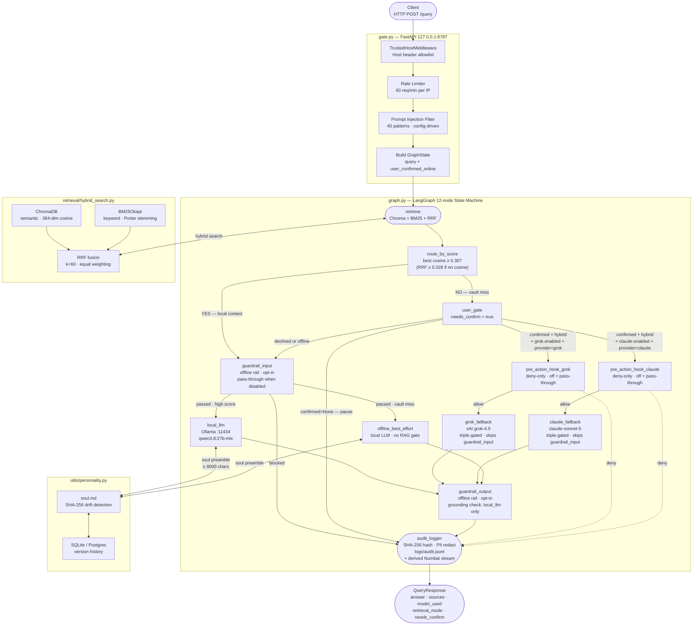

# CyClaw

[](https://www.python.org/)
[](https://fastapi.tiangolo.com/)
[](https://github.com/langchain-ai/langgraph)
[](https://github.com/cgfixit/CyClaw/actions/workflows/ci.yml)

[](https://github.com/cgfixit/CyClaw/tree/main/docs/screenshots)

CyClaw is an offline-first local RAG server for **your own documents, on your
own hardware**. A local model answers from a local index. Safety is the
12-node LangGraph in `graph.py`: retrieval is the entry, every path ends in
the audit log, and a paid Grok or Claude call is a graph edge you confirm
per question. It binds to `127.0.0.1:8787`.

**What that means in practice**

- **Offline-first RAG.** Embeddings, BM25, and the cross-encoder run on CPU.
  Caching those models is separate from consenting to a paid call.
- **Fail-closed gates.** An unset `CYCLAW_API_KEY` returns 401 on soul, ops,
  memory, and audit routes. External calls need hybrid mode, that provider
  enabled, a per-request confirmation, and a usable client.
- **Spend and audit forensics.** Questions are stored as SHA-256 hashes.
  Billed calls append token counts to `logs/spend.jsonl`; dollars are priced
  when you read the ledger. `cyclaw-metrics` joins the two offline.
- **Everything else ships off.** Per-user auth, memory, guardrails,
  connectors, the agentic loop, and the Telegram/X channels sit behind
  master switches that ship disabled. The Numbat stream and the spend ledger
  ship on, because each only writes a local file.

**Scope.** Trusted-operator, loopback-bound, single-tenant: one operator, or
a small mutually trusted group once `auth.enabled` is on. Not multi-tenant,
and not a microVM. [`docs/THREAT_MODEL.md`](docs/THREAT_MODEL.md).

## Table of Contents

- [Quick Start](#quick-start)
- [For newcomers](#for-newcomers)
- [What It Does](#what-it-does)
- [Architecture](#architecture)
- [Installation](#installation)
- [API Key Setup (Soul Mutations)](#api-key-setup-soul-mutations)
- [Per-User Authentication](#per-user-authentication)
- [Spend Tracking](#spend-tracking)
- [Benchmarks and Evals](#benchmarks-and-evals)
- [Optional layers](#optional-layers)
- [Security Model](#security-model)
- [Project Structure](#project-structure)
- [Documentation Map](#documentation-map)
- [License](#license)

Step-by-step installs and every REST call: [Full Setup Guide](setup-guide.md).

---

## Quick Start

**macOS (Apple Silicon)** — install, keys, Ollama, index, and startup:

```bash
git clone https://github.com/cgfixit/CyClaw && cd CyClaw
bash macos/setup-cyclaw.sh
```

**Linux** — Ollama already running on `127.0.0.1:11434`:

```bash
git clone https://github.com/cgfixit/CyClaw && cd CyClaw
python3.12 -m venv .venv && source .venv/bin/activate
pip install torch==2.13.0+cpu --index-url https://download.pytorch.org/whl/cpu
pip install -r requirements.txt -r requirements-test.txt -c constraints.txt --ignore-installed PyYAML
ollama pull qwen3.8:27b-mlx
export CYCLAW_API_KEY="$(openssl rand -hex 20)"  # /soul/* and /ops/*; /query does not need it
python -m retrieval.indexer                      # once; without this, /query is 503
python gate.py                                   # http://127.0.0.1:8787
```

**Windows** uses the same pins (`py -3.12 -m venv .venv`,
`.\.venv\Scripts\Activate.ps1`). [Windows](setup-guide.md#windows-powershell)
and [Linux](setup-guide.md#linux-bash).

Confirm: `curl http://127.0.0.1:8787/health`, then open
`http://127.0.0.1:8787/`.

> **Manual macOS install differs in one step.** There is no `+cpu` torch
> wheel for macOS. Install plain `torch==2.13.0` from stripped copies of
> `requirements.txt` and `constraints.txt`:
> [macOS (Apple Silicon)](setup-guide.md#macos-apple-silicon).

---

## For newcomers

**Python.** `requires-python` is `>=3.12,<3.13`. On some machines `python3`
is 3.11; use `python3.12` for the venv. No admin rights are required to
create `.venv`.

**Which install.** Native macOS: `macos/setup-cyclaw.sh` (launchd + Keychain,
[`macos/README.md`](macos/README.md)). Native Windows:
[`powershell/README.md`](powershell/README.md) and Credential Manager for
scheduled tasks. Linux: the Quick Start above. Container:
[`docs/DOCKER.md`](docs/DOCKER.md) (`ghcr.io/cgfixit/cyclaw`, `linux/amd64`,
host publish `127.0.0.1` only). Apple Silicon should use the native path
until an arm64 image is verified. `pip install -e .` is what creates the
`cyclaw-server`, `cyclaw-index`, `cyclaw-mcp`, `cyclaw-metrics`,
`cyclaw-user`, `cyclaw-gen-cert`, and `cyclaw-clear-cache` commands;
`python -m …` works without it.

**Where keys live.** `gate.py` reads the environment. It does not load a
dotenv file. On macOS, `macos/setup-cyclaw-keys.sh` stores allowlisted
secrets in the Keychain. `~/.CyClaw/.env` (mode 600, gitignored) holds
ordinary settings; secret lines land there only with `--write-env-file`.
On Windows, `Install-CyClaw.ps1` stores allowlisted secrets in Credential
Manager. `Invoke-CyClaw.ps1` loads non-secret settings from the first
owner-only file found (`%USERPROFILE%\.CyClaw\.env`, then a checkout
dotenv) and reads secrets from Credential Manager only. Services never
get secrets from a dotenv file. LaunchAgents and scheduled tasks never
embed a token in a plist or task XML: macOS fetches Keychain at exec time
(`macos/cyclaw-keychain-env.sh`), Windows uses Credential Manager
(`powershell/CyClaw-CredMan-Env.ps1`). The gate scheduled task receives
the API key only when `windows/generate_service_task.py` is passed
`--api-key-target`; without that flag the task has no API key. Fill the
item with `powershell/CyClaw-CredMan-Set.ps1 com.cgfixit.cyclaw.api-key`.
Both platforms fail closed if the item is missing. Secrets are not written
into `config.yaml`, not inlined into a shell rc file, and not placed on
argv. Provider keys (`GROK_API_KEY`, `ANTHROPIC_API_KEY`) are env vars too
— see [`spend/README.md`](spend/README.md#api-keys). The server boots
without them; that provider then reports unavailable.

**Offline vs hybrid.** Shipped `app.mode` is `hybrid`, which only *allows*
a paid call. The call still needs `models.grok.enabled` or
`models.claude.enabled` (both ship `true`), `user_confirmed_online: true`
on that request (never persisted), `online_provider` selecting one of them,
and a client that `is_available()` (the key is set). Set `app.mode: offline`,
or decline the confirm, and the answer stays local. `offline_best_effort`
can still answer from partial context after a vault miss. Embedding and
reranker downloads do **not** use `user_confirmed_online`. With a completed
index, `models.embeddings.offline_after_index: true` forces both loaders
onto local files. `/health` does not call Grok or Claude
(`api.health_probe_external_providers` ships `false`).

**Ports.** Gateway `127.0.0.1:8787` (`api.port`; launchers honor
`CYCLAW_GATE_PORT`). Ollama `127.0.0.1:11434`. Optional local failover
(ships off) is another loopback server, example `127.0.0.1:1234`. The old
in-tree coding console on `:8790` is gone ([#1367](https://github.com/cgfixit/CyClaw/pull/1367));
that role is [CG-agent-harness](https://github.com/cgfixit/CG-agent-harness),
a separate install CyClaw does not start.

**First-run gotchas.**

- No index yet: `POST /query` returns `503 INDEX_NOT_FOUND`. Run
  `python -m retrieval.indexer`, or start a build from the browser
  (`POST /index/build`, then `GET /index/status`).
- `status: degraded` on `/health` with Ollama down is normal. So is the
  `TELEMETRY KILL` line at startup.
- The first query can be slow: the reranker (~91MB) loads then, not at
  index time. Cache both retrieval models before you expect offline use.
- `cyclaw-*` names are missing until `pip install -e .`.
- Soul, ops, memory, and `/audit/summary` 401 until `CYCLAW_API_KEY` is
  set (or, with `auth.enabled`, until an admin logs in). In the browser,
  use "Unlock operator tools"; see [API Key Setup](#api-key-setup-soul-mutations).
  `/auth/*` returns 503 while `auth.enabled` is false, not 404.
- The rate limit (60/min per IP) is in-memory unless you set
  `api.rate_limit.persist_path` or its Postgres DSN. A restart clears it.
  `/health` and `/index/status` are not counted, because the console polls
  them for the whole of a build.
- The embedding query-cache size is not a `config.yaml` key. It is fixed
  at import from `CYCLAW_EMBED_CACHE_SIZE` (default 2048). Editing
  `config.yaml` in a running process also does not reload the sanitizer;
  that cache is keyed by config path, so restart the gateway.

**Check the install.** `curl -s http://127.0.0.1:8787/health` (look for
`index_ready`). Open `/` and ask something that is in `data/corpus/`.
Static policy check, no services:
`python3 .claude/skills/invariant-guard/check_invariants.py`. Unit tests:
`GROK_API_KEY=dummy pytest tests/ -q --tb=short` (any non-empty dummy key;
no live provider). Retrieval floors, needs the cached models:
`python -m tests.ci_rag_smoke`.

**Where the records go.** Under the repo by default. All gitignored except
`data/personality/soul.md`:

| Path | What |
|---|---|
| `logs/audit.jsonl` | Authoritative audit. Query hash, not the question, while `logging.audit_fields.include_query_hash` is `true` (the shipped default). `false` stores redacted raw query text. Written on the request thread |
| `logs/spend.jsonl` | Token counts for billed Grok/Claude calls. No query text, no prices |
| `logs/numbat-events.ndjsonl` | Derived copy of redacted audit records plus out-of-band actions. Observes only |
| `logs/cyclaw.log` | Application log. Bounded writer; a stalled disk drops lines instead of holding the request |
| `logs/evals/` | Opt-in dogfood and judge output. Not the production ledger |
| `index/` | Chroma + `bm25.json`. Rebuild with `python -m retrieval.indexer` |
| `data/personality/` | `soul.md` is **tracked**. An approved soul change rewrites it, so it shows in `git status` and a broad `git add` stages it. The version DB (`cyclaw_soul.db`) and `soul.md.bak` are gitignored |

`python -m metrics` (`cyclaw-metrics`) reads the audit and spend files
offline, including a Sequences section. That scan skips repeated work on a
query hash it has already walked, so a long ledger stays cheap
([#1504](https://github.com/cgfixit/CyClaw/pull/1504)).

Once a question has come back with sources, the day-two commands are small:

```bash
python -m metrics                              # spend, audit aggregates, sequences
python -m retrieval.clear_cache                # dry-run; add --apply to delete .emb_cache
python -m retrieval.indexer                    # rebuild after you edit data/corpus/
curl -s http://127.0.0.1:8787/index/status     # build progress; not rate-limited
```

`/health` is unauthenticated and unrate-limited on purpose (the console
polls it). `degraded` means a dependency is down, usually Ollama; it is
not a crash. `index_ready: false` means `/query` will 503 until you build.
External providers are absent from that payload unless you turn on
`api.health_probe_external_providers`, which ships `false` so a health
poll cannot spend your keys. The browser console is the same loopback
origin as the API (`http://127.0.0.1:8787/` and `http://localhost:8787/`
are both on the CORS list; a portless origin is not).

---

## What It Does

CyClaw answers from your Markdown (and `.txt`) corpus. Graph edges enforce
retrieval and paid-provider consent. Groundedness is measured in CI; it is
not a graph node.

> **Cache both retrieval models.** `retrieval/embeddings.py` and the enabled
> `retrieval/rerank.py` fetch a missing Hugging Face snapshot.
> `local_files_only` applies once the snapshot is on disk. An unavailable
> reranker leaves the cosine gate in control and sets `rerank_degraded`.

1. **Retrieval is first.** `retrieve` is the entry of the 12-node graph. No
   model call precedes it. `offline_best_effort` may still answer from
   partial context after a vault miss.
2. **Hybrid search.** ChromaDB (default) plus BM25, fused by RRF
   (`retrieval.rrf_k`). A query is a vault hit when the best cosine in the
   local context window clears `retrieval.min_semantic_score`, or, with no
   cosines, when the top fused hit clears `retrieval.min_score` (RRF scale,
   not cosine). The cross-encoder scores that window in shadow mode
   (`retrieval.min_rerank_score` ships `null`): logits are audited as
   `rerank_best` and nothing is vetoed. A number can only turn a hit into a
   miss. [`retrieval/README.md`](retrieval/README.md).
3. **Local model by default.** Ollama, `models.local_llm.model` (shipped
   `qwen3.8:27b-mlx`). An optional loopback failover ships disabled
   (`models.local_llm.fallback`). Tunables live in `config.yaml`.
4. **Governed soul.** `data/personality/soul.md`, SHA-256 drift detection,
   atomic writes. `POST /soul/apply` needs a human `reason` and the enforced
   injection scan. `POST /soul/restore` reapplies the vetted `.bak` without
   that enforced scan (advisory hits are logged, not refused). Startup drift
   recovery and `POST /soul/reload` adopt the on-disk file unscanned. A
   missing file self-heals at boot. [`INVARIANTS.md`](INVARIANTS.md) Rules 4–5.
5. **Online fallback, triple-gated.** Grok (`grok-4.5` at `api.x.ai`) or
   Claude (`claude-sonnet-5` at `api.anthropic.com`) runs only when **all
   three** hold: `app.mode: hybrid`, that provider's `enabled` flag, and
   `user_confirmed_online: true` on this request — plus a usable client.
   Two of the three are fixed when `gate.py` builds the clients; only the
   confirmation is decided in the graph. A client can send `true` on the
   first call; nothing stores it. Outbound calls are also capped by the
   remaining `api.graph_timeout_sec` budget, and
   `utils/endpoint_trust.py` refuses a rewritten base URL.
6. **Two front doors.** FastAPI at `127.0.0.1:8787` (browser console at
   `/`) and a retrieval-only MCP server (`mcp_hybrid_server.py`,
   `sampling: None`, same injection filter, no model path).
7. **Hashed audit.** All eleven nodes upstream of `audit_logger` reach it
   before END. `cyclaw-metrics` reads `logs/audit.jsonl` offline.

The six invariants (I1–I6) are defined in [`INVARIANTS.md`](INVARIANTS.md):
RAG-first entry, topology as policy, the triple gate, audit convergence,
soul governance, and import isolation. `gate.py`, `graph.py`, and the MCP
server never import `agentic`, `sync`, `guardrails`, `telegram`, or
`opentweet`.
`python3 .claude/skills/invariant-guard/check_invariants.py` checks them.

**Vector store.** `indexing.vector_backend` ships `chroma` (embedded,
offline). `pgvector` is optional and needs Postgres. `sqlite-vec` is a
test-only prototype, not a backend: macOS CI cannot load the extension
([spike notes](docs/audits/2026-09-21-sqlite-vec-phase-c-spike.md)). BM25
stays JSON either way. Pickle is not used.

**Browser console** (`static/terminal.html`). Query box, index-build
progress, Soul / Sync / Agentic / Filesystem / SQL panels, and, when
per-user auth is on, Users and Audit. It is the RAG console. It is not a
coding harness.

### Optional layers at a glance

| Layer | What it adds | Ships |
|---|---|---|
| [Per-user auth](#per-user-authentication) | scrypt passwords, session cookie + CSRF, device tokens, roles `admin` / `operator` / `audit`. With `auth.enabled: true`, `/query` requires a session or token | off |
| [Memory](docs/memory/README.md) | Facts + episodes (SQLite + FTS5), propose/apply, optional retrieval fusion, HTML export. `memory.consolidation` is a stub: `run_consolidation` returns disabled even if the flag is flipped | off |
| [NeMo Guardrails](#optional-layers) | Offline input/output rails; with the extra, NeMo `check()` around answer-node model calls. Deny-only, fails open (audited), never a router | off |
| [Dropbox sync](docs/SYNC_README.md) | `rclone` pull into `data/corpus/`, out of band | CLI |
| [Connectors](agentic/README.md) | Scoped filesystem, SELECT-only SQL, passive LAN inventory | off |
| [Agentic loop](docs/agentic/AGENTIC_README.md) | `gh` read context, skills registry, clone → plan → patch → verify → human decides | off |
| [Telegram](docs/channels/TELEGRAM_DESIGN.md) / [OpenTweet](docs/channels/OPENTWEET_DESIGN.md) | Phone remote and weekly X drafts, via loopback `POST /query` only | off |
| [Numbat stream](docs/security-philosophy/numbat_secondary_evaluator.md) | Derived NDJSON. Observes; enforces nothing | **on** |
| [Pre-action hook](docs/security-philosophy/numbat_pre_action_gate.md) | Deny-only check after the triple gate, before a confirmed paid call | off |
| [Spend ledger](#spend-tracking) | Token counts per billed call | **on** |
| [Fine-tune kit](tools/lora_finetune/README.md) | Offline QLoRA toolkit. Not part of the runtime install | toolkit |

---

## Architecture

`gate.py` checks the Host allowlist, rate-limits (**60 req/min per IP,
before the injection filter**), runs the config-driven filter, inits soul,
and hands a `GraphState` to the 12-node graph. Routing is edges only. The
numbered map is [`CLAUDE.md`](CLAUDE.md); the contract is
[`INVARIANTS.md`](INVARIANTS.md).


```mermaid
flowchart TD
    A(["Client\nHTTP POST /query"])
    A --> B

    subgraph GATEWAY ["gate.py — FastAPI 127.0.0.1:8787"]
        B["TrustedHostMiddleware\nHost header allowlist"]
        B --> C["Rate Limiter\n60 req/min per IP"]
        C --> D["Prompt Injection Filter\n40 patterns · config-driven"]
        D --> E["Build GraphState\nquery + user_confirmed_online"]
    end

    E --> F

    subgraph GRAPH ["graph.py — LangGraph 12-node State Machine"]
        F(["retrieve\nChroma + BM25 + RRF"])
        F --> G["route_by_score\nbest cosine ≥ 0.30?\n(RRF ≥ 0.028 if no cosine)"]
        G -->|"YES — local context"| X["guardrail_input\noffline rail · opt-in\npass-through when disabled"]
        X -->|"blocked"| L
        X -->|"passed · high score"| H["local_llm\nOllama :11434\nqwen3.8:27b-mlx"]
        G -->|"NO — vault miss"| I["user_gate\nneeds_confirm = true"]
        I -->|"confirmed + hybrid\n+ grok.enabled + provider=grok"| PG["pre_action_hook_grok\ndeny-only · off = pass-through"]
        PG -->|"allow"| J["grok_fallback\nxAI grok-4.5\ntriple-gated · skips guardrail_input"]
        I -->|"confirmed + hybrid\n+ claude.enabled + provider=claude"| PC["pre_action_hook_claude\ndeny-only · off = pass-through"]
        PC -->|"allow"| W["claude_fallback\nclaude-sonnet-5\ntriple-gated · skips guardrail_input"]
        I -->|"declined or offline"| X
        X -->|"passed · vault miss"| K["offline_best_effort\nlocal LLM · no RAG gate"]
        I -->|"confirmed=None — pause"| L
        H --> Y["guardrail_output\noffline rail · opt-in\ngrounding check: local_llm only"]
        J --> Y
        W --> Y
        K --> Y
        Y --> L
        PG -.->|"deny"| L
        PC -.->|"deny"| L
        L(["audit_logger\nSHA-256 hash · PII redact\nlogs/audit.jsonl\n+ derived Numbat stream"])
    end

    L --> M(["QueryResponse\nanswer · sources · model_used\nretrieval_mode · needs_confirm"])

    subgraph RETRIEVAL ["retrieval/hybrid_search.py"]
        N["ChromaDB\nsemantic · 384-dim cosine"]
        O["BM25Okapi\nkeyword · Porter stemming"]
        P["RRF fusion\nk=60 · equal weighting"]
        N --> P
        O --> P
    end

    F <-->|"hybrid search"| P

    subgraph SOUL ["utils/personality.py"]
        Q["soul.md\nSHA-256 drift detection"]
        R["SQLite / Postgres\nversion history"]
        Q <--> R
    end

    H <-->|"soul preamble\n≤ 8000 chars"| Q
    K <-->|"soul preamble"| Q
```

The MCP server calls the retriever directly after sanitization. It never
enters this HTTP gateway or this graph.

What the diagram compresses: `HybridRetriever` fuses ChromaDB
(`all-MiniLM-L6-v2`, 384-dim cosine, CPU-only) with BM25Okapi (Porter
stemming) by RRF (`k=60`, equal weights) and keeps per-chunk provenance on
every hit. The BM25 top-k is a numpy `argpartition` when scores are finite,
with `heapq.nlargest` as the fallback. The telemetry-kill block runs before
any SDK import; the MCP server and the indexer apply the same block.

With guardrails enabled and `nemoguardrails` installed, NeMo `check()` also
wraps the model call inside `local_llm`, `grok_fallback`, `claude_fallback`,
and `offline_best_effort`: input rails before the call, output rails after.
It can only deny, and its flows run Python checks, not an LLM. If a guard
cannot run, the answer goes out and the audit record says
`guardrail_degraded: true`. The CEL monitor, when `numbat.cel` is enabled,
runs after the graph returns, records matches, and never blocks.

---

## Installation

Platform steps, Docker, conda (`environment.yml`), and first index:
[`setup-guide.md`](setup-guide.md). macOS installs plain `torch==2.13.0`;
Windows and Linux use the `+cpu` wheel. Scripts:
[`macos/README.md`](macos/README.md),
[`powershell/README.md`](powershell/README.md). Image:
[`docs/DOCKER.md`](docs/DOCKER.md).

---

## API Key Setup (Soul Mutations)

`/soul/*`, `/ops/*`, `/memory/*`, `/query/export/html`, and `/audit/summary`
need operator access and fail closed (401) without it. `/query` and
`/health` do not. Any one of these grants it:

- **Bearer `CYCLAW_API_KEY`**, for curl, MCP and scripts. Comparison is
  `hmac.compare_digest`.
- **The console cookie.** In the browser, "Unlock operator tools" trades the
  key once for an HttpOnly, `SameSite=Strict` cookie and forgets the key.
  The cookie lasts `security.console_session_ttl_sec` (12 h shipped);
  "Lock" deletes it, and rotating the key revokes every cookie at once.
- **An admin login**, when `auth.enabled` is on. No key is needed in the
  browser at all. `operator` and `audit` accounts do not get operator
  access.

Writes from the browser also carry a CSRF token, and cross-site requests
are refused. With `CYCLAW_API_KEY` unset, the Bearer and cookie paths fail
closed; only an admin login still works.

**The key is generated and used for you.** `macos/invoke-cyclaw.sh` and
`powershell\Invoke-CyClaw.ps1` generate a missing `CYCLAW_API_KEY` into the
macOS Keychain or Windows Credential Manager on first run. They then open
the console with a one-time unlock link (`#pair=...`, single-use, valid for
`security.console_pairing_ttl_sec`, 5 min shipped), so the console is
already unlocked when it appears. If you open the console some other way,
copy the key from the keystore and paste it into the unlock dialog:

```bash
# macOS
security find-generic-password -a "$(whoami)" -s com.cgfixit.cyclaw.api-key -w | pbcopy
```

```powershell
# Windows, from the CyClaw folder
. .\powershell\CyClaw-SecretStore.ps1; (Read-CyclawCredential com.cgfixit.cyclaw.api-key).Secret | Set-Clipboard
```

Do not persist the key with `setx` or a user environment variable; the
launchers read it from the keystore into the gateway process only
([`powershell/README.md`](powershell/README.md#secret-classification)).
Rotation and the macOS bootstrap:
[`macos/README.md`](macos/README.md#key-bootstrap)
([401 recovery](macos/README.md#401--key-drift-recovery)).

`security.api_key_optional` ships `false`. When set, a request skips the key
only if the flag is on, the socket peer is loopback, no forwarding header
is present, and the request is not cross-site. A remote caller still needs
the key, including under Docker (NAT makes the peer the bridge gateway, so
the flag is inert there). [`INVARIANTS.md`](INVARIANTS.md) Rule 6 and
[`docs/THREAT_MODEL.md`](docs/THREAT_MODEL.md) (eighteenth amendment) hold
the full boundary.

## Per-User Authentication

Separate from the operator API key. `gate_auth.py`: scrypt passwords, a
session cookie plus CSRF for browsers, named device tokens for scripts,
roles `admin`, `operator`, and `audit`. Ships `auth.enabled: false`. While
off, every `/auth/*` route returns 503. Design, TLS, and the non-loopback
bind rule: [`docs/AUTHENTICATION_DESIGN.md`](docs/AUTHENTICATION_DESIGN.md).
First-boot `curl` and `cyclaw-user`:
[`setup-guide.md`](setup-guide.md#authentication-routes-auth-off-by-default).
`cyclaw-gen-cert` writes a self-signed cert for the auth + TLS bind exception.

---

## Spend Tracking

A triple-gated Grok or Claude call that actually bills appends one line to
`logs/spend.jsonl`. **Tokens are stored; dollars are computed at read time**,
so a rate-card fix re-prices history. The row has no query text, prompt, or
API key. A full disk logs a warning and drops the row rather than failing
the answer.

| `source` | Writer | Covers |
|---|---|---|
| `query` | `llm/client.py` | `/query` online fallback a human confirmed |
| `agentic` | `agentic/deepagent_github/chat_client.py` | Out-of-band planner calls |
| `eval` | `tests/judge_eval.py` | Opt-in judge runs, written under `logs/evals/`, not this ledger |

`python -m metrics` prints `today` / `last_7d` tokens, a derived USD figure,
per-provider and per-source row counts, and two data-quality counters
(`usage_missing`, `rate_unknown`). A vendor-reported cost is shown beside
the table figure (`table_usd` / `vendor_usd` / `delta_usd`) so rate-card
drift is visible. Pricing follows the vendor's own rules, including Grok's
long-context band and Claude's cache-write split; `PRICED_AS_OF` is flagged
stale after 30 days (`utils/spend.py`). The Sequences section joins
`source: query` rows to `logs/audit.jsonl` on `query_hash` (a blocked
injection, then a later paid call on another hash, inside a 15-minute
window on this loopback host). It is forensic only: not imported by
`gate.py`, `graph.py`, or the MCP server, and not a `/query` policy point.
The same-hash skip ([#1504](https://github.com/cgfixit/CyClaw/pull/1504))
keeps that join from re-walking a hash it has already scanned.

`CYCLAW_SPEND_LIVE=1 python tests/spend_live_probe.py` spends real money,
writes a temp ledger, deletes it, and asserts no forbidden field landed.
Pytest does not collect it.

Schema, rate bands, and the probe walkthrough:
[`spend/README.md`](spend/README.md).

---

## Benchmarks and Evals

Four planes. Only the first blocks a merge. None of them is a graph node
or a security control. Detail, thresholds, and what is unmeasured:
[`docs/EVALS.md`](docs/EVALS.md).

| Plane | Command | Runs | Measures |
|---|---|---|---|
| Retrieval gate | `python -m tests.ci_rag_smoke` | every PR (`ci.yml`), no LLM | Corpus probe matrix through `route_by_score_node`, then hit@5 / Recall@5 / MRR on `tests/fixtures/groundedness/` (8 docs, 52 cases). Floors in that script fail the job ([#1399](https://github.com/cgfixit/CyClaw/pull/1399)). Injected chunks must be sanitized to `[FILTERED]` |
| Local dogfood | `CYCLAW_EVAL_DOGFOOD=1 python scripts/cyclaw-eval-dogfood.py` | operator, opt-in | One case per category on the real loopback model. Not CI. The published Qwen matrix is [this audit](docs/audits/2026-09-12_Local_Qwen_Dogfood_Matrix.md); recipe in [`DOGFOOD.md`](tests/fixtures/groundedness/DOGFOOD.md) |
| Anthropic judge | `CYCLAW_EVAL_LIVE=1 python tests/judge_eval.py` | operator, spends money | Groundedness, completeness, abstention, graded by Claude |
| Local judge | same command, `evals.local_judge.enabled: true` | operator, fully local | Same rubric, second loopback model of a different family |

A published groundedness run reached hit@5, Recall@5, and MRR of 1.0 on
that fixture. That does not mean every corpus question is answerable. The
[reranker bake-off](docs/audits/2026-09-26-reranker-bakeoff.md) found no
model and threshold that passed its held-out probes, so the veto stays in
shadow mode. No judge-plane result has been published.

The [#1400](https://github.com/cgfixit/CyClaw/pull/1400) dogfood record is
one opt-in run, not a standing benchmark: five `generated` rows on
`qwen3.8:27b-mlx` on an M5 Pro with 48 GB, plus a sanitizer probe that
never called the model. A down Ollama produces `unverified`, not a green
matrix. It is not a GitHub Actions job.

---

## Optional layers

Master switches ship disabled except the Numbat stream and the spend
ledger. Each link is the operator guide; this section is the shape.

**Dropbox sync.** Out-of-band `rclone` pull into `data/corpus/`, with
`max_delete` / `max_transfer` fuses, a single-instance lock, and an
optional reindex when the corpus changes (exit code 10 means
"reindex"). `python -m sync.cli setup`, then `test`, `sync --dry-run`,
`sync`, `status`, `schedule`. The Sync Console calls `POST /ops/sync`
(API key, audited). Scheduler glue covers cron, Windows Task Scheduler,
and an opt-in Darwin launchd backend that prints `launchctl bootstrap`
and does not load the agent.
[Guide](docs/%21%20How-To-Guides/Dropbox_Sync_Guide.md) ·
[`docs/SYNC_README.md`](docs/SYNC_README.md).

**macOS launchd and Windows tasks.** Generators write a plist or task
from resolved install paths and print the load command; none of them
loads it. Token-bearing jobs chain the Keychain or Credential Manager
wrapper and fail closed if the item is missing. Store a Keychain secret
with a no-echo prompt (`macos/cyclaw-keychain-set.sh`); the trust is
pinned with `-T /usr/bin/security`. Scheduled jobs include Dropbox sync,
Telegram poll/health, fsconnect trash emptying, and OpenTweet.
`macos/generate_service_plist.py` (and
`windows/generate_service_task.py`) refuse a KeepAlive gateway without
`--confirm` and a non-empty `--reason`, because that turns the loopback
server into a listener that survives reboot. `macos/uninstall-cyclaw.sh`
unschedules registered jobs and removes landed agents by label.
[`macos/README.md`](macos/README.md) ·
[`docs/work/MACOS_LAUNCHD_INTEGRATION_PLAN.md`](docs/work/MACOS_LAUNCHD_INTEGRATION_PLAN.md).

**Fine-tune kit.** `tools/lora_finetune/` is QLoRA for the local model,
so an operator model stops re-deriving the same invariants. Examples are
generated from live source and each carries `source_refs`. It is outside
every runtime install profile. The CUDA training install is currently
blocked: Unsloth's ranges conflict with the kit's patched Hugging Face
pins — do not bypass those, and audit that environment on its own (it is
excluded from this repo's OSV walk). `finetune_qwen38.py` downloads a
base checkpoint on first run; `local_files_only` is not set, so "offline"
here means independent of the CyClaw server, not free of network. Seed
the caches first on a no-egress machine. Dry path, no GPU:
`python tools/lora_finetune/build_cyclaw_corpus.py` then
`python tools/lora_finetune/dryrun_finetune.py`.
[`tools/lora_finetune/README.md`](tools/lora_finetune/README.md).

**Agentic layer and coding loop.** Opt-in and out of band (I6).
`agentic.enabled` ships `false`, and the CLI no-ops while it is false.
`mode: write` and `writes_enabled: true` have shipped open since
2026-08-07; a default checkout still cannot open a PR, because the
master switch, a per-call `reason`, and `confirm` all have to be
present. `gh` is an argv list (no shell, no token stored or forwarded).
The skills registry at `data/agentic/skills_registry.json` ships empty.

The real-repo pipeline (`python -m agentic.cli real-repo-run`) clones
into a jail, plans, patches, verifies, and stops for a human before it
commits. Push and a draft PR are separate decisions.
`deepagent_github.enabled` and `allow_git_write_tools` ship `false`.
Verification runs caller-declared checks (pytest, ruff, …) through
`agentic/executor`: Linux `unshare --net`, macOS `sandbox-exec`, Windows
Job Object. A missing sandbox binary fails closed. There is no silent
fallback to a plain `subprocess`, and there is no microVM — Windows is
a process-tree kill, so sockets still work there.
[`docs/THREAT_MODEL.md`](docs/THREAT_MODEL.md).

`POST /ops/agentic` accepts `status`, `test`, `context`,
`propose-skill`, and `apply-skill`. It does not accept `real-repo-run*`
(422). The Agentic Console drives only the actions that route allows.
An offline prose check (`agentic/unslop_bridge.py`) can run on the loop;
`unslop.enabled` ships `false`.

```bash
python -m agentic.cli status
python -m agentic.cli context --repo          # also --pr 123 / --issue 45
python -m agentic.cli propose-skill --name deploy --desc "..." --body-file s.md --reason "draft"
```

[`agentic/README.md`](agentic/README.md#2-real-repo-coding-loop) ·
[`docs/agentic/AGENTIC_README.md`](docs/agentic/AGENTIC_README.md#9-governed-github-coding-harness) ·
[write-path rollback](docs/agentic/GITHUB_WRITE_ENABLEMENT.md).

**Connectors.** Three more switches, all off, all outside the request
path. `fsconnect` does scoped, capped reads; writes are a second gate
and ship off (on Windows every write op is refused even then).
`sqlconnect` allows SELECT/WITH only. `netconnect` reads the local host
and the existing neighbor cache for explicit RFC1918/loopback CIDRs and
sends no probes. The browser FS and SQL consoles call the same
subprocess shim (`POST /ops/fsconnect`, `POST /ops/sqlconnect`).
[Filesystem](agentic/README.md#5-filesystem-connector) ·
[SQL](agentic/README.md#6-sql-connector-read-only) ·
[passive network](agentic/README.md#7-passive-network-connector).

**NeMo Guardrails.** `guardrails.enabled: false` is a pass-through; only
the boolean `true` arms it, and boot refuses a non-boolean. The core
never imports `guardrails` (I6). `utils/guardrail_bridge.py` builds
three callables, or `None` while the layer is off, and the graph's own
edges still pick the route.

| Guard | Where | On a block |
|---|---|---|
| Offline input rail | `guardrail_input`, local and best-effort paths only (not Grok/Claude) | `block_message`, straight to `audit_logger`, no model call |
| Offline output rail | `guardrail_output`, `local_llm` answers only (grounding overlap below `hallucination_threshold`, shipped `0.18`, plus a soul-leak check) | answer replaced |
| NeMo `check()` | around the model call in all four answer nodes, once `pip install -e ".[guardrails]" -c constraints.txt` has installed `nemoguardrails==0.24.0` | input refusal skips the model; output refusal replaces the answer |

No LLM-backed rail is active; CI asserts zero model calls from the
flows. A rail that raises, an engine that cannot build, or a missing
package fails open and sets `guardrail_degraded: true` — with the layer
on and the extra not installed, every answered query is audited as
degraded. Blocked events also go to `logs/guardrails.jsonl` (hashes
only, not rotated). `python -m guardrails.cli status`.
[`guardrails/README.md`](guardrails/README.md) ·
[`docs/NeMo/README.md`](docs/NeMo/README.md).

**Numbat.** External Go CLI, pinned at 0.2.0 (schema 0.3.0). CyClaw
never vendors or imports it. Four pieces, four switches:

| Piece | Switch | Ships | Does |
|---|---|---|---|
| Stream (`utils/numbat_emitter.py`) | `numbat.enabled` | **on** | Appends redacted audit records and out-of-band actions to `logs/numbat-events.ndjsonl`. Rolls at 50 MiB to one `.1` file. One writer thread; a stall cannot hold the request |
| Pre-action hook | `policy.fallback.pre_action_hook.enabled` | off | Deny-only, after the triple gate has already allowed the call. `engine: command` (exit 0 allow, 2 deny) or `engine: numbat` (pinned CLI, `rules test --no-builtin-rules`). Anything but an explicit allow denies, including engine failure |
| CEL monitor | `numbat.cel.enabled` (extra `numbat-cel`) | off | Records matches on HTTP `/query` after the graph returns. Never blocks. Needs the stream on |
| Offline scoring | none | CI (`numbat-rules.yml`) and an operator-run CLI | Shape and rules. The hand-written fixture job is advisory; the stream-contract jobs block |

Nothing scores the live file at request time. Do not point the command
engine at `numbat hook`: it drops the provider and URL and exits 0 on
errors. No rules ship; examples live in
`tests/fixtures/numbat/gate-rules/`. Events carry the host name, user,
and uid (`N/A` on Windows). Verdict reason codes (`hook_allowed`,
`hook_denied`, `hook_timeout`, `hook_error`, `hook_failure`,
`hook_misconfigured`) land on the audit record and in `cyclaw-metrics`.
`/health` reports whether an enabled hook could decide a call now.
[Pre-action gate](docs/security-philosophy/numbat_pre_action_gate.md) ·
[stream](docs/security-philosophy/numbat_secondary_evaluator.md) ·
[phase status](docs/plans/NUMBAT_AND_ALWAYS_ON_ROADMAP.md).

**Telegram and OpenTweet.** Both out of band, both `enabled: false`,
both reach the pipeline only through loopback `POST /query` — never a
direct call into `graph.py`. The bot token and OpenTweet credentials
come from the env var named in config, never from YAML.

Telegram: `mode: notify` (outbound) or `mode: chat` (long-poll; no
public webhook). `allowed_chat_ids` must be non-empty when enabled.
Chat text can set `user_confirmed_online` only via the exact
`/online on <grok|claude>` command, only when `allow_hybrid_confirm`
is on (it ships off), and only for that one message (hard cap 300s).
The triple gate is still the authority. Media staging
(`media.enabled` ships off) accepts `/save --confirm <reason>` only
through the fsconnect write path. `python -m telegram.cli status`.

OpenTweet generation always posts `user_confirmed_online: false`, so a
weekly draft cannot bill. The default write is a draft;
`scheduled_date` is opt-in (`opentweet.schedule_enabled`). Schedulers
never send `publish_now`. `python -m opentweet.cli status`.
[`docs/channels/TELEGRAM_DESIGN.md`](docs/channels/TELEGRAM_DESIGN.md) ·
[`telegram/README.md`](telegram/README.md) ·
[`docs/channels/OPENTWEET_DESIGN.md`](docs/channels/OPENTWEET_DESIGN.md) ·
[`opentweet/README.md`](opentweet/README.md).

**Worth knowing, easy to miss.**

- OpenTweet cannot spend, by construction (confirmation forced off).
- `netconnect` inventories; it does not scan.
- The shadow reranker records a logit and changes no route until you set
  a threshold, and a threshold cannot create a hit.
- Memory consolidation is not a feature yet. The function ignores the flag.
- `policy.fallback.enabled` is not read. The triple gate is the control.
  Boot rejects `require_user_confirm: false`, so that key cannot pose as
  an off switch.
- Telemetry env is stripped before heavy imports, and ONNX gets a
  post-import suppression call. That is not a network firewall.
  [`SECURITY.md`](SECURITY.md) ·
  [kill reference](docs/security-philosophy/cyclaw_telemetry_kill.env).

---

## Security Model

| Layer | Mechanism |
|---|---|
| Network | Binds `127.0.0.1:8787`. A non-loopback `api.host` is refused except the documented auth + TLS path, or `CYCLAW_ALLOW_NON_LOOPBACK_BIND` ([bind guard](docs/AUTHENTICATION_DESIGN.md#7-interaction-with-the-main-bind-guard-825)) |
| Endpoint trust | Local nodes: loopback or an exact host in `models.local_llm.trusted_hosts` (ships `[]`). Online nodes: `api.x.ai` and `api.anthropic.com` only |
| Input | `policy.prompt_filter`: 40 `banned_patterns`, `max_input_chars` from config. Same filter on MCP search |
| Rate limit | 60 req/min per IP, before the filter. In-memory unless you set SQLite or Postgres |
| Proxy bypass | `httpx` clients set `trust_env=False` |
| Telemetry | Kill maps before any SDK import (invariant-guard G1), plus ONNX's post-import call. Not a network kill switch. [`SECURITY.md`](SECURITY.md) |
| Audit | SHA-256 query hash + redacted metadata in `logs/audit.jsonl`, then the derived Numbat stream. `include_query_hash: false` stores raw query text |
| Grok / Claude | [Triple gate](#what-it-does) item 5, then the opt-in pre-action hook (deny-only once enabled) |
| Soul writes | Human `reason` + enforced scan + atomic replace, on `POST /soul/apply` only. Restore, reload, and drift recovery are the exceptions in [What It Does](#what-it-does) item 4 |
| API key | Fail closed. Bearer key, the browser's console cookie, or (with `auth.enabled`) an admin login; cookie writes need CSRF. The loopback bypass is `security.api_key_optional` plus three more conditions ([API Key Setup](#api-key-setup-soul-mutations)) |
| Agentic writes | `agentic.enabled` ships `false`. Git writes also need `allow_git_write_tools`, which ships `false`. `real-repo-run*` is CLI-only |
| Connectors | fsconnect scoped; sqlconnect SELECT/WITH-only; netconnect passive. All off |
| Guardrails | Opt-in, deny-only, fail open with `guardrail_degraded` audited. Not a router |
| Channels | Off by default. Loopback `POST /query` only. OpenTweet cannot confirm a paid call |
| launchd / tasks | No tokens in the plist or task XML. Supervised-service generators require `--confirm` and `--reason` |
| `/ops/*` | API key, rate limit, audit. `subprocess.run([...])` only — never imports `sync` or `agentic` |
| `/auth/*` | Present either way; 503 while auth is off. When on, `/query` needs a session or device token. Last `admin` cannot be removed |
| `/memory/*` | Off unless enabled. Mutations need the API key and a non-empty `reason` |
| Container | Non-root, `no-new-privileges`, dropped caps, read-only rootfs. Optional Falco (`deploy/falco/`) ships off |
| Dependency risk | `chromadb==1.5.9` carries CVE-2026-45829, accepted only for embedded `PersistentClient`. [`SECURITY.md`](SECURITY.md) |

Full threat model: [`docs/THREAT_MODEL.md`](docs/THREAT_MODEL.md). Design
notes: [`docs/security-philosophy/`](docs/security-philosophy/).

---

## Project Structure

```text
CyClaw/
├── gate.py                 # FastAPI gateway
├── gate_ops.py             # /ops/* subprocess shims
├── gate_auth.py            # /auth/*
├── gate_memory.py          # /memory/* + /query/export/html
├── graph.py                # 12-node LangGraph
├── metrics.py              # cyclaw-metrics: audit + spend + sequences
├── mcp_hybrid_server.py    # retrieval-only MCP
├── config.yaml             # tunables
├── retrieval/              # indexer, hybrid search, embeddings, rerank,
│                           # vector_store (Chroma or pgvector), clear_cache
├── llm/client.py           # local, Grok, Claude
├── memory/                 # optional facts + episodes (default off)
├── agentic/                # GitHub context, real-repo loop, executor,
│                           # fsconnect / sqlconnect / netconnect
├── guardrails/             # opt-in rails, reached only via guardrail_bridge
├── telegram/  opentweet/   # optional channels, shipped off
├── sync/                   # optional Dropbox pull
├── utils/                  # sanitizer, logger, personality, spend,
│                           # sequence_detect, numbat_*, endpoint_trust,
│                           # authn*, telemetry_kill, onnx_telemetry
├── macos/  powershell/  windows/   # native installers and schedulers
├── spend/                  # ledger reference
├── schemas/  static/  tests/  docs/  deploy/
├── tools/lora_finetune/    # operator QLoRA kit, not a runtime extra
└── .github/workflows/
```

`data/corpus/` is the shipped sample corpus. `data/personality/soul.md` is
the live soul. `data/agentic/skills_registry.json` ships empty.

---

## Documentation Map

| Read this | When you want |
|---|---|
| [`setup-guide.md`](setup-guide.md) | Install paths, Docker, conda, and every REST call |
| [`INVARIANTS.md`](INVARIANTS.md) | I1–I6, what is code vs convention, and the test that pins each |
| [`CLAUDE.md`](CLAUDE.md) / [`AGENTS.md`](AGENTS.md) | Request-path map and the rules agents work under |
| [`SECURITY.md`](SECURITY.md) | Egress, accepted CVEs, disclosure |
| [`docs/THREAT_MODEL.md`](docs/THREAT_MODEL.md) | Scope, bind exceptions, amendments (including the removed harness) |
| [`docs/AUTHENTICATION_DESIGN.md`](docs/AUTHENTICATION_DESIGN.md) | Per-user auth |
| [`docs/DOCKER.md`](docs/DOCKER.md) | GHCR image and compose hardening |
| [`docs/EVALS.md`](docs/EVALS.md) | The four eval planes and their floors |
| [`spend/README.md`](spend/README.md) | Ledger schema and live probes |
| [`docs/memory/README.md`](docs/memory/README.md) | Facts, episodes, propose/apply, and the inert consolidation stub |
| [`retrieval/README.md`](retrieval/README.md) | Hybrid search, the cosine gate, and the shadow reranker |
| [`docs/security-philosophy/`](docs/security-philosophy/) | Why telemetry is killed, why offline is the default, Numbat designs |
| [`guardrails/README.md`](guardrails/README.md) / [`docs/NeMo/README.md`](docs/NeMo/README.md) | Rail semantics and what is display-only |
| [`docs/agentic/AGENTIC_README.md`](docs/agentic/AGENTIC_README.md) | Real-repo loop, exit codes, and the write gate |
| [`macos/README.md`](macos/README.md) / [`powershell/README.md`](powershell/README.md) | Keychain, Credential Manager, 401 recovery |

Memory, when you turn it on, is not the soul. Facts are proposed and
applied with a human `reason` and an injection scan; retrieval fusion is
a later switch (`facts.retrieval_enabled` plus `retrieval_fusion.enabled`).
`GET /query/export/html` stays 404 until `memory.export_html.enabled`.
Consolidation does not run in this version: `memory/consolidation.py`
returns `disabled` and ignores the flag. [`memory/README.md`](memory/README.md).

---

## License

Source-available, all rights reserved; personal use is permitted. See
[`LICENSE`](LICENSE).

*Designed and built by Chris Grady, with AI tooling used under human review,
CI, and the invariant guard.*
