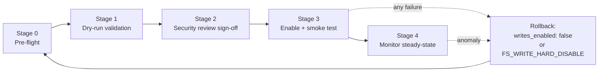

# fsconnect Write-Enablement Playbook

A staged runbook for enabling **production writes** in the CyClaw filesystem
connector (`agentic/fsconnect/`). Each stage ends in a verify step; a failed verify
sends you backward, never forward. This document describes the behavior actually
implemented in Phase 2 — where a capability is designed-but-deferred it says so.

## 1. Scope & audience

For the MSP/operator turning on production writes on a POSIX host. It does **not**
cover: Windows write-enablement (refused until Phase 4 — the Windows write paths are
unverified `# pragma: no cover`), browser/HTTP-driven writes (there are none — writes
are CLI-only), or the read-only side of the connector (already covered by the connector
README).

## 2. Architecture in 90 seconds

Writes are **out-of-band and local-CLI-only**. `gate.py`, `graph.py`, and
`mcp_hybrid_server.py` never import `agentic.fsconnect` (invariant I6), and the
`/ops/fsconnect` HTTP endpoint exposes read actions only. A write happens exclusively
by running `python -m agentic.fsconnect.cli <subcommand>` on the host. Content is
supplied by the operator (`--body`/`--body-file`/stdin); the connector never calls the
LLM. Every mutation is confined to a `writable_roots` entry by the same POSIX
fd-descent path-containment core (`pathsafe.py`) that guards reads.



## 3. The gate model

Every write op passes, in order and fail-closed:

1. `writes_enabled` (config, default false) — while false, every op returns a **dry-run
   plan** and writes nothing. `FS_WRITE_HARD_DISABLE` (code constant in `writer.py`)
   forces dry-run even if config enables writes.
2. A non-empty human `--reason` — no anonymous mutation (`failed_gate="reason"`).
3. `--confirm` for destructive ops (overwrite, move, delete) when
   `require_confirm_destructive` is set (`failed_gate="confirm"`).
4. For `delete --purge` and `trash-empty` only: a **fifth** global gate,
   `allow_hard_delete: true` (`failed_gate="allow_hard_delete"`).

After the gates, two capacity/rate refusals may still fire (they never relax a gate):
`quota` (per-root byte/file ceiling) and `rate_limit` (per-root `fs:<root>` + global
`fs:*` bandwidth). Payload size is capped even earlier (`max_write_bytes`, before any
syscall). All refusals raise `FsWriteRefused` → **exit code 4** and are audited.

## 4. Stage 0 — Pre-flight

1. Create a dedicated non-root OS user; `chown` each writable root to it; `chmod 0700`
   (or `0750`). The OS user owning the root is the security boundary for out-of-band
   local attackers (R-1) — CyClaw does not defend against a peer with write access to
   the root directory.
2. Confirm each root is **not** inside the repo, inside `data/corpus/`, or inside a
   read root; confirm ≥ 2× disk headroom over the sum of configured quotas.
3. Review every key in the `fsconnect:` block of `config.yaml` (see §5 of the connector
   README for the schema). The Phase 2 keys default off: `strict_roots`,
   `block_on_injection_flags`, `allow_hard_delete`, `write_rate_limit.enabled`.
4. Run the self-test: `python -m agentic.fsconnect.cli --config config.yaml test`.
5. Back up any pre-existing content in the roots.

**Verify:** self-test passes; `cli status` shows the intended roots and
`writes_enabled: false`.

## 5. Stage 1 — Dry-run validation (hard gate)

With `writes_enabled: false`, exercise every op class and confirm the dry-run plans and
audit events look correct **before** the flag flips:

```bash
CFG=config.yaml
python -m agentic.fsconnect.cli --config $CFG write  --path a.txt --body "hi" --reason test
python -m agentic.fsconnect.cli --config $CFG append --path a.txt --body "more" --reason test
python -m agentic.fsconnect.cli --config $CFG mkdir  --path sub --reason test
python -m agentic.fsconnect.cli --config $CFG move   --src a.txt --dst sub/a.txt --reason test --confirm
python -m agentic.fsconnect.cli --config $CFG delete --path a.txt --reason test --confirm
```

Each returns `{"status": "dry_run_plan", "executed": false, ...}` (exit 0) and writes
nothing. The `delete` plan includes the computed `trash_entry` name and
`retention_expires_at`. Each also emits a `fsconnect_write_dryrun` audit event carrying
a `rule_applied` string.

**Verify:** no files created; audit log shows one `fsconnect_write_dryrun` per op with a
sensible `rule_applied`.

## 6. Stage 2 — Security review

Execute `FSCONNECT_SECURITY_REVIEW_CHECKLIST.md` end to end. Record the config sha256
and file the signed checklist. **No sign-off, no flag flip.**

## 7. Stage 3 — Enable + smoke test

Flip `writes_enabled: true` (and set `strict_roots: true`, `write_rate_limit.enabled:
true`, per-root `quota_bytes` as reviewed). The CLI re-reads config per invocation, so
no restart is needed. Run a scripted smoke covering the full lifecycle:

```bash
python -m agentic.fsconnect.cli --config $CFG write  --path note.txt --body "content" --reason "smoke"
python -m agentic.fsconnect.cli --config $CFG append --path note.txt --body " more"   --reason "smoke"
python -m agentic.fsconnect.cli --config $CFG delete --path note.txt --reason "smoke" --confirm      # -> trash
python -m agentic.fsconnect.cli --config $CFG quota-status
# restore needs the entry name from the delete output or a trash listing:
python -m agentic.fsconnect.cli --config $CFG trash-restore --entry <name> --reason "smoke" --confirm
```

Applied ops return `{"status": "applied", "executed": true, "intent_id": ..., "rule_applied": "allowed: ..."}`.

**Verify:** for each applied op the audit log contains a matched
`fsconnect_write_intent` → `fsconnect_write_applied` pair sharing one `intent_id`;
`quota-status` reflects the writes; the trashed file is restored.

## 8. Stage 4 — Steady-state monitoring

- **Daily:** grep the audit JSONL for any `fsconnect_write_intent` whose `intent_id`
  has no matching `applied`/`refused` (a crash-window candidate — Phase 2 has no
  `audit-verify` subcommand yet, so this is a manual grep). Check `quota-status` per
  root.
- **Weekly:** review trash, then purge expired entries. `trash-empty` purges only
  entries past `trash_retention_days` unless `--all` is given, is itself gated + audited
  per entry, and also sweeps orphaned `*.cyclaw-tmp` crash leftovers older than 24 h.
  Sample cron (no daemon ships — Assumption A5):

  ```cron
  0 3 * * 0  cd /opt/cyclaw && python -m agentic.fsconnect.cli --config config.yaml trash-empty --reason "weekly retention purge" --confirm
  ```

- A `fsconnect_root_fallback` audit event means a writable root could not be prepared
  and (because `strict_roots` was false) writes fell back to `~/CyClaw-FS`. Treat it as
  config drift: investigate and, in production, run with `strict_roots: true` so this
  fails closed instead.

## 9. Compliance mapping

| Phase 2 feature | NIST 800-171 | CMMC 2.0 | HIPAA §164 | SOC 2 | Sell it as |
|---|---|---|---|---|---|
| Four/five-gate writes + human reason | 3.1.1, 3.1.2, 3.1.7 | AC.L1-3.1.1, AC.L2-3.1.7 | 312(a)(1) | CC6.1, CC6.3 | No anonymous mutation — every write carries an accountable human reason |
| Two-phase audit + `rule_applied` | 3.3.1, 3.3.2, 3.3.5 | AU.L2-3.3.1/3.3.2 | 312(b) | CC7.2 | An auditor can reconstruct *why* every action was allowed or denied; crashes can't hide mutations |
| Trash + retention + meta sidecars | 3.8.3 | MP.L2-3.8.3 | 310(d)(2)(i) | CC6.5 | Governed disposal with a reversible window and disposal evidence |
| Per-root quotas | 3.4.6 | CM.L2-3.4.6 | 306(a) | CC6.1, A1.1 | A compromised or misused writer cannot exhaust storage |
| Write rate-limiting | 3.13.x | SC.L2 | 306(a) | A1.2 | Mutation bandwidth is bounded per share and globally |
| Playbook + review checklist | 3.12.1, 3.12.4 | CA.L2-3.12.1/4 | 308(a)(8) | CC3.x, CC8.1 | Write-enablement is a documented, signed, reviewable change — not a config flip |
| `strict_roots` fail-closed | 3.4.2 | CM.L2-3.4.2 | 312(a) | CC6.1 | Misconfiguration halts, never silently relocates data |

One-liner: **every mutation is human-attributed, capacity-bounded, rate-bounded,
reversible by default, and reconstructable by an auditor — and the enablement procedure
itself is a signed control.**

## 10. Rollback & incident response

Three concentric switches, fastest first:

1. **`writes_enabled: false`** in `config.yaml` — takes effect on the next CLI
   invocation (no restart). This is rollback #1; the checklist requires you to have
   tested it before go-live.
2. **`FS_WRITE_HARD_DISABLE = True`** in `agentic/fsconnect/writer.py` — code-level,
   survives config tampering; forces dry-run regardless of config.
3. **OS-level** — remove the root from `writable_roots` and/or `chmod` the directory;
   survives CyClaw-level tampering.

For an incident, preserve evidence first: copy `logs/audit.jsonl` and the affected
`<root>/.cyclaw-trash/*.meta.json` sidecars before touching anything.

## 11. Known limitations (honest)

- **Audit log is not yet tamper-evident** (R-9, open). Hash-chaining is designed but
  deferred beyond Phase 2. Interim mitigation: `chattr +a` on `audit.jsonl` or ship logs
  off-host.
- **Quota ledger can drift** (R-3, bounded) if someone writes into a root out-of-band
  (cp/rsync). The root belongs to CyClaw; out-of-band writes are an operational error.
  Recompute bounds the drift window to `quota_recompute_hours` (default 24 h); run
  `quota-status --recompute` to reconcile immediately.
- **Rate limit can overshoot slightly under concurrent CLI processes** (R-4, low): the
  per-`allow()` read-modify-write is not serialized cross-process, so a race can exceed
  the ceiling by a small margin. The limiter is an abuse brake, not a security boundary;
  the failure mode is over-counting (fail-closed).
- **Injection flags are advisory by default.** The content scan flags matches but still
  writes, preserving the content-agnostic contract. Set `block_on_injection_flags: true`
  to refuse flagged content (`failed_gate="injection_scan"`).
- **Windows writes are unsupported** for production until Phase 4.
